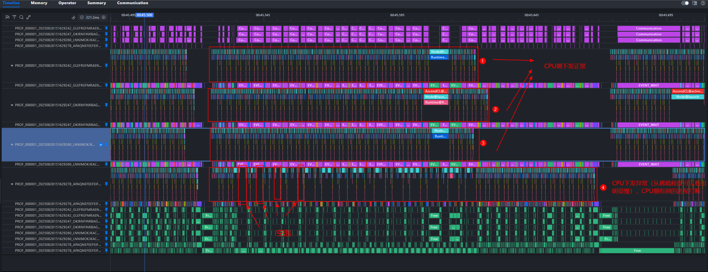
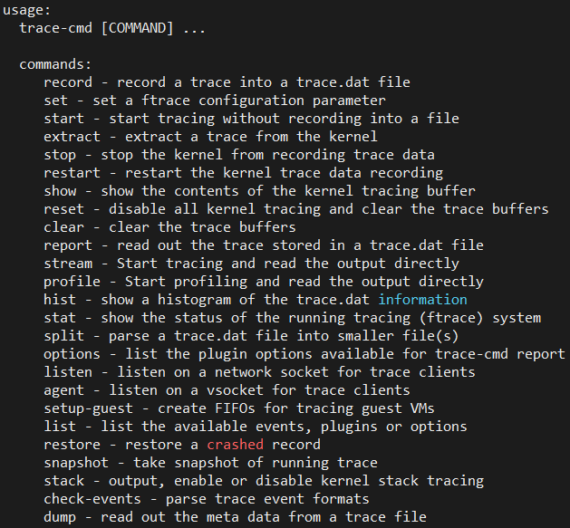
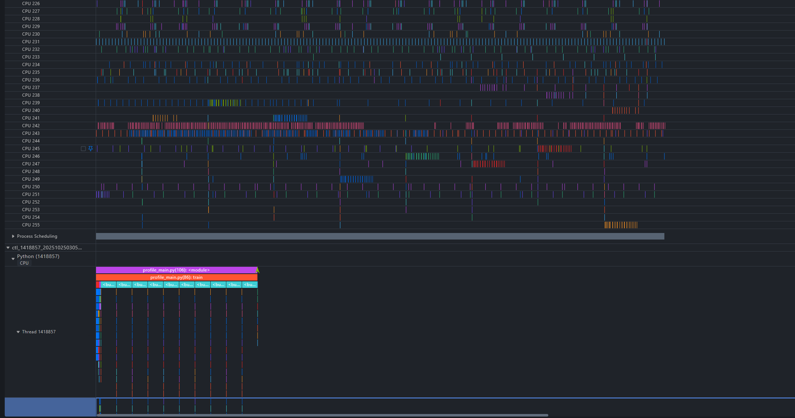
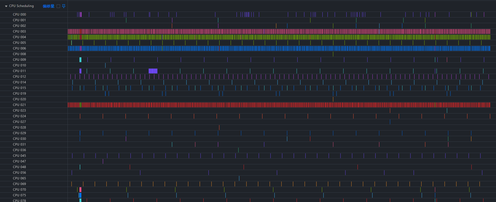
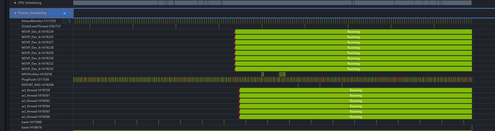
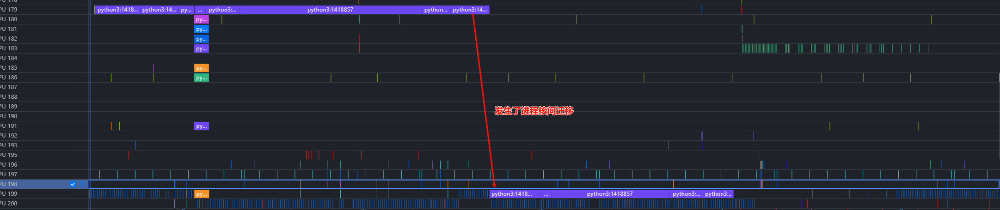
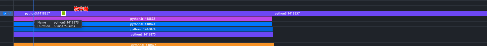
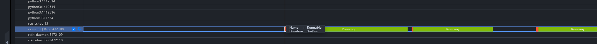
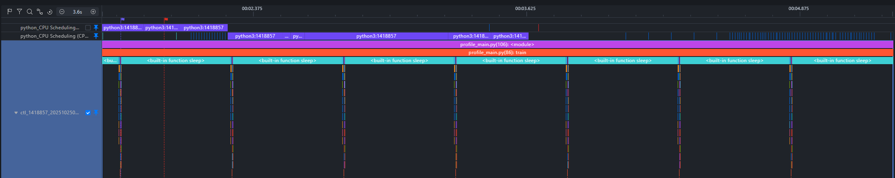

# 基于Linux Kernel Trace的Host Bound问题分析

## 问题背景

在大模型中，CPU主要负责任务的下发，NPU负责任务执行。在现网问题中，无论推理或训练领域，HostBound都是现网的高发问题。
HostBound模型在Profiling中经常表现为下发时间长，Device和Host侧对应出现大量空泡，如下图所示：

HostBound问题通常会采集ftrace数据分析CPU调度问题，但缺乏工具将ftrace的数据和profiling的信息整合。MindStudio Insight提供了工具脚本实现两种数据同时展示，提高HostBound问题定位的效率。

## 定位思路

1. 绑核、流水优化、内存分配库替换三板斧
2. 同时采集ftrace和profiling数据(容器场景下，ftrace和profiling应在同一容器内执行)
3. 将ftrace数据转换为MindStudio Insight可识别的数据
4. 同时导入MindStudio Insight 分析进程调度情况

## 模型Profiling数据采集

参考：
[msprof采集通用命令-CANN商用版8.2.RC1-昇腾社区 (hiascend.com)](https://www.hiascend.com/document/detail/zh/canncommercial/82RC1/devaids/Profiling/atlasprofiling_16_0010.html#ZH-CN_TOPIC_0000002370195313__section2176155111323)
[PyTorch训练/在线推理场景性能分析-昇腾社区 (hiascend.com)](https://www.hiascend.com/document/detail/zh/canncommercial/82RC1/devaids/Profiling/atlasprofiling_16_0006.html)

## Linux Kernel ftrace数据采集

### **1、Linux Kernel ftrace数据介绍**

Linux 内核内置了多种跟踪(trace)工具，其中 ftrace 作为从 2.6.27 版本开始引入主流内核的跟踪框架，可用于看管和调试内核中发生的各类事件，帮助开发人员深入分析系统运行时的内部行为。ftrace 支持多种跟踪器，例如函数调用跟踪、上下文切换跟踪、中断延迟分析等，能够有效辅助定位内核态性能问题与调度异常。在如下示例中，我们仅开启了与 CPU 进程调度相关的事件(sched)进行数据采集，具体输出如下：

```bash
# tracer: nop
#
# entries-in-buffer/entries-written: 112246/112246   #P:192
#
#                                _-----=> irqs-off
#                               / _----=> need-resched
#                              | / _---=> hardirq/softirq
#                              || / _--=> preempt-depth
#                              ||| / _-=> migrate-disable
#                              |||| /     delay
#           TASK-PID     CPU#  |||||  TIMESTAMP  FUNCTION
#              | |         |   |||||     |         |
   kworker/145:1-1023940 [145] d.... 1725926.126419: sched_stat_runtime: comm=kworker/145:1 pid=1023940 runtime=23230 [ns] vruntime=3450824076020452 [ns]
   kworker/145:1-1023940 [145] d.... 1725926.126423: sched_switch: prev_comm=kworker/145:1 prev_pid=1023940 prev_prio=120 prev_state=I ==> next_comm=release_thread next_pid=2813514 next_prio=120
  release_thread-2813514 [145] d.... 1725926.126427: sched_stat_runtime: comm=release_thread pid=2813514 runtime=8880 [ns] vruntime=468045121382 [ns]
  release_thread-2813514 [145] d.... 1725926.126429: sched_switch: prev_comm=release_thread prev_pid=2813514 prev_prio=120 prev_state=S ==> next_comm=swapper/145 next_pid=0 next_prio=120
          <idle>-0       [145] d.h.. 1725926.126478: sched_waking: comm=release_thread pid=2813514 prio=120 target_cpu=145
          <idle>-0       [145] dNh.. 1725926.126480: sched_wakeup: comm=release_thread pid=2813514 prio=120 target_cpu=145
          <idle>-0       [145] d.... 1725926.126485: sched_switch: prev_comm=swapper/145 prev_pid=0 prev_prio=120 prev_state=R ==> next_comm=release_thread next_pid=2813514 next_prio=120
```

各种事件代表不同的含义，主要的几种事件如下：

* sched_switch: 记录每次进程上下文切换，包括当前进程换出，新进程换入
* sched_wakeup: 已有进程被唤醒
* sched_wakeup_new: 新创建的进程首次被唤醒
* sched_process_fork/sched_process_exec/sched_process_exit ：进程创建销毁

[trace-cmd](https://www.trace-cmd.org/Documentation/trace-cmd/)是 ftrace 的一个前端命令行工具。它封装了直接操作 /sys/kernel/debug/tracing/ 下复杂文件的过程，提供了更简单易用的命令接口


### **2、Linux Kernel数据采集操作**

#### 前置准备

+ 安装trace-cmd命令
  Ubuntu安装命令：`sudo apt-get install trace-cmd`
  CentOs安装命令：`sudo yum install trace-cmd`
+ 获取MindStudio Insight提供的采集脚本trace_record.py(见附件)，推荐profiling和ftrace数据同步采集
  
#### 非侵入式采集
  
  这种方式不需要修改现有代码，将trace_record.py脚本作为整体使用。优点在于无需修改代码，快速上手，但是同时灵活性较低。
  作为整体脚本使用时提供以下参数：
  
  ```bash
  usage: trace_record.py [-h] [--cpu CPU] [--output OUTPUT] --record_time RECORD_TIME
  
  options:
    -h, --help            show this help message and exit
    --cpu CPU
    --output OUTPUT
    --record_time RECORD_TIME
                          record time, if pass <=0 will start long term record that user should attention the disk space
  ```
  
  + cpu: cpu_mask列表，多个cpu使用逗号分割，例如采集0，1，4则传入--cpu=0,1,4
  + output: 输出的文件名
  + record_time：采集的时间，单位秒。如果传递小于等于0的数字，则会持续采集，直到使用ctrl-c终止进程
  
  Example:
  
  1. 在终端中启动训练脚本`python train.py`
  2. 同时在另一终端中启动采集脚本，采集60s，`python trace_record.py --record_time=60`

#### 侵入式采集

利用trace_record脚本中提供的接口，在代码对应位置调用接口。优点在于灵活性高，可对特定的逻辑进行采集。

**开始采集接口**：

```python
def ftrace_record_start(cpu_list)
```

函数作用：打开ftrace采集开关
函数的参数说明：
cpu_list：cpu采集列表，用于指定需要采集的cpu，默认传None，表示采集所有CPU的数据。格式采取数组形式，数组内容为CPU编号，例如指定采集CPU1和CPU4，则传入[1, 4]。

**停止采集保存数据接口**

```python
def ftrace_record_stop(output)
```

函数作用：关闭ftrace采集开关，并将数据写入指定的output文件中，注意数据保存需要一定时间，会阻塞线程
record脚本中两个接口可以在任意代码中添加，也可以作为整体脚本使用。

Example：
在代码中中profiling开关开启/关闭处添加采集开始/结束接口调用

```python
import ftrace_record
    ftrace_record_start(cpu=[0, 1, 4])
    profiling_start()
    train()
    profiling_stop()
    ftrace_record_stop(output='/tmp/ftrace.txt')
```

### **3、数据采集后处理**

MindStudio Insight提供了ftrace格式数据，转换为流水图数据脚本trace_convert.py(见附件)，使用方法如下：

```shell
root@uboot:/home# python trace_convert.py --help
usage: trace_convert.py [-h] [--input INPUT] [--output OUTPUT] [--cpu_list CPU_LIST] [--profiling_data PROFILING_DATA]
options:
  -h, --help            show this help message and exit
  --input INPUT
  --output OUTPUT
  --cpu_list CPU_LIST
  --profiling_data PROFILING_DATA
                        use profiling data to adjust start time
```

参数说明：

--input: 输入的ftrace数据文件路径

--output:输出的JSON格式文件路径

--cpu_list: 过滤指定的cpu，建议在采集时指定cpu_list，而非采集后转换时指定

--profiling_data ：采集步骤中采集的profiling数据，用于ftrace数据的时间轴对齐

Example:
假设第一步采集的profiling数据在目录 result_dir/ctl_1418857_20251025030529768_ascend_pt下，对应的ftrace文件保存在result_dir/ftrace.txt中
执行命令：`python trace_convert.py --input=result_dir/ftrace.txt --profiling_data=result_dir/ctl_1418857_20251025030529768_ascend_pt`

## 联合分析

1. 在MindStudio Insight中导入profiling数据
2. 在工程管理中向当前工程添加转换后的结果文件，就可以得到两种数据并存的流水图
   
   
3. 查看CPU侧调度情况， 查看CPU Proscheduling泳道


4. 查看特定进程的调度状态



通过上述流水图，可以观察到进程的调度行为，例如观察进程python3:1418857，可以看到他发生了一次核间迁移，运行过程中存在软中断的情况。






利用Insight的泳道置顶功能，可以更直观的对照调度情况：

