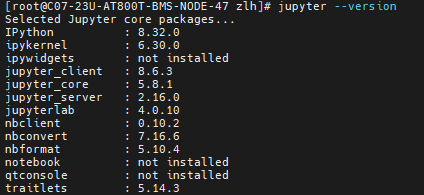
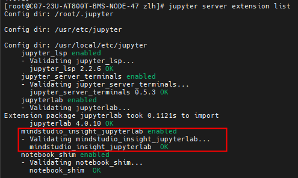
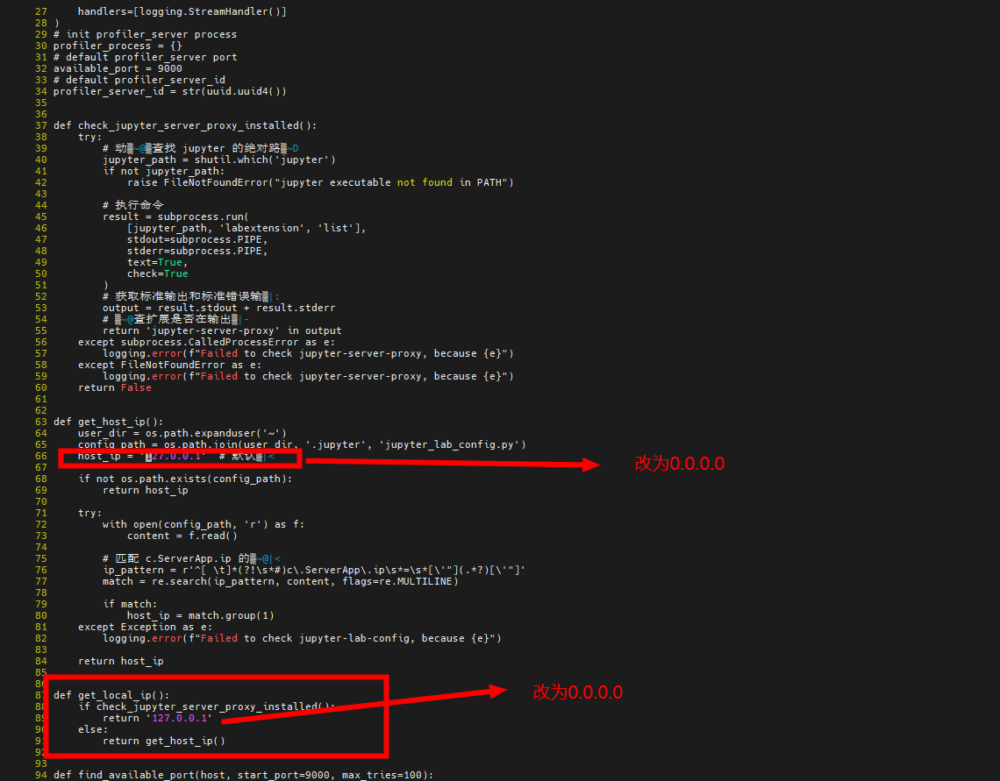
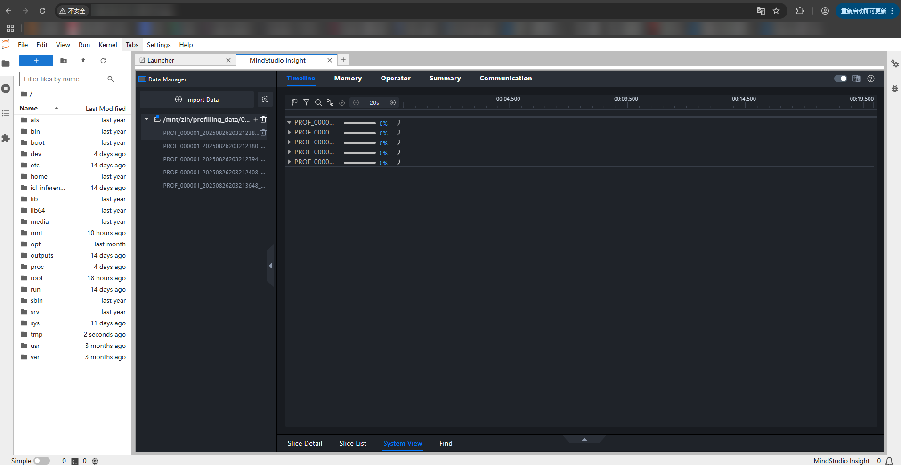
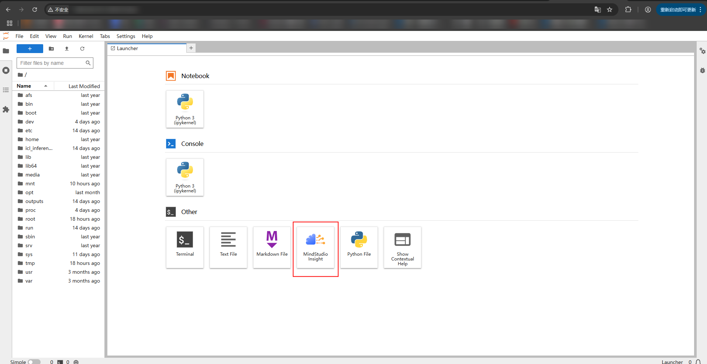
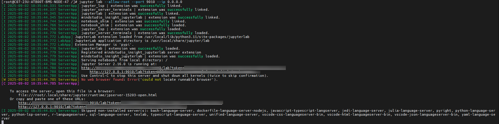

**目录：**

1. [背景](#1)
2. [参考资料](#2)
3. [安装使用方法](#3)
   1. [环境准备](#3.1)
   2. [安装包准备](#3.2)
   3. [包安装及服务查看](#3.3)
   4. [启动服务](#3.4)
      1. [手动修改代码，指定ip](#3.4.1)
      2. [启动jupyter](#3.4.2)
4. [Reference](#reference)

<h2 id="1">1. 背景</h2>

对于大模型的性能测试来说，往往采集的Profiling很大，或存在无法从服务器导出的场景。这时候使用图形化界面分析存在困难。

MindStudio Insight 提供了基于 jupyter 的插件可供使用，无需从服务器下载 Profiling 数据到本地，可以通过 Jupyter 以 web 界面的形式在本地进行分析。

<h2 id="2">2. 参考资料</h2>

[MindStudio insight官方指导](https://www.hiascend.com/forum/thread-0255181207629753032-1-1.html)

<h2 id="3">3. 安装使用方法</h2>

<h3 id="3.1">3.1 环境准备</h3>

```bash
# 1.使用pip安装jupyterlab(python版本大于等于3.8以上不指定版本安装jupyterlab，jupyterlab应当满足jupyterlab>=4,<5的条件)
$ pip install jupyterlab
# 2.使用pip安装指定版本jupyterlab，如jupyterlab-4.0.11
$ pip install jupyterlab==4.0.11
```

> 安装完成后查看jupyterlab版本
> 
> ```bash
> $ jupyter -version
> ```
> 
> 

<h3 id="3.2">3.2 安装包准备</h3>

参照 [章节2](##2.%20参考资料) 中提供的链接下载指定版本的MindStudio Insight Jupyter的whl包

<h3 id="3.3">3.3 包安装及服务查看</h3>

```bash
# 安装mindstudio_insight_jupyterlab插件包
$ pip install mindstudio_insight_jupyterlab-{version}-py3-none-{platform}.whl # version为版本号，platform为兼容平台
```

> 安装后可查看是否安装成功
> 
> ```bash
> $ jupyter server extension list
> ```
> 
> 

> 如果安装后未启动，可使用下面命令拉起
> 
> ```bash
> $ jupyter server extension enable mindstudio_insight_jupyterlab --sys-prefix
> ```

<h3 id="3.4">3.4 启动服务</h3>

<h5 id="3.4.1">3.4.1 手动修改代码，指定ip</h5>

```bash
$ vi /usr/local/lib/python3.11/site-packages/mindstudio_insight_jupyterlab/handlers.py
```

修改 66 行和 89 行的 ip 为 `"0.0.0.0"`



<h5 id="3.4.2">3.4.2 启动jupyter</h5>

```bash
$ jupyter lab --allow-root --port 9010 --ip 0.0.0.0
```



复制回显中提供的url+token到本地浏览器中访问即可



导入 Profiling 数据开始分析



<h2 id="reference">Reference</h2>


[1] MindStudio Insight. MindStudio insight官方指导. 2025.04. Wiki.  [https://www.hiascend.com/forum/thread-0255181207629753032-1-1.html](https://www.hiascend.com/forum/thread-0255181207629753032-1-1.html)


