# 快捷键说明

**本文软件版本：2025年330版本(8.0.RC1)**

在 MindStudio Insight 中，我们致力于为用户提供更流畅、更高效的操作体验。为了帮助大家更快速地掌握这些高效工具，本文将介绍一些常用的键盘快捷键，助力您快速上手，提升操作效率。

如果您想快速查看或了解当前所有快捷键操作，可以点击界面右上角的 ​**帮助按钮**​，在下拉菜单中选择 ​**“键盘快捷键”**​，即可打开快捷键说明的弹窗。该弹窗将按照模块展示对应的快捷键说明，方便您快速找到所需的快捷键。

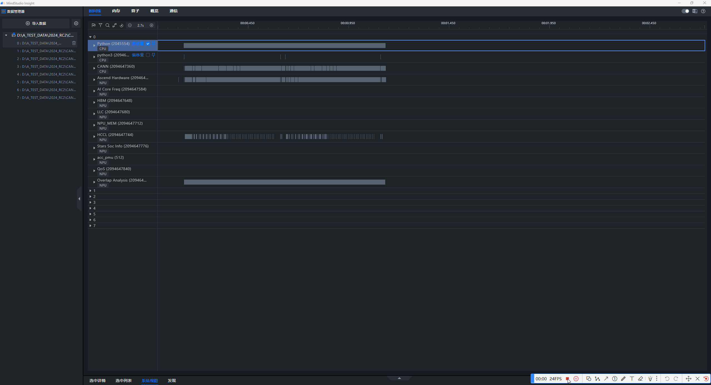

接下来，本文将详细介绍一些常用的快捷键，包括：

**1. 基础功能**

放大/缩小时间轴、左移/右移时间轴、页面向上/下滚动、撤销一次缩放或平移、重置时间轴、收起/展开底部面板

**2. 框选功能**

将已框选的区域放大至屏幕、框选一段区域并放大至屏幕、根据当前选中的算子设置或取消框选区域

**3. 对齐功能**

选中算子的开始时间与基准算子的开始时间对齐、选中算子的结束时间与基准算子的结束时间对齐

**4. 源码视图-在源码中查找功能**

## 时间线页面

适用场景：系统调优、算子调优

### **1. 基础功能**

​**放大时间轴**​：`W`

* ​**说明**​：按下 `W`，时间轴会放大，便于您查看更细粒度的数据。

​**缩小时间轴**​：`S`

* ​**说明**​：按下 `S`，时间轴会缩小，帮助您快速查看更大的时间范围。

**截图示例：**

​**左移时间轴**​：**`A`** 或 **`←`** 或 `<strong>Ctrl</strong>(Windows)<strong>/</strong> <strong>Cmd</strong>(Mac) <strong>+ 拖动</strong>`

* ​**说明**​：按 **`A`** 或 **`←`** 或者按住 `<strong>Ctrl</strong>(Windows)<strong>/</strong> <strong>Cmd</strong>(Mac)` 后**拖动**页面，您可以将页面向左平移，便于查看左侧的内容。

​**右移**时间轴****​：**`D`** 或 **`→`** 或 `<strong>Ctrl</strong>(Windows)<strong>/</strong> <strong>Cmd</strong>(Mac)`​`<strong>+ 拖动</strong>`

* ​**说明**​：按 **`D`** 或 **`→`** 或者按住 `<strong>Ctrl</strong>(Windows)<strong>/</strong> <strong>Cmd</strong>(Mac)` 后**拖动**页面，您可以将页面向右平移，快速查看右侧的内容。

**截图示例：**

​**页面向上滚动**​：`↑`

* ​**说明**​：按上箭头 `↑`，页面会向上滚动，适用于查看页面顶部的内容。

​**页面向下滚动**​：`↓`

* ​**说明**​：按下箭头 `↓`，页面将向下滚动，快速查看页面底部的内容。

**截图示例：**

​**撤销一次缩放或平移**​：`Backspace`

* ​**说明**​：如果您希望撤销之前的缩放操作，按下 `Backspace` 可以恢复到上一次的缩放状态。

**截图示例：**
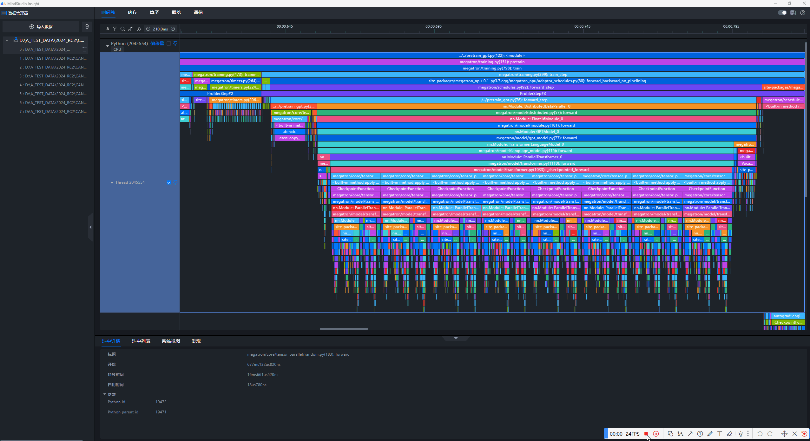

​**重置时间轴**​：`<strong>Ctrl</strong>(Windows)<strong>/</strong> <strong>Cmd</strong>(Mac)`​`<strong>+ 0</strong>`

* ​**说明**​：按下 `<strong>Ctrl</strong>(Windows)<strong>/</strong> <strong>Cmd</strong>(Mac)`​`<strong>+ 0</strong>`，时间轴会重置到初始状态，恢复为默认的视图。

​**截图示例**​：

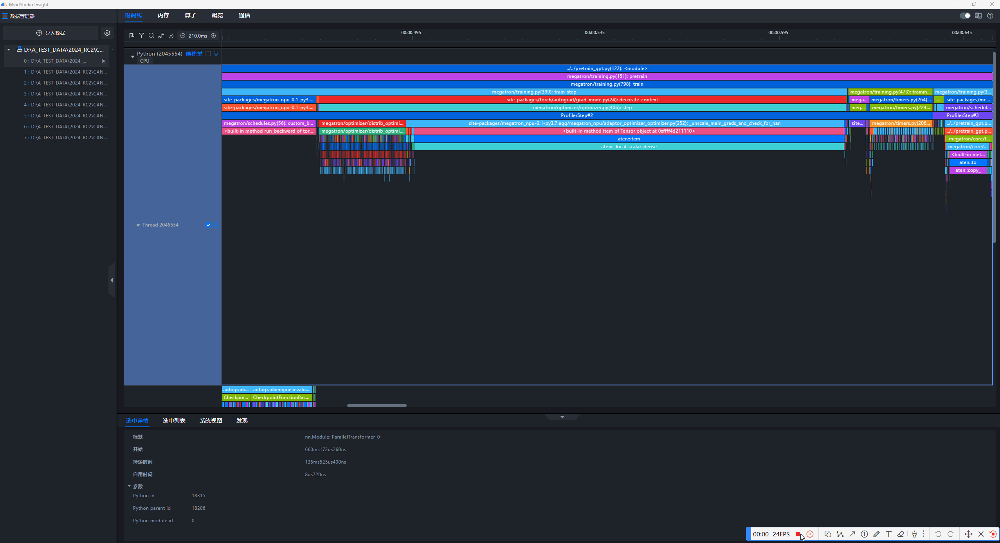

​**收起/展开底部面板**​：`Q`

* ​**说明**​：按 `Q`，您可以快速收起或展开底部面板，节省屏幕空间，提升工作效率。

**截图示例：**
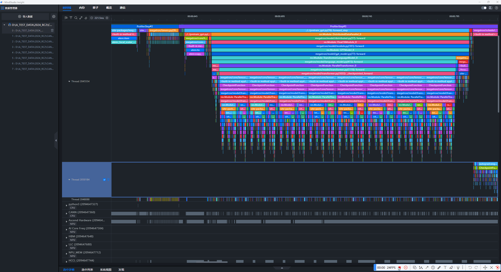

### 2. 框选功能

框选功能介绍：框选部分算子，可以在“底部面板-选中列表”中看到相应统计信息，点击“更多”可跳转至时间线具体算子位置。

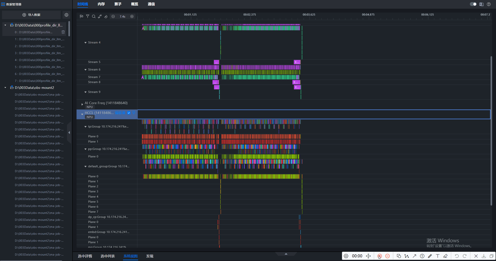

​**将已框选的区域放大至屏幕**​：`Shift + Z`

* ​**说明**​：框选一段区域后，按 `Shift + Z`，系统会将该区域放大至全屏显示，帮助您专注于选中的区域。

**截图示例：**
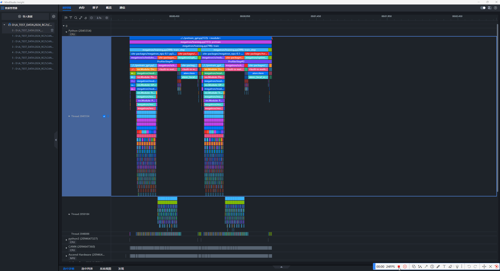

​**框选一段区域并放大至屏幕**​：`<strong>Alt</strong>(Windows)<strong>/</strong> <strong>Option</strong>(Mac)`​`<strong>+ 拖动</strong>`

* ​**说明**​：按住 `<strong>Alt</strong>(Windows)<strong>/</strong> <strong>Option</strong>(Mac)` 键并**拖动**鼠标，您可以放大框选区域，使其更加精确。

​**截图示例**​：

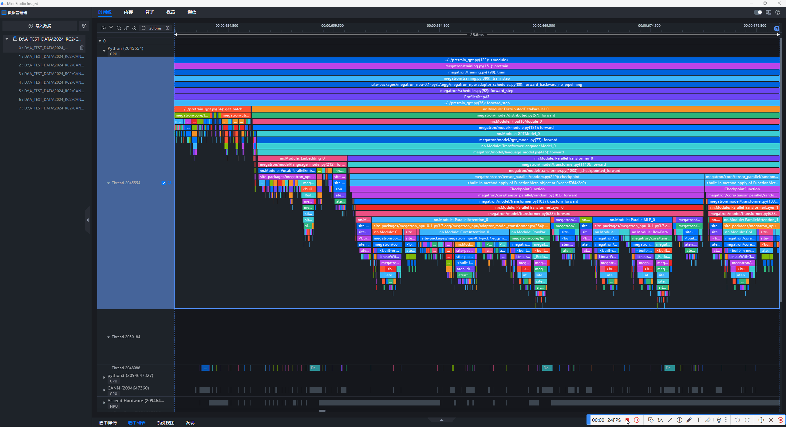

​**根据当前选中的算子设置或取消框选区域**​：`M`

* ​**说明**​：按 `M`，您可以根据当前选中的算子来设置或取消框选区域，快速定义分析的范围。

**截图示例：**
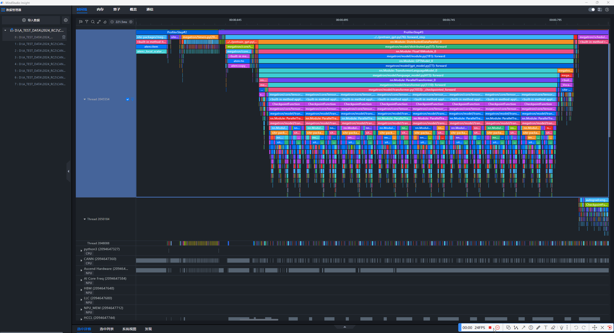

### 3. 对齐功能

所采集NPU数据可能存在时钟源误差导致的卡间不同步问题，可用MindStudio Insight一键对齐。对齐时，deviceID相同的泳道会共享偏移量。

​**选中算子的开始时间与基准算子的开始时间对齐**​：`L`

* ​**说明**​：选择一个算子作为基准算子，右键“设置为基准算子”，在不同的二级泳道下选中要对齐的算子，按下 `L`，选中算子的开始时间将与基准算子的开始时间对齐。

**截图示例：**
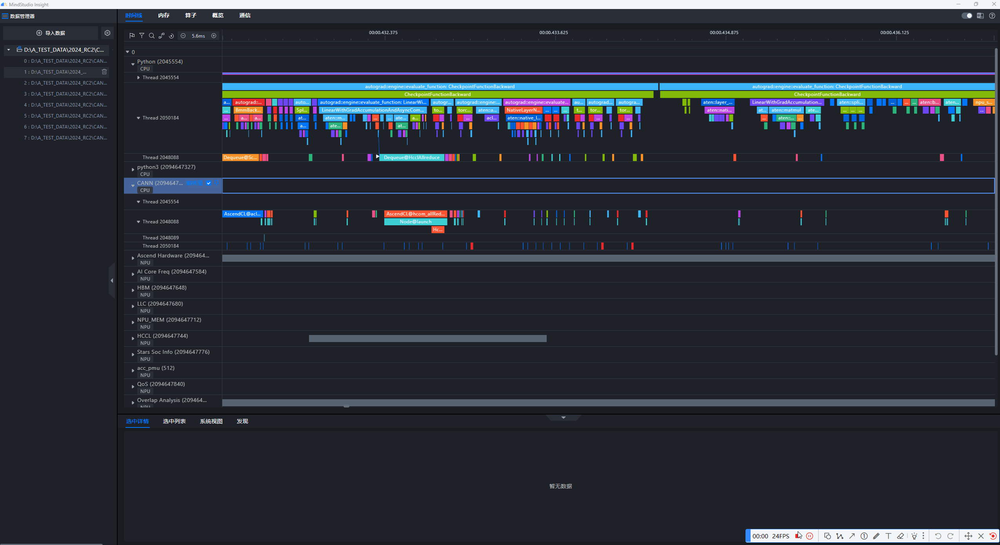

​**选中算子的结束时间与基准算子的结束时间对齐**​：`R`

* ​**说明**​：选择一个算子作为基准算子，右键“设置为基准算子”，在不同的二级泳道下选中要对齐的算子，按下 `R`，选中算子的结束时间将与基准算子的结束时间对齐。

**截图示例：**
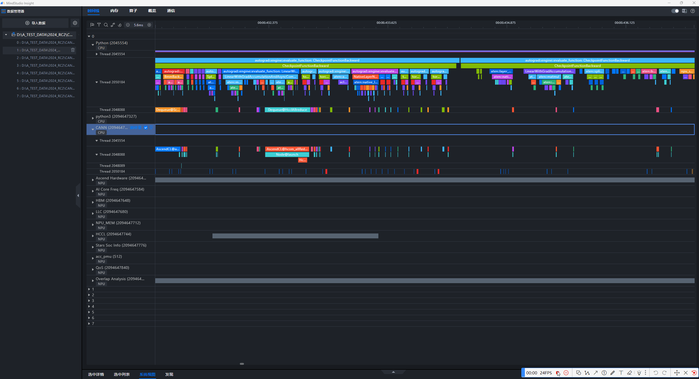

## 源码页面

适用场景：算子调优

​**在源码中查找**​：`<strong>Ctrl</strong>(Windows)<strong>/</strong> <strong>Cmd</strong>(Mac)`​`<strong>+ F</strong>`

* ​**说明**​：按下 `<strong>Ctrl</strong>(Windows)<strong>/</strong> <strong>Cmd</strong>(Mac)`​`<strong>+ F</strong>`，弹出查找框，您可以在源码中快速搜索指定内容，减少查找时间。

**截图示例**

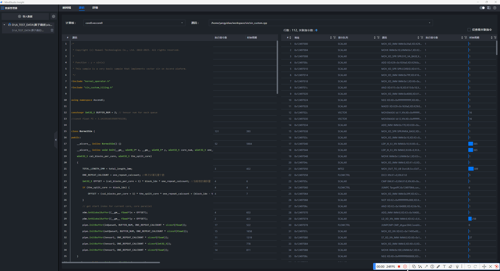
