本文回答系统调优场景以下问题：

1. Timeline(时间线)常用泳道与界面有哪些？彼此之间有什么关系？
2. 什么是Overlap Analysis(覆盖分析)？
3. Timeline常用于观察哪些问题？

## Timeline(时间线)常用泳道与界面有哪些？

时间线(Timeline)是将训练或推理过程中的Host、Device上的运行详细情况平铺在时间轴上，直观呈现Host侧的API耗时情况以及Device侧的Task耗时。常用泳道与界面如下图与下表所示。

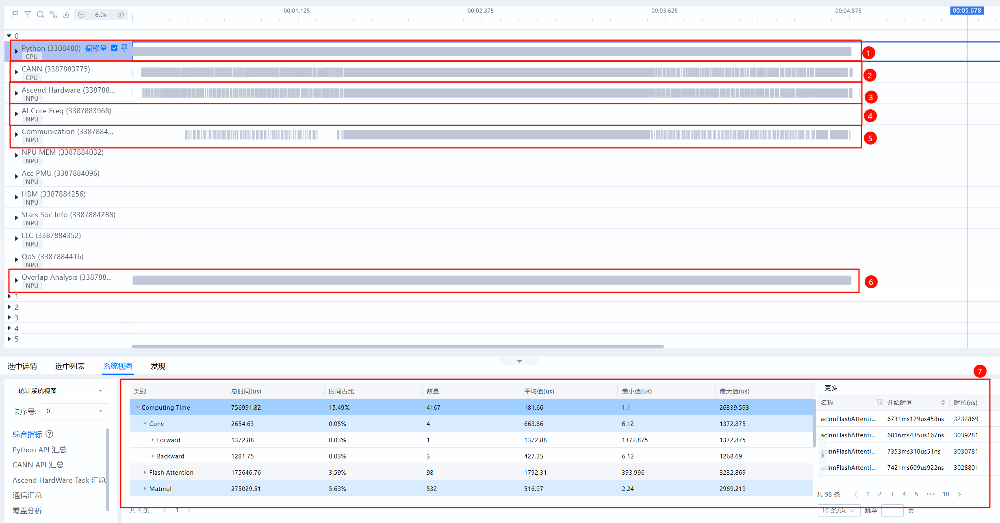

| 序号 | 名称                         | 说明                                                                                                                                     |
| ---- | ---------------------------- | ---------------------------------------------------------------------------------------------------------------------------------------- |
| 1    | Python泳道(一级流水)       | 查看Python层代码，采集时开启with stack开关可查看代码调用栈。                                                                             |
| 2    | CANN泳道(二级流水)         | 收集ACL接口执行、GE融合、Runtime等数据。Python侧算子从一级流水下发至此二级流水，任务从二级流水出队后被下发至NPU层。                      |
| 3    | Ascend Hardware(NPU层)     | 也称Device侧，记录发生在NPU上计算、通信等任务的执行时序。                                                                                |
| 4    | AI Core Freq                 | AI Core频率，可用于观察降频问题。                                                                                                        |
| 5    | Communication                | 旧称HCCL泳道。记录NPU层通信事件，与Ascend Hardware的通信子泳道一一对应，此处由HCCL等组件上报。定位通信细节时，可查看此泳道。             |
| 6    | Overlap Analysis(覆盖分析) | 将Ascend Hardware(NPU层)的计算、通信任务垂直投影至此，得到计算、通信、空闲时间的拆分。常用于快速比对不同卡间计算、通信、空闲差异来源。 |
| 7    | 统计视图                     | **单卡维度**统计汇总信息，可通过左侧“**卡序号**”下拉框切换不同卡。                                                                     |

## 泳道彼此之间有什么关系？

模型运行时，算子从Python(一级流水)处下发至CANN层(二级流水)。通过查看async_task_queue连线，可以看到算子任务的入队、出队关系：

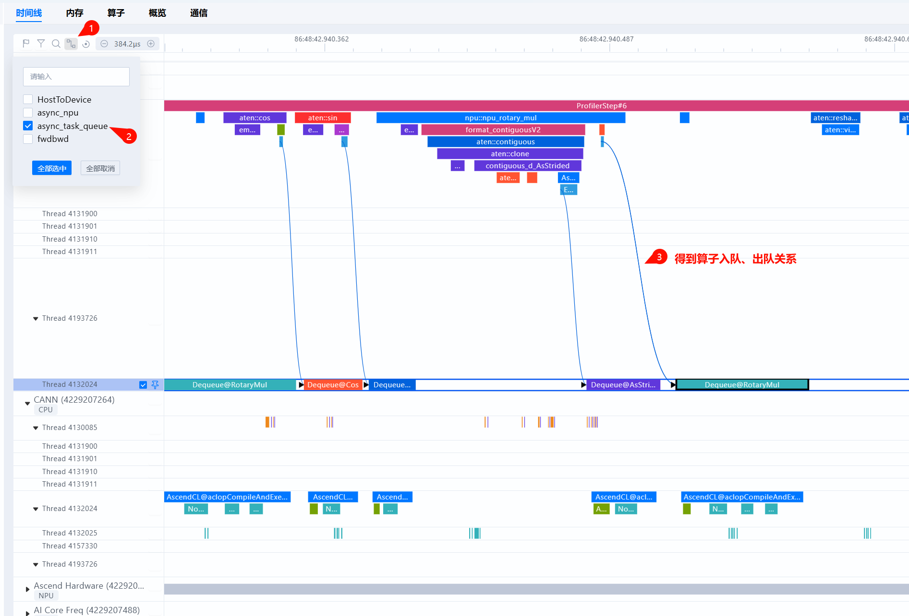

随后，算子从CANN层(二级流水)下发至NPU层，即Ascend Hardware泳道。通过查看HostToDevice连线，可以看到算子下发关系：

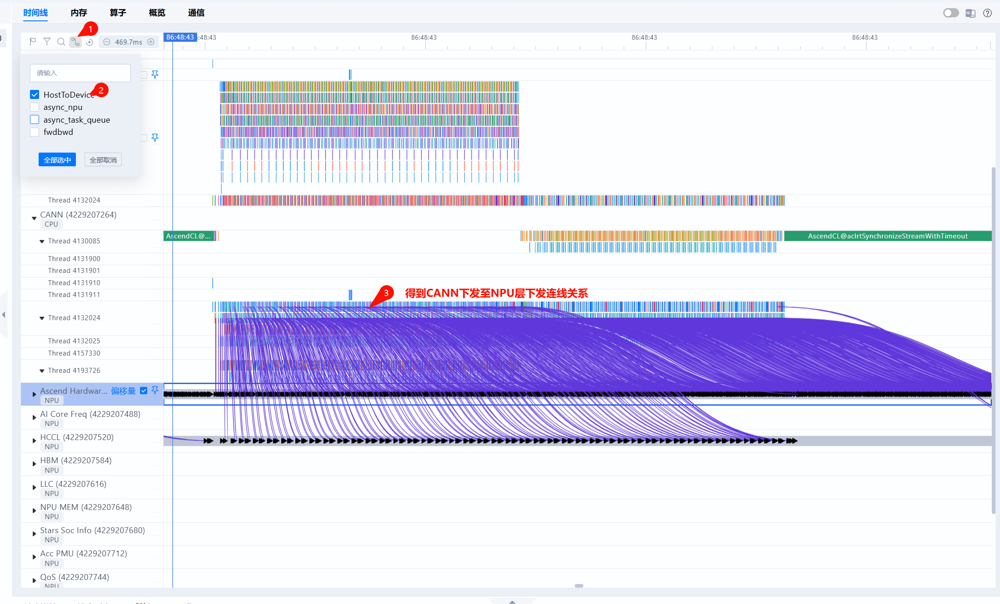

此外，Timeline提供从Python层到NPU层的连线关系`async_npu`，方便定位到NPU性能瓶颈点时，直接向上寻找至具体Python侧代码位置：

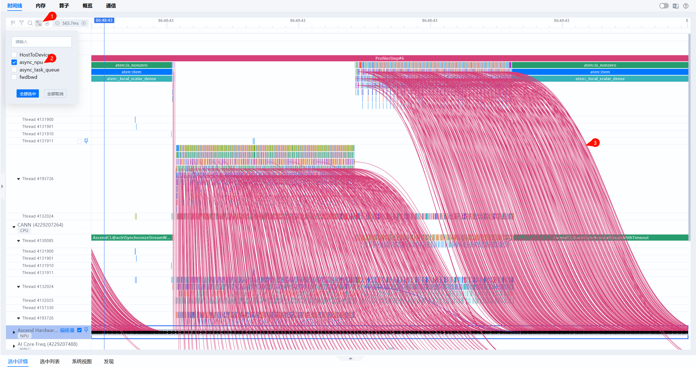

## 什么是Overlap Analysis(覆盖分析)？

NPU层(即Ascend Hardware层)的事件大致可以分为两种类型，计算事件与通信事件，Overlap Analysis即对NPU层垂直投影后的分类统计。Computing为计算算子垂直投影：

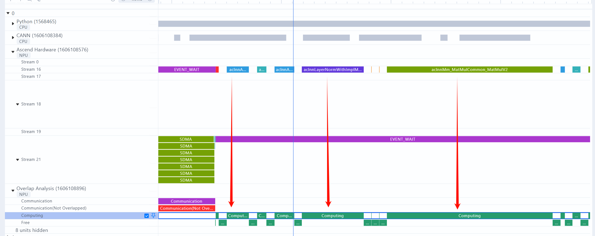

Communication为通信算子垂直投影(PS：对于通信算子，直接查看Communication泳道(旧称HCCL泳道)更加直观，该泳道记录NPU层通信事件，与Ascend Hardware的通信子泳道一一对应，此处由HCCL等组件上报。)：

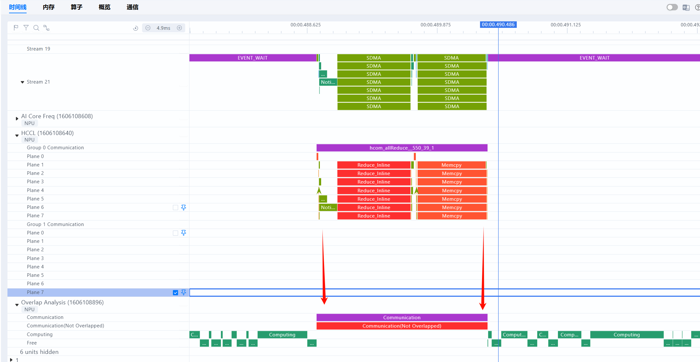

Communication Not Overlapped即为未被计算覆盖的通信时间。当此类时间占比过高时，可考虑增加计算通信的并行程度。

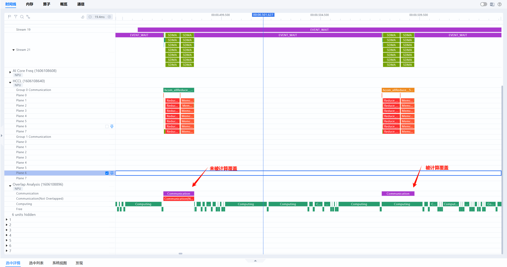

Free代表NPU即不在计算也不在通信的时间，即为空闲时间。理想情况下，NPU侧的流水线应尽量避免空闲，减少出现NPU等Host侧的场景。若Free Time占比较高(例如超过10%)，说明出现Host下发瓶颈，NPU在等待Host侧下发任务，需针对Host侧进行着重优化，例如流水优化、绑核优化、开启CPU高性能模式等。

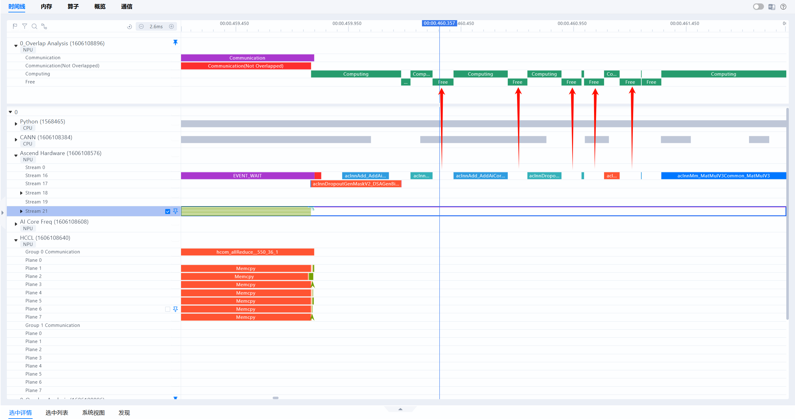

## Timeline常用于观察哪些问题？

### 快慢卡根因定位

时间线(Timeline)常用于进一步定位**快慢卡具体的差异来源**。理想情况下，每张卡的计算用时相对接近，不应存在某张卡提前完成计算，长时间等待另一张卡的情况。当出现某些卡存在时长较长的通信算子，且通信算子主要时长来源于等待(例如Notify Wait事件)时，优先考虑是否出现了快慢卡问题。

具体定位过程如下：

1. 在通信(Communication)页签的通信算子缩略图中，观察到耗时差异较大的卡与通信算子，根据通信算子跳转至时间线界面。
   
   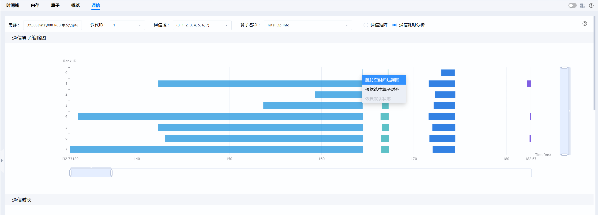
2. 分别置顶比对快卡与慢卡的Overlap Analysis泳道，确认Ascend Hardware层(NPU层)差异来源。
   
   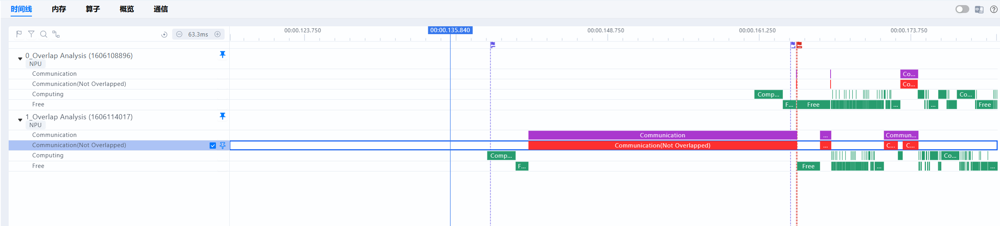
3. 在时间线(Timeline)界面选择`async_npu`下发连线，通过连线关系，由NPU层向上寻找，确认Python层差异来源。
   
   利用Timeline定位快慢卡的具体案例可参考：[快慢卡定位Timeline操作案例-MindStudio8.1.RC1-昇腾社区](https://www.hiascend.com/document/detail/zh/mindstudio/81RC1/practicalcases/GeneralPerformanceIssue/toolsample6_034.html)

### 下发瓶颈观察

时间线(Timeline)是观察下发问题的有力工具，理想情况下NPU侧的计算流水线能不停运转，不会出现NPU等CPU的场景。一旦下发慢，将导致流水线无法运转，AI Core算力利用率降低。理想Free Time占比约为10%以内。

下发瓶颈在时间线(Timeline)典型表现如下。

1. 覆盖分析Free Time占比远超Computing和Communication，如下图：

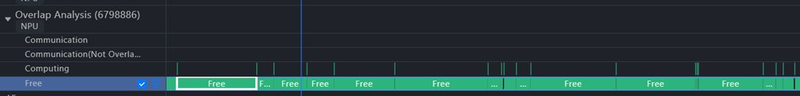

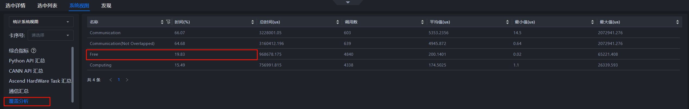

2. `async_npu`下发连线接近垂直，如下图：

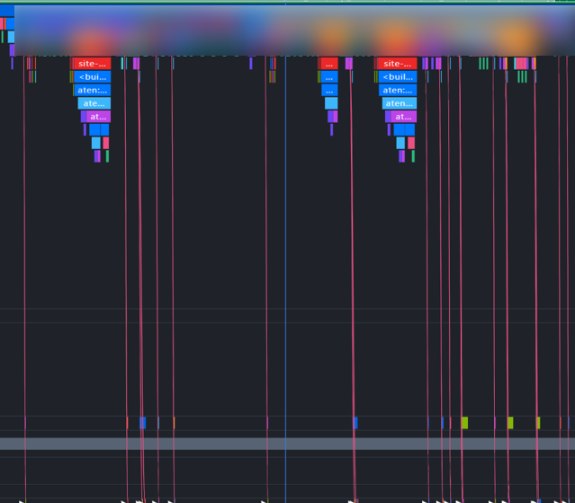

下发瓶颈，PyTorch场景通用优化思路参考：[调度优化-Ascend Extension for PyTorch7.1.0-昇腾社区](https://www.hiascend.com/document/detail/zh/Pytorch/710/ptmoddevg/trainingmigrguide/performance_tuning_0059.html)，排查思路参考：[下发异常分析-MindStudio8.1.RC1-昇腾社区](https://www.hiascend.com/document/detail/zh/mindstudio/81RC1/practicalcases/GeneralPerformanceIssue/toolsample6_076.html)

