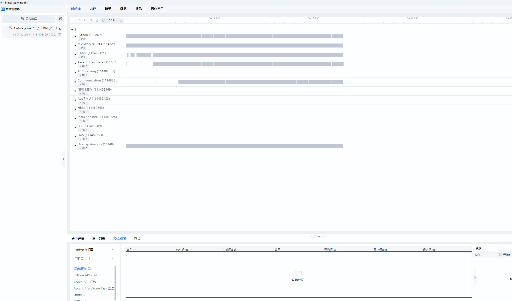
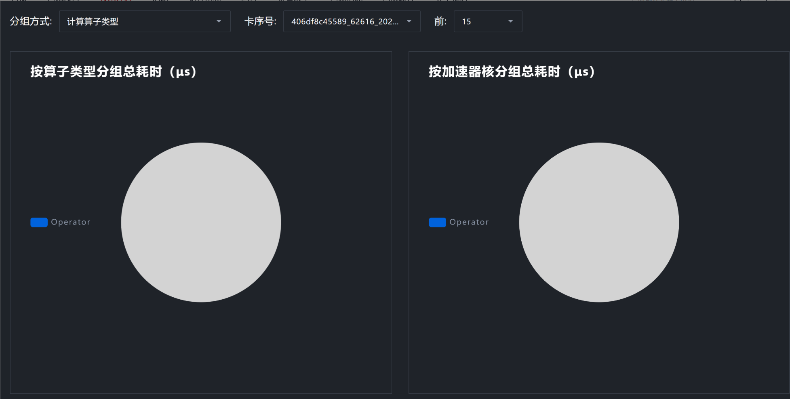
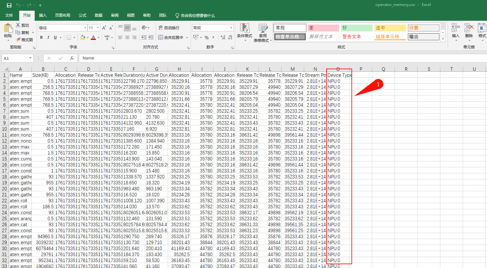

# System view没有内容

## 问题现象

在采集配置正常的情况下，采集到的profiling数据在MindStudio Insight中System view没有内容，情况如下：

还表现为Operator页签无内容，如下：

## 问题原因

使用 torch_npu 旧版本，如 2.5.1.post1.dev20250722 时，采集到的 operator\_memory.csv文件中Device信息不正确，在进行ASCEND_RT_VISIBLE_DEVICES资源配置时，每个Device会存在Device Id和Device索引值两个内容，operator_memory.csv中记录了Device索引值，与其他文件的Device Id不一致导致System view、Operator界面无法正常显示。2025/08/06后的torch_npu已修复此问题。

## 解决方案

1. 手动修改operator_memory.csv内容

根据配置的ASCEND_RT_VISIBLE_DEVICES信息修改operator_memory.csv文件中的Device Type列内容

注意此处应修改为局部DeviceId，而非全局RankId。举例，若单节点8卡，双节点共16卡，全局rankId为0至15，而DeviceId为0至7；RankId=8为第二个节点DeviceId为0的卡，RankId=9为第二个节点DeviceId为1的卡，以此类推。
2. 版本更新
2025/08/06后的torch_npu已修复此问题，更新torch npu到2025/08/06后的版本。
