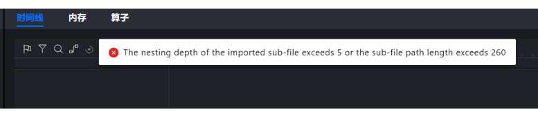

# 导入问题常见报错

## 1. 导入文件后，显示文件路径过长或者文件嵌套层数过深

**Q：**

The nesting depth of the imported sub-file exceeds 5 or the sub-file path length exceeds

**A：**

1. 首先排查是否文件路径过长，如果**文件路径长度超过260**则可以修改文件路径名称；
2. 然后排查是否文件嵌套过深，如以**导入目录到trace_view.json文件的嵌套层数**是否超过5层来判断，如果超过5层则可以修改嵌套深度；
   
   
3. 检查导入文件是否为有效数据，文件是否有损坏或不完整
4. 如果以上方法均不可以，可联系Insight工具接口人进一步定位。
   