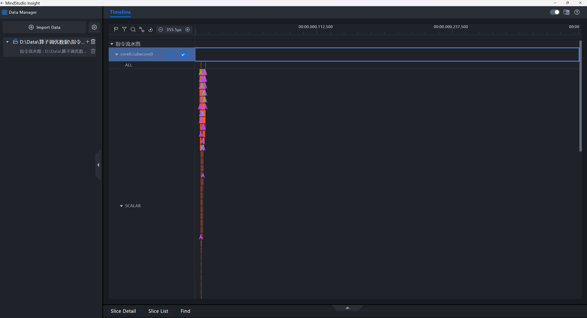
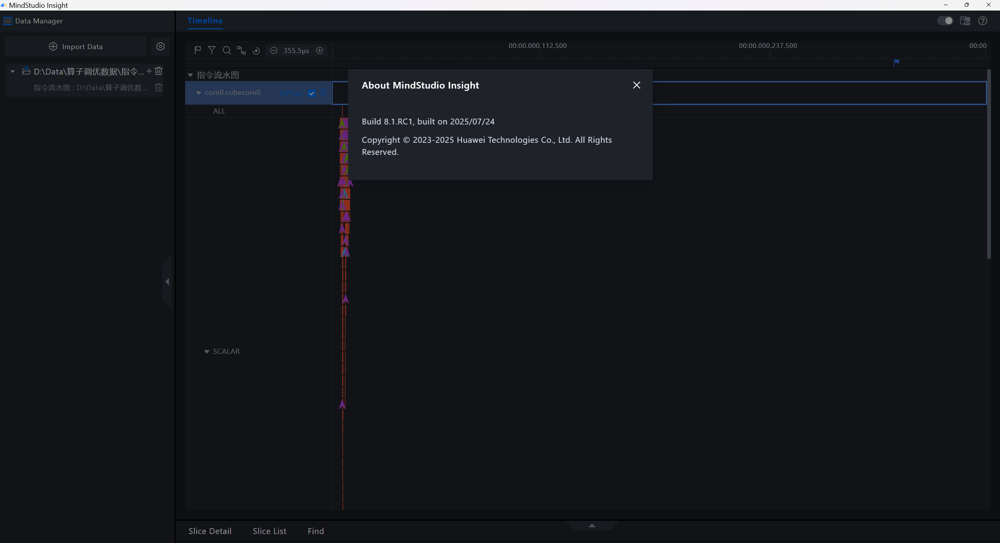

# 同文件夹下多JSON文件Timeline显示问题

## 问题现象

当在同文件夹下放置多个JSON时，多开MindStudio Insight想同时查看多个JSON文件对应的timeline页面时，会出现只有一个页面能显示对的情况，其它页面会出现无显示或者显示错误的情况，举例如下：

无显示

显示错误

示例版本号

## 问题原因

MindStudio Insight解析JSON文件后会生成db文件，方便后续查询，当如果一个目录下有多个JSON，仍然只会生成一个db，所以后解析的文件内容会覆盖先解析的文件内容，导致先打开的文件内容不对。

## 解决方案

删除db文件后，将多个JSON文件分开在不同文件夹下，重新导入。
