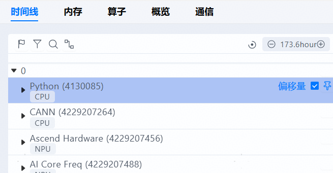
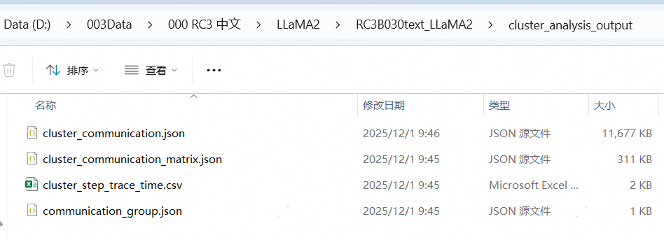
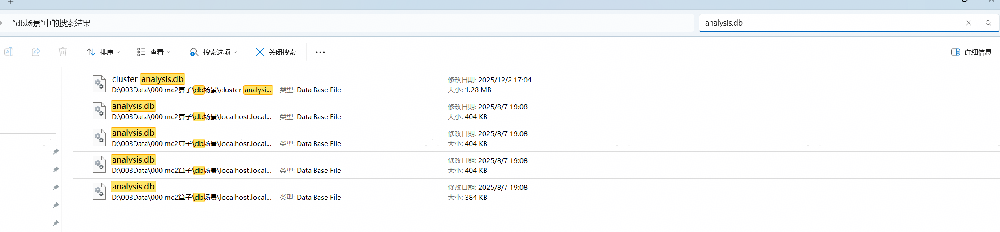

## 问题现象

### 为什么泳道看着不习惯

想要这样的👇

但得到了这样的👇

### 为什么常见的csv交付件不见了

想要这样的：

但得到了这样的：

## 原因

profiling采集交付件分为**Text类型**与**DB类型**，8.1.RC1之后的CANN包Profiling采集时，若选择输出Text交付件，会同时生成Text与DB类型数据，Insight会优先识别为DB数据。

DB数据的优点是磁盘占用小，文件解析加载更快。但部分用户可能不习惯新的DB交付件，和新的泳道排布关系，想要恢复为text场景。

## 解决方式

在数据目录搜索并删除所有DB交付件，包括ascend_pytorch_profiler_x.db、analysis.db文件，则Insight只会识别Text数据。

