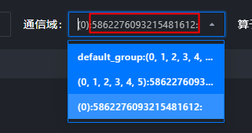
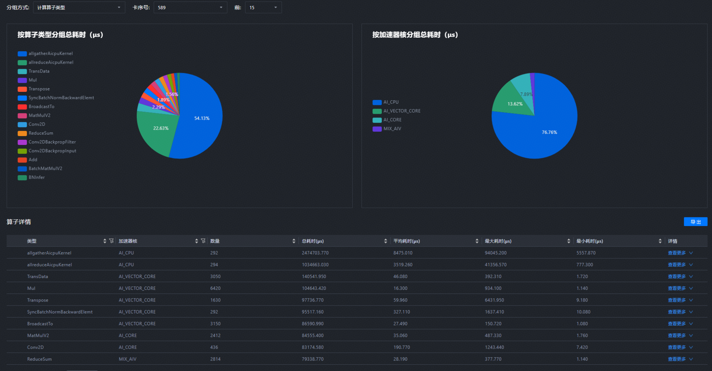
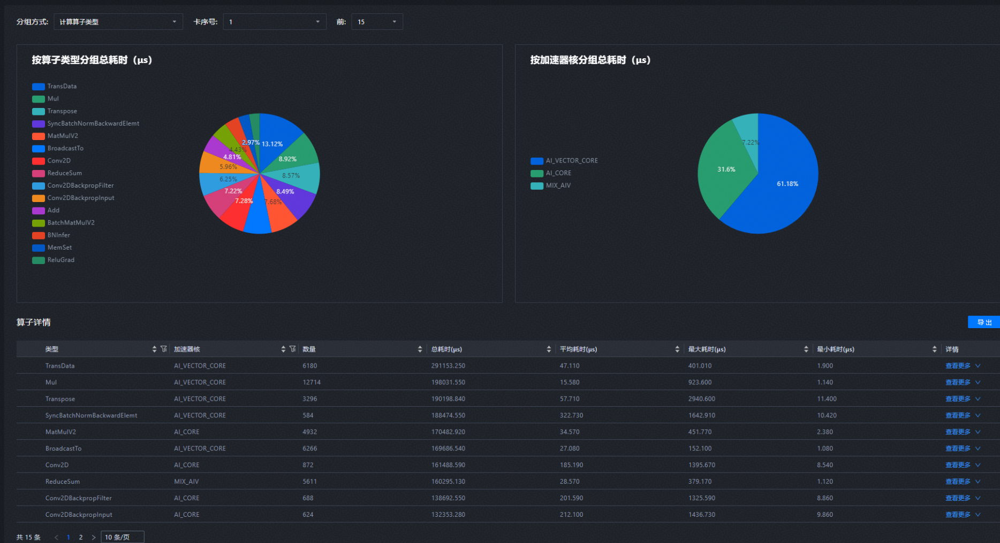
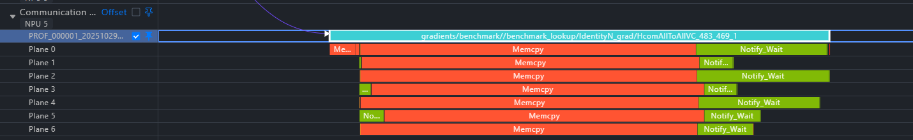
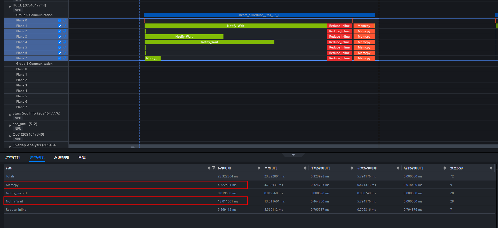
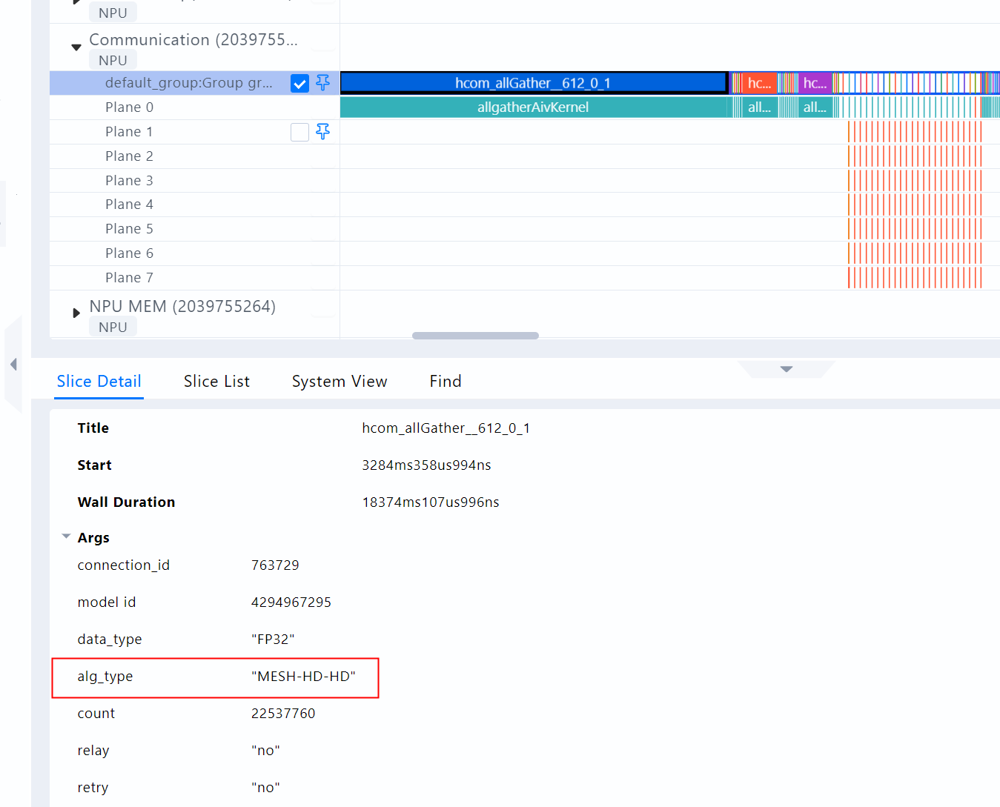
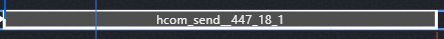
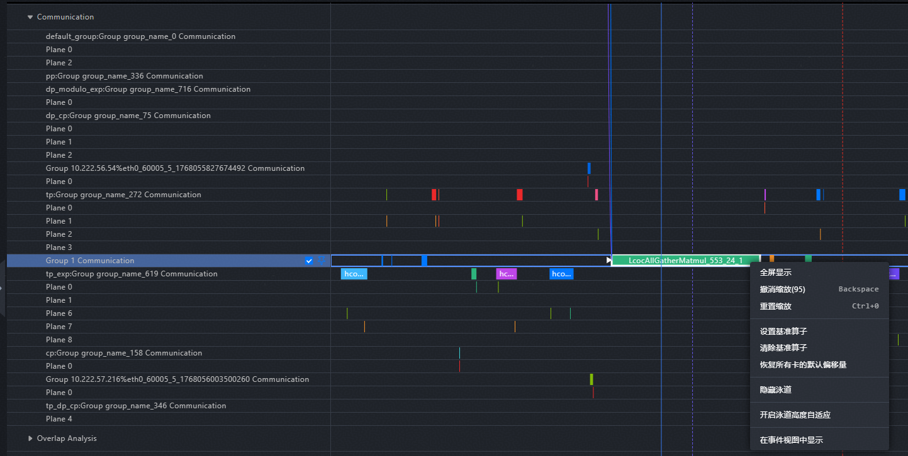
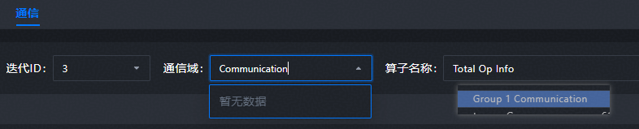

### A3日志通信域有异常值

#### 问题描述：

A3四卡8die的作业，通信域中有异常大的值，工具版本8.2.RC1



#### 解决方法：

这个字符串不是异常值，是profiling在不同集合通信域采集到的不同哈希值，用于区分不同集合通信域的唯一标识。在profiling采集不到通信域具体类型时，会用这个唯一标识值区分同一个RankSet但不同通信域的情况(比如上图中有两个包含RankSet为0, 1, 2 ,3, 4, 5的通信域，但并不是同一个通信域，里面的通信行为也有不同)。

---
### A3 aicpu相关算子采集问题

#### 问题描述：

在A3上采集到的Profiling数据显示模型有很大一部分AICPU相关算子



但是对应在A2上采集到的数据就没有AICPU相关算子，这是什么原因，A3和A2在算子上有区别，还是profiling采集的问题？



工具版本：8.1.RC1


#### 解决方法：

从截图中看出 A3 算子里有 allgatherAicpuKernel，名称中带了 “Aicpu”报的是 aicpu 类型，所以归到aicpu操作里了。

分析其中的名字，可以知道这些算子是通信算子走aicpu展开的场景。

---
### Communication不同Plane下的数据统计分析咨询

#### 问题描述：

以HcomAllToAllVC算子为例，有办法分别统计算子中Memcpy的耗时与Notify_Wait的耗时？



#### 解决方法：

框选这个区间可以查看统计数据


---
### MindStudio Insight 在查看all gather通信算法时遇到了自带后缀HD的情况

#### 问题描述：

【芯片类型】910B3

【cann版本】8.0.RC3

【框架】torch 2.5.1；torch-npu 2.5.1.post1.dev20250619

【采集方式】

```
+def get_npu_profiler(option: DictConfig, role: Optional[str] = None, profile_step: Optional[str] = None):
+    """Generate and return an NPU profiler object.
+
+    Args:
+        option (DictConfig):
+            The options to control npu profiler.
+        role (str, optional):
+            The role of the current data collection. Defaults to None.
+        profile_step(str, optional):
+            The current training step. Defaults to None.
+    """
+    if option.level == "level_none":
+        profile_level = torch_npu.profiler.ProfilerLevel.Level_none
+    elif option.level == "level0":
+        profile_level = torch_npu.profiler.ProfilerLevel.Level0
+    elif option.level == "level1":
+        profile_level = torch_npu.profiler.ProfilerLevel.Level1
+    elif option.level == "level2":
+        profile_level = torch_npu.profiler.ProfilerLevel.Level2
+    else:
+        raise ValueError(f"level only supports level0, 1, 2, and level_none, but gets {option.level}")
+
+    profile_save_path = option.save_path
+    if profile_step:
+        profile_save_path = os.path.join(profile_save_path, profile_step)
+    if role:
+        profile_save_path = os.path.join(profile_save_path, role)
+
+    experimental_config = torch_npu.profiler._ExperimentalConfig(
+        aic_metrics=torch_npu.profiler.AiCMetrics.PipeUtilization,
+        profiler_level=profile_level,
+        export_type=torch_npu.profiler.ExportType.Text,
+        data_simplification=True,
+        msprof_tx=False,
+    )
+
+    activites = []
+    if option.with_npu:
+        activites.append(torch_npu.profiler.ProfilerActivity.NPU)
+    if option.with_cpu:
+        activites.append(torch_npu.profiler.ProfilerActivity.CPU)
+
+    prof = torch_npu.profiler.profile(
+        with_modules=option.with_module,
+        with_stack=option.with_stack,
+        record_shapes=option.record_shapes,
+        profile_memory=option.with_memory,
+        activities=activites,
+        on_trace_ready=torch_npu.profiler.tensorboard_trace_handler(profile_save_path, analyse_flag=option.analysis),
+        experimental_config=experimental_config,
+    )
+    return prof
```

我在项目中export了通信算法`export HCCL_ALGO="allgather=level0:NA;level1:H-D_R"`，在不带verl框架显示为MESH-HD，verl框架下显示如下图，项目中没有找到其他设置通信算法的地方


#### 解决方法：

【问题】
为何通信算法中会多一个HD

【原因】
采集 level 配置的原因。level1 是 MESH-HD , level2 是 MESH-HD-HD

---
### hcom_send应如何找到对端 

#### 问题描述：



hcom_send应如何找到对端hcom_receive有什么规则

#### 解决方法：

【问题分析】
用户希望找到 hcom_send__447_18_1 对应的 receive 通信算子。send 和 receive 会在相同的通信域中进行通信。

【解决方案】

1. 注意到 hcom_send 后面带 `447_18_1` 这是一个唯一标识符，用户可以通过全局搜索 `447_18_1` 找到  对应的 hcom_receive__447_18_1；
2. send 和 receive 会在相同的通信域中进行通信。到这个 send 对应的泳道上右键，点击 “置顶相同通信域”可以将对应 receive 的通信域泳道也一起置顶。

---
### 右键通信算子无法跳转到通信，通信选项卡中找不到对应通信域

#### 问题描述：

右键通信算子，菜单中缺少跳转到通信 和置顶相同通信域的选项



通信选项卡中找不到对应通信域



#### 解决方法：

【问题分析】
置顶相同通信域功能要求通信域名称不能只是数字

采集侧采集了纯数字的数据，数据本身存在问题。

---