# MindStudio Insight打开profiling数据文件，信息显示不全

## 问题描述

用MindStudio insight打开profiling文件夹./localhost.localdomain_355720_20251204222740460_ascend_pt，只显示CANN层以上的profiling信息

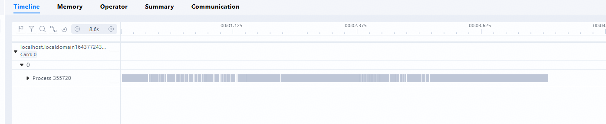

如果打开文件夹内部的文件夹./localhost.localdomain_355720_20251204222740460_ascend_pt/PROF_000001_20251204222740461_RKFAKPJFMEEOIMMB，只显示CANN层及以下的profiling信息

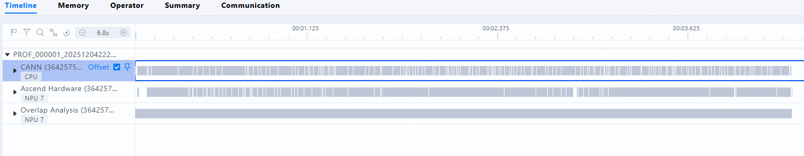

MindStudio版本信息：8.2

硬件使用 A5。

## 解决方法

A5当前导出db存在已知问题，手动拦截了db导出。

建议将 ASCEND_PROFILER_OUTPUT 文件夹下的 db 文件均删除，使用 TEXT 格式数据读取。

---

## 无法导入项目

### 问题描述

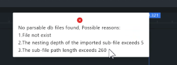

用MindStudio Insight打开profiling，显示无法打开。已排查2和3，profiling中的steptrace也能用google perfetto正常打开。

工具版本：Insight 8.1 

### 解决方法

Insight 版本更新到 8.2 版本及以上

---

## cluster_analyze集群分析结果MindStudio Insight无法识别

### 问题描述

客户的内网采集了 128 机的 profiling 之后，使用 `msprof-analyze cluster all -d {profiling\_path}` 命令执行出来的结果，MindStudio Insight 工具识别不了

命令执行的过程中有很多warning：
`Rank 58 does not have valid communication data and communication\_matrix data.`

`The dst local 993 of the operator allgather -bottom3@xxx cannot be mapped to the global rank.`

### 解决方法

【问题原因】

概览界面有显示，通信界面无显示，原因是cluster_communication_matrix.json缺少具体step，这会导致落盘数据库step记为`0`，但是cluster_step_trace_time.csv里step是`114`，对不上导致通信界面无显示。

【解决方案】

对单卡进行离线解析。

---

## MindStudio Insight多卡采集结果导入后无Summary Communication

### 问题描述

采集背景：llamafactory lora微调qwen模型，两卡单机。使用 `msprof --output=` 采集

能看到算子和时间线

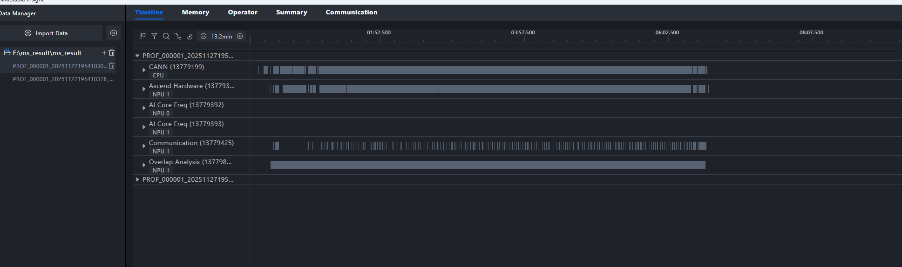

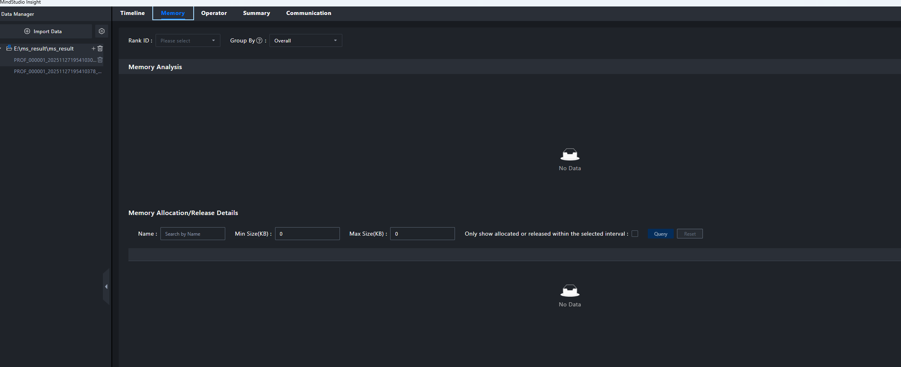

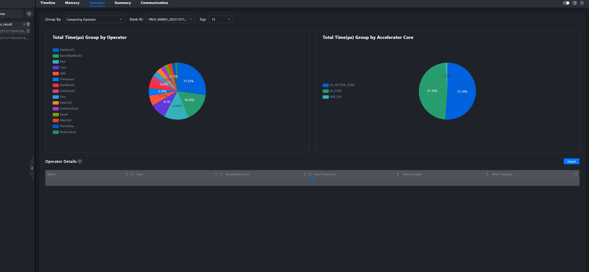

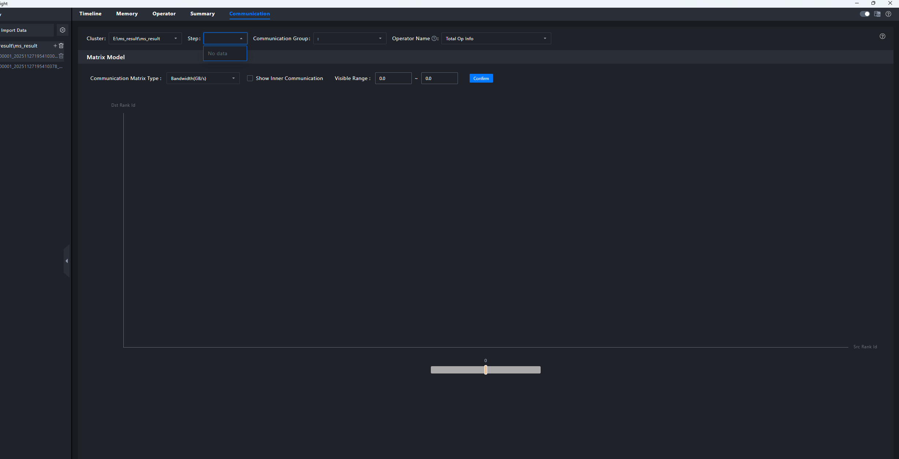

### 解决方法

【问题分析】
msprof 是采集 NPU 卡内的数据。而 Summary 和 Communication 显示的是卡间的数据。因此解析 msprof 采集的数据不会得到卡间的数据，Summary 和 Communication 也就没有数据。

【解决方案】

1. 使用 Ascend PyTorch Profiler，可以采集卡内和卡间的数据。https://www.hiascend.com/document/detail/zh/CANNCommunityEdition/850alpha001/devaids/Profiling/atlasprofiling_16_0033.html
2. mstt 可能支持对 msprof 数据的集群分析。

---

## L1采集集群信息没有集合通信和集群概览信息

### 问题描述

采集配置如下：

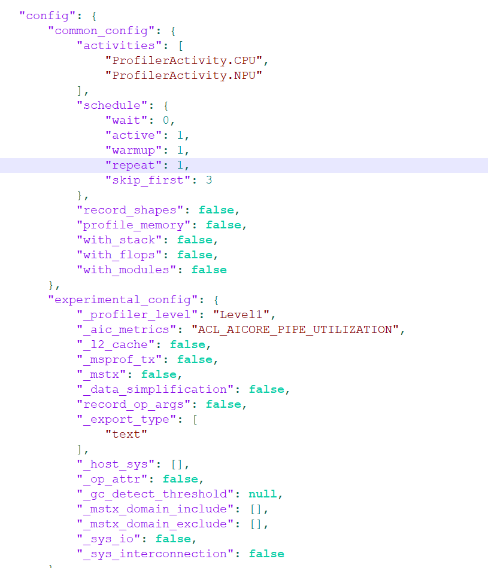

数据导入 Insight 后页面显示：

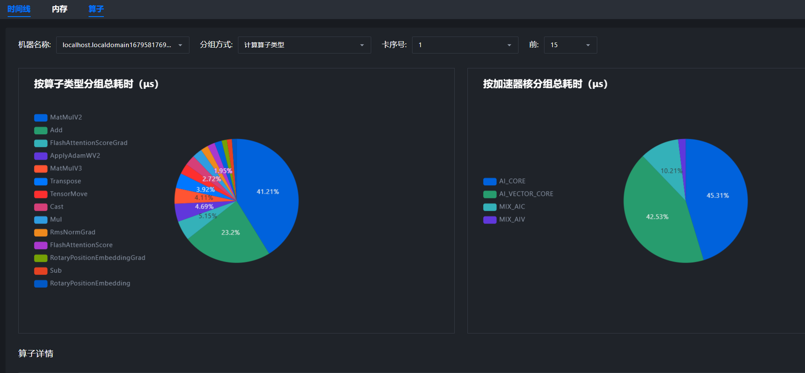

### 解决方法

分析数据没有问题，但 Insight 版本太老，更新 Insight 到 8.2 版本解决

---

## MindStudio Insight多卡采集结果导入后无NPU算子信息

### 问题描述

环境：镜像版本为：mindie:dev-2.1.RC1.B152-800I-A3-py311-ubuntu22.04-aarch64，

这是msprof采集后解析的结果：

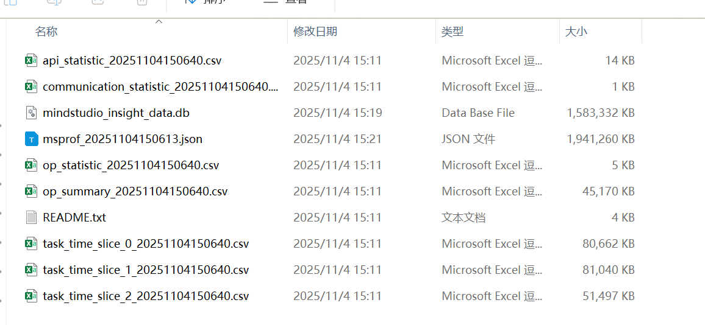

多卡的采集结果op_summary中存在NPU的算子信息，但是导入output文件后：

NPU无算子信息展示：

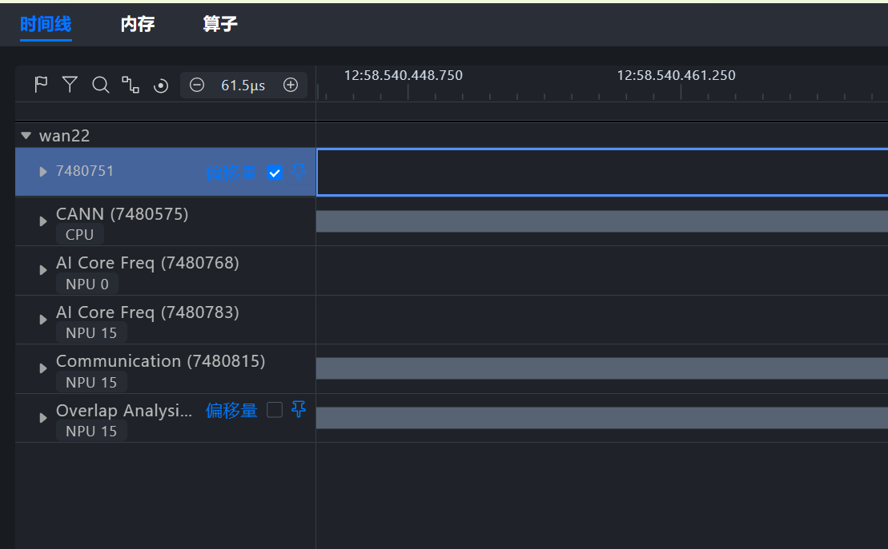

只更改卡数，单卡采集后的结果就存在NPU算子信息：

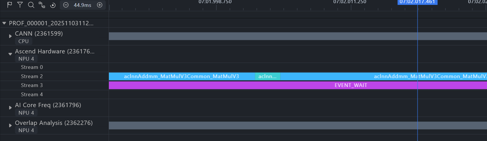

### 解决方法

【问题分析】
多卡数据在个人电脑中导入可以看到 Ascend Hardware 泳道。
猜测是因为之前解析过，但未解析完成就关闭 Insight，因此没有显示 Ascend Hardware 的泳道。
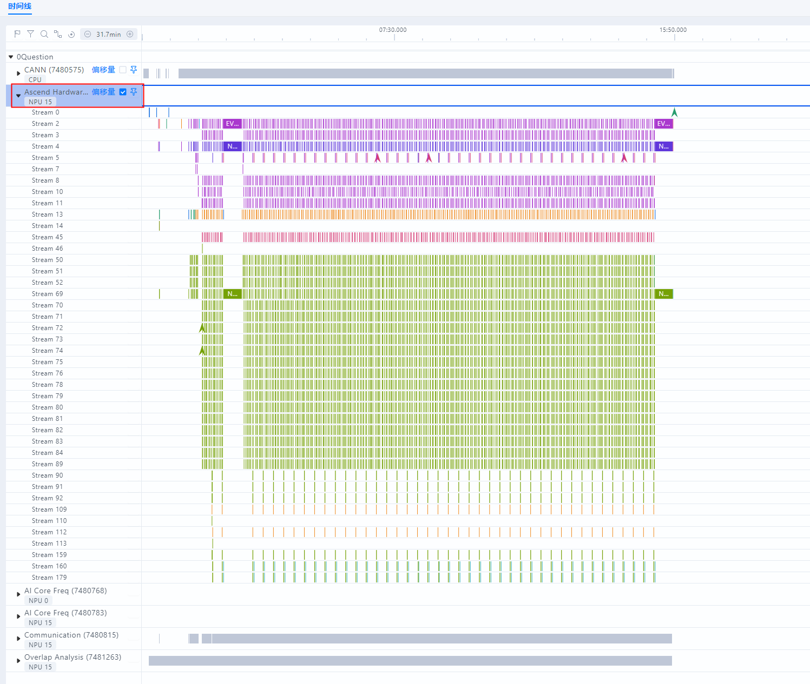

【解决方法】
删除导入目录下的 mindstudio_insight_data.db 缓存数据库，重新导入解析

---

## MindStudio Insight 如何查看GPU采集的profile的内存信息

### 问题描述

希望查看GPU采集的内存数据

### 解决方法

2025年 Insight 8 的版本，内存页签需要的数据文件是 memory_record.csv, npu_module_mem.csv, static_op_mem.csv 和 operator_memory.csv 文件。

GPU 应该没有这些数据生成，因此不能查看 GPU 采集的内存数据。

---

## 导入项目后Communication无数据呈现

### 问题描述

导入项目后Communication无数据呈现

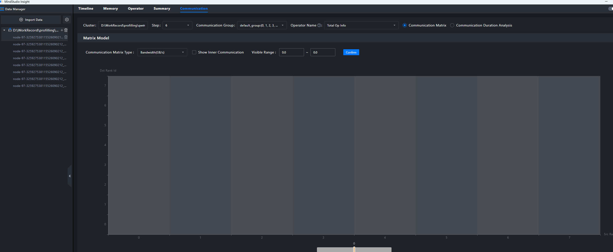

**工具版本：** Insight 8.2.RC1

**问题来源：** 昇腾计算训练开发部部门MinSpeed-MM团队

**模型使用场景：** qwen3vl-30B, 8卡

**性能问题描述：** 训练场景，开箱性能未达预期

#### 解决方法

【问题分析】
查看analysis.db，发现CommAnalyzerBandwidth表无数据

【解决方法】
怀疑profiling在线解析过程出错，建议离线解析试试看

---

## 【cluster】MindStudio Insight导入profiling数据后无结果

### 问题描述

使用MindStudio Insight导入使用msprof-analyze cluster all -d ./profile命令收集的集群性能数据，无响应

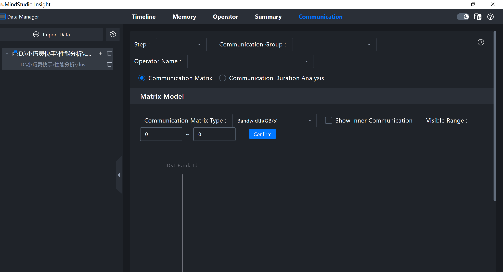

### 解决方法

mstt集群分析时未开启--data_simplification导致，insight不支持未精简模式数据。msprof-analyze cluster -m all -d {数据位置} --data_simplification 再执行一遍即可。和mstt同事确认了一下，后续会默认开启精简，干掉未精简模式。

---

## 【导入问题】MindStudio Insight 打开profile文件报错“No parsable db files found”

### 解决方法

【问题原因】

导入的文件夹中，PROF_***文件夹下有msprof.db，而ASCEND_PROFILER_OUTPUT中是text格式数据，MindStudio Insight会优先识别msprof.db，导致无法展示ASCEND_PROFILER_OUTPUT文件夹中的数据。

【解决方案】

导入时，只导入ASCEND_PROFILER_OUTPUT文件夹即可。

从采集上来说，出现ASCEND_PROFILER_OUTPUT中是text格式而PROF_***有msprof.db的原因是CANN用的是默认导出db的而框架侧profiling是旧的。

---

## 【导入问题】文件均存在，但无法导入No parsable db files found

### 问题描述

文件均存在，但无法导入

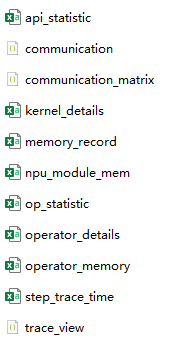

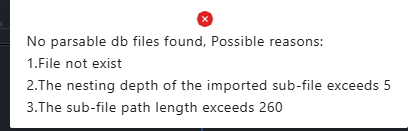

### 解决方法

【问题原因】

导入的文件夹中，PROF_***文件夹下有msprof.db，而ASCEND_PROFILER_OUTPUT中是text格式数据，MindStudio Insight会优先识别msprof.db，导致无法展示ASCEND_PROFILER_OUTPUT文件夹中的数据。

【解决方案】

导入时，只导入ASCEND_PROFILER_OUTPUT文件夹即可。

从采集上来说，出现ASCEND_PROFILER_OUTPUT中是text格式而PROF_***有msprof.db的原因是CANN用的是默认导出db的而PTA是旧的。建议更新PTA。

---

## MindStudio Insight 导入profiling数据时，看不到目录

### 问题描述

版本：8.1.RC1

重启Insight还是看不到

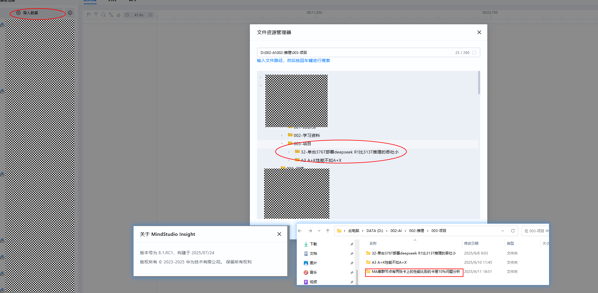

### 解决方法

【问题原因】

导入路径安全检验防护，主要字符为以下这些

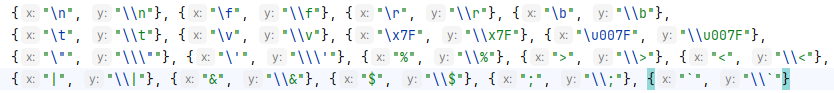

【后续措施】

可进行简单提示

---

## MindStudio Insight 解析数据nodata

### 问题描述

数据有，单解析nodata

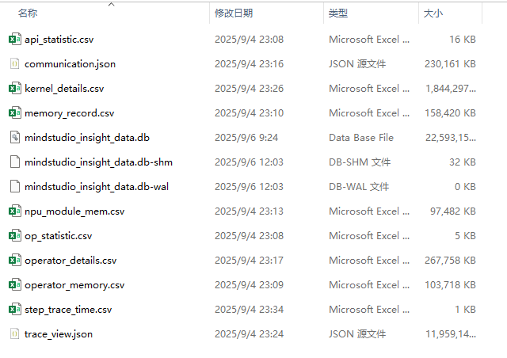

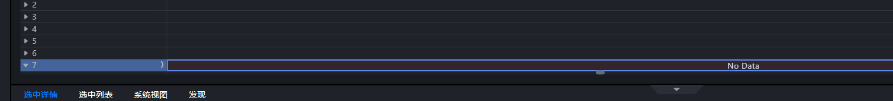

### 解决方法

重新导入后问题解决，可能的原因是数据文件过大，导致磁盘空间耗尽

---

## MindStudio Insight 打开profile没数据显示

### 问题描述

版本号 8.1.RC1

### 解决方法

是因为profiling数据中缺失了trace_view.json文件导致，下载该文件后显示正常

---

## 打开JSON文件没有trace图显示

### 问题描述

版本号 8.2.RC1

### 解决方法

【错误原因】

采集侧问题，和MindStudio Insight无关，采集侧的时间跨度过大，而timeline界面初始显示的时间跨度就是采集侧的时间跨度。

【解决方案】

可以先任意搜索一个事件，界面会自动放大到对应大小，然后使用wasd查看。

---

## MindStudio Insight打开性能仿真图trace.json报错

### 问题描述

通过msprof op simulator生成算子仿真图

通过MindStudio Insight打开trace.json文件失败，报错如下:

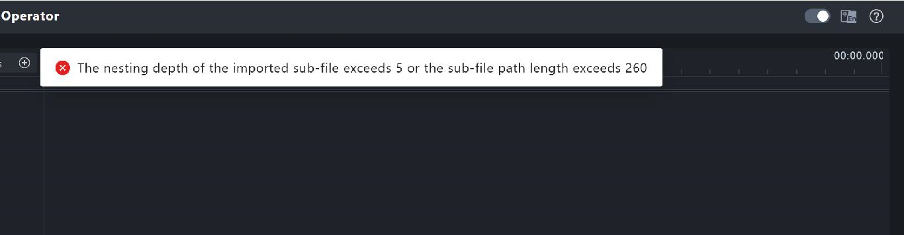

### 解决方法

【问题原因】

客户从vscode上下载原始数据后，JSON数据格式变成了bin文件格式，导致解释识别失败

【解决方案】

将原始数据改回JSON数据后即可成功导入

【进一步提升】

客户使用老版本Insight报错提示不够准确，新版本Insight在错误提示上更加友好，可持续优化

---

## 无法加载profiling，一直转圈

### 问题描述

jupyter 版本
一开始能加载，突然弹窗

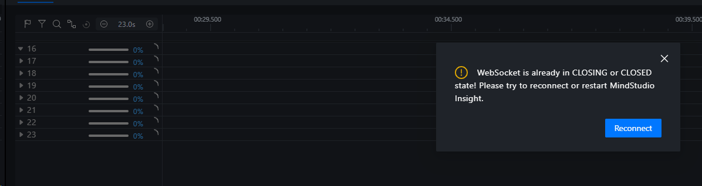

然后就一直转圈

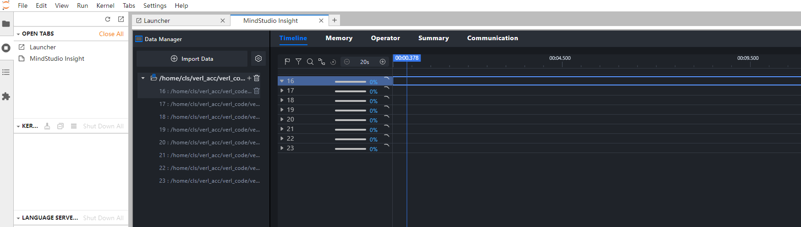

### 解决方法

【解决方案】

将数据下载到本地后，使用Windows版本打开，能够正常展示。

【遗留问题】

1.定位Jupyter无法加载和断连的原因。

2.ACC PMU无法展示，原因是单个泳道数据过多，导致前端通信量承载不了，致使断连，Counter泳道在迭代四已通过采样减小数据量。用户数据单卡导入是不会出现无法加载和断连现象的

---

## 使用msprof采集集群profiling，没有集群通信信息

### 问题描述

* 打开集群profiling后，没有集群通信信息

### 解决方法

检查下是不是采集时profiler等级为Level0，改成Level1；

如果Level1仍然没有，且采集方式为msprof通用命令(而非AI框架接口命令),检查下是不是没做通信性能数据解析，参考命令：

```bash
msprof --export=on --output=<dir>
msprof --analyze=on --output=<dir>
```

[解析并导出性能数据-MindStudio8.1.RC1-昇腾社区](https://www.hiascend.com/document/detail/zh/mindstudio/81RC1/T&ITools/Profiling/atlasprofiling_16_0018.html)

---

## 采集vllm服务的profiling数据，MindStudio Insight 打不开

### 问题描述

采用/start_profile接口采集vllm服务的profiling数据，通过 MindStudio Insight 打开报错The nesting depth of the imported sub-file exceeds 5 or the sub-file path length exceeds，目录超深或路径超长，但实际未超深或超长。

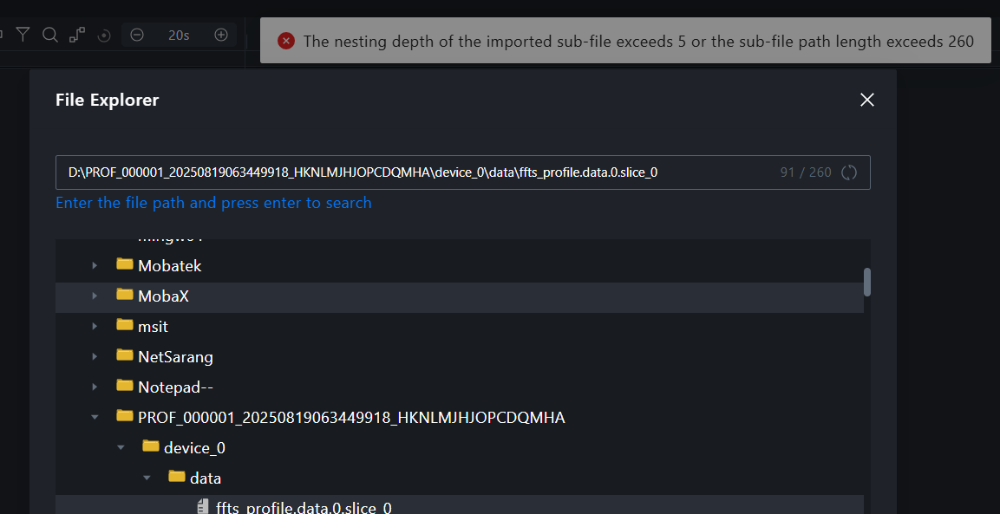

采集的profiling数据中没有mindstudio_profiler_output目录。

### 解决方法

若不存在超长、超深目录，可怀疑是交付件有损坏或不完整。最新版本insight里已经加上了此提示。

常见导致profiler交付件不完整的原因，一种是profiler数据​**仅采集，未解析**​，​**缺少解析相关交付件**​。

可按照profiler官方文档，根据采集方式，确认交付件是否完整。

vllm-ascend应该封装了Ascend PyTorch Profiler接口，按照该命令离线解析即可

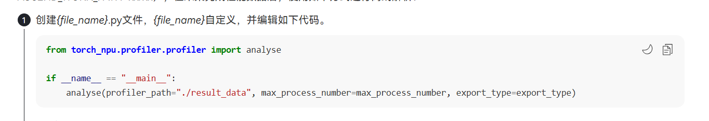

[离线解析-MindStudio8.1.RC1-昇腾社区](https://www.hiascend.com/document/detail/zh/mindstudio/81RC1/T&ITools/Profiling/atlasprofiling_16_0091.html)

①(PROF_XXX、FRAMEWORK)经过解析，得到交付件②(ASCEND_PROFILER_OUTPUT)

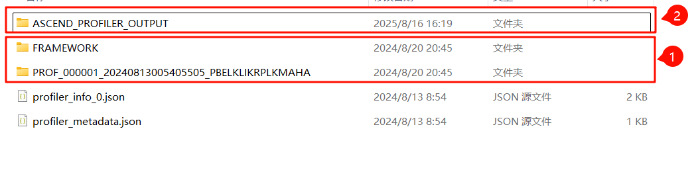

用户回复：确认是没有解析，建议优化错误提示。

通过如下脚本解析后可以正常加载。

```python
from torch_npu.profiler.profiler import analyse

if __name__ == "__main__":
    analyse(profiler_path="path/to/profiling")
​
```

---

## 打开两个文件，数据消失

### 问题描述

打开两个JSON文件，存在数据丢失情况

### 解决方法

你的两个 JSON 文件在同一个目录下，解析数据保存的 .db 文件相同，因此同时打开两个JSON 文件，解析数据会覆盖。要同时打开两个 JSON 文件，可以通过工程内导入解决这个问题，930主线版本会优化这个问题。

---

## Profiling数据导入不显示

### 问题描述

Profiling数据导入MindStudio Insight后不显示通信分析，重启及删除原有旧文件重启后仍未解决。第二天重新导入Profiling数据成功显示。

### 解决方法

【错误原因】

这份数据有通信耗时数据，但是没有通信矩阵数据

目前insight中对集群数据的解析逻辑是先解析矩阵数据，再异步解析通信耗时数据

解析完矩阵数据后，前端页面会提前渲染，然而由于矩阵数据内容为空，导致下拉框内容都无数据。后续在通信耗时数据解析完后，下拉框内容没有刷新，导致始终无内容展示。

【规避方法】

重启insight，打开已经解析完整的数据

【修改方案】

通信耗时数据解析完成时，刷新上侧下拉框内容

---

## msprof工具采集db数据后，MindStudio Insight 无法导入

### 问题描述

msprof工具采集db数据后，MindStudio Insight 无法导入：

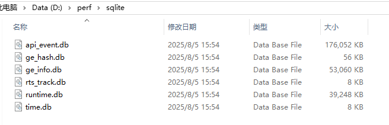

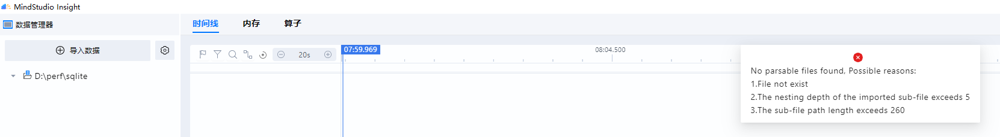

### 解决方法

【错误原因】

该场景是一张卡上跑多个进程，无法用msprof进行采集，后改为用动态profiling进行采集，timeline能够正常展示，memory页面缺少相关数据所以不展示，operator页面无法显示数据，原因是单文件夹下只有一个msprof_*.db的导入方式缺少deviceId。

【规避方法】

1. 使用Q1商用版本进行规避。

【修改方案】

新特性的引入导致当前对离线推理msprof场景的导入约束较为严格，后续会进行分析，适当放宽msprof场景的导入约束。

---

## MindStudio打开cluster结果后communication group丢失

### 问题描述

#### 使用背景

组织：四野 诺亚

4096p训练多模态7Bv5 cluster分析

#### 工具版本

MindStudio-Insight\_8.1.RC1\_win.exe

#### 问题详细描述

MindStudio打开cluster结果后仅剩communication group 0，原本是4096p卡的cluster结果

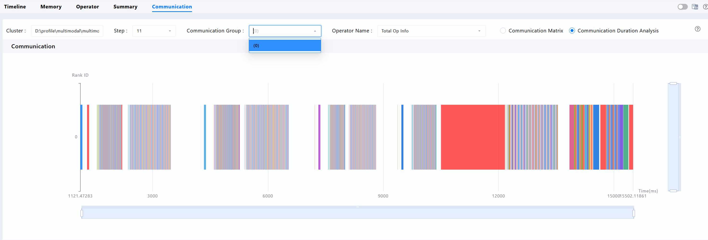

查看communication_group.json，原始确实包含大量的communication group

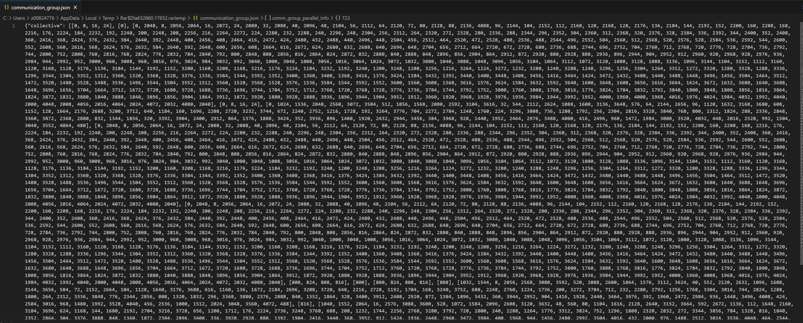

### 解决方法

【错误原因】

集群导入时，未识别到cluster_communication_matrix.json文件(导入逻辑未考虑只存在cluster_communication.json不存在cluster_communication_matrix.json的情况，即未适配过mstt集群分析的time模式)，对所导入的0卡重新调用了mstt集群分析功能，​**用0卡集群分析将结果错误地覆盖了全量卡集群分析结果**​，导致Communication只看到0卡。

【规避方法】

1. 直接导入cluster analysis output子目录，则不会走到以上覆盖逻辑。
2. 对全量卡手动调用集群分析的communication matrix模式，把cluster_communication_matrix.json文件补充到cluster analysis output中。

【修改方案】

集群导入解析时存在错误逻辑，流程如下：

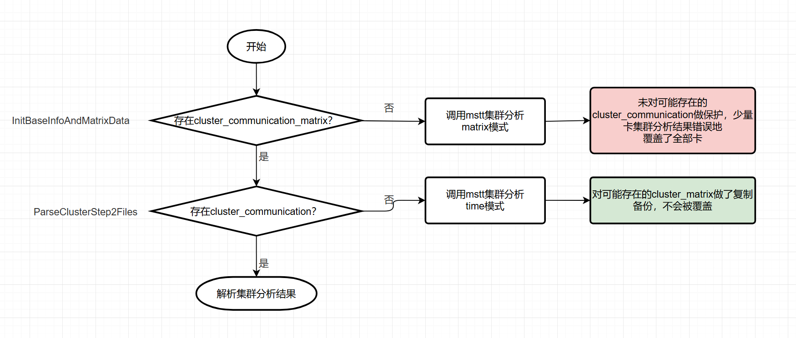

修改为以下正确流程即可：

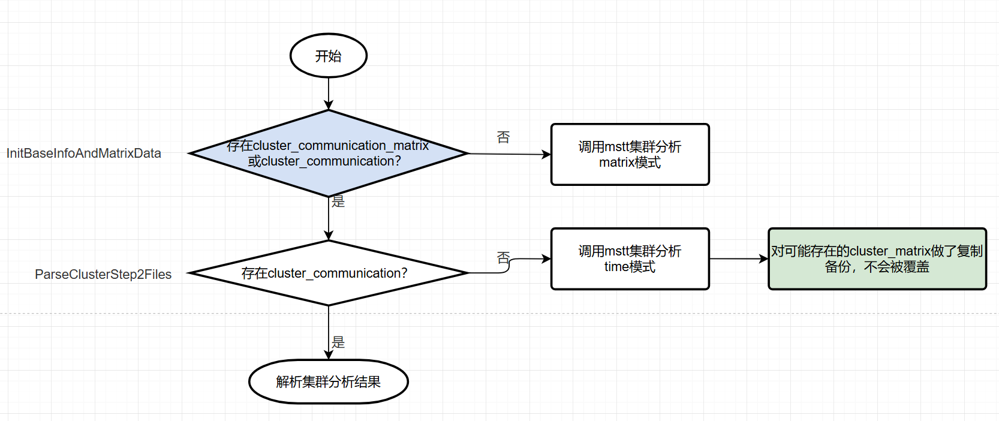

---

## 80G左右的profiling文件，导入MindStudio Insight后，无法加载

### 问题描述

通过verl框架后训练Qwen3-32B模型，采集了一个步骤的性能数据(level1)，数据解析后整个文件大概80G左右，导入MindStudio Insight后，没有加载出可视化的性能解析数据，也没有相关报错 @x30025753 (肖遥)

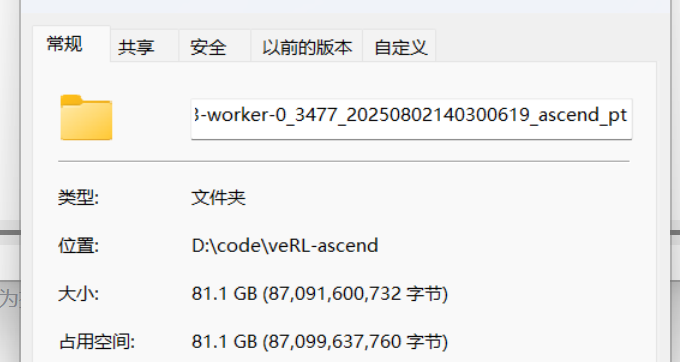

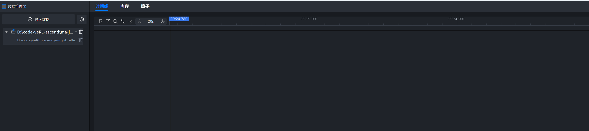

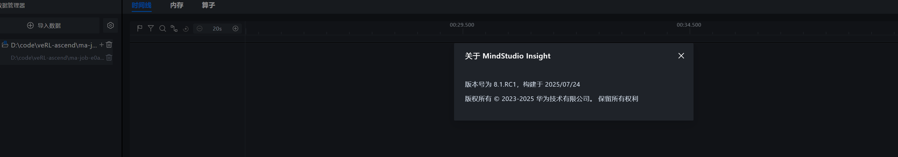

### 解决方法

verl rollout阶段采集的性能数据过大，调小batch size和prompt+response长度或者将profiling加到vllm里， 只采集少量decode步骤，可以减小采集的数据量大小
