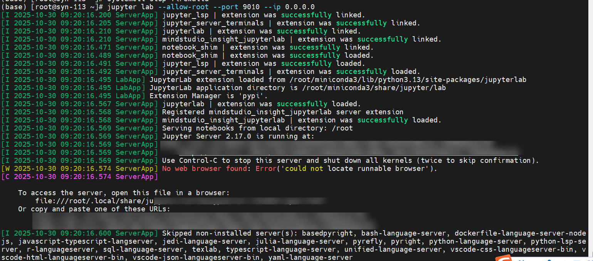
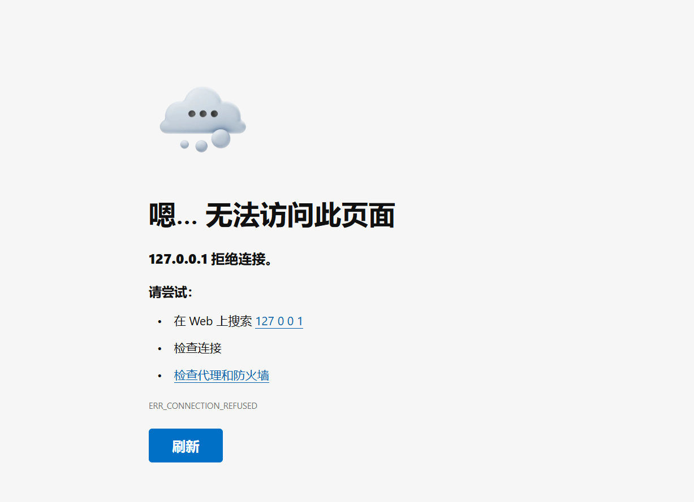

# jupterlab相关问题修复

## 使用 mindstudio_insight_jupyterlab 版本无法打开网页

### 问题描述

使用 mindstudio_insight_jupyterlab 版本无法打开网页

### 解决方法

【问题分析】
`127.0.0.1` 指本机的地址，Jupyterlab 运行在远程服务器上，因此本机访问需要传入远程服务器地址才能访问 Jupyterlab。

【解决方案】
使用 linux 服务器 ip 地址可以打开
