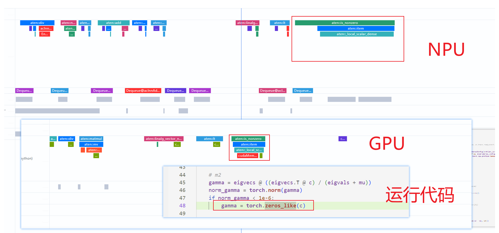
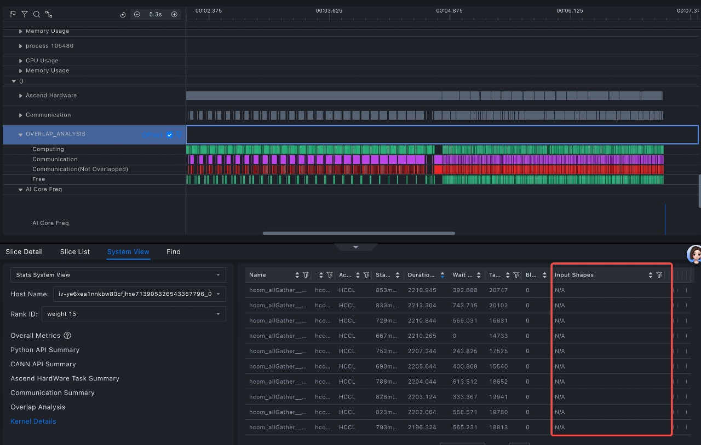
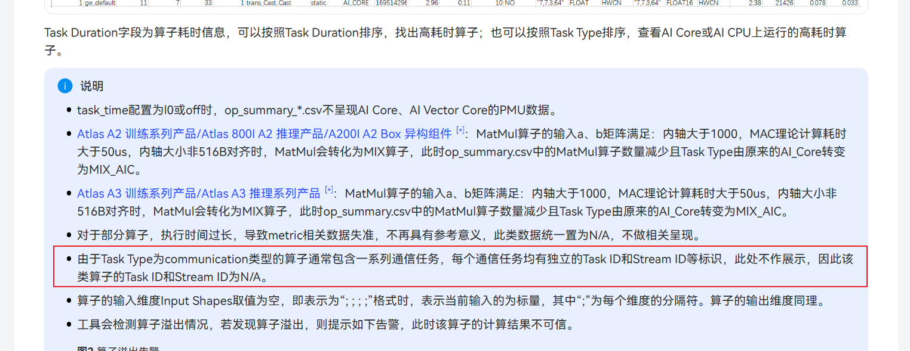
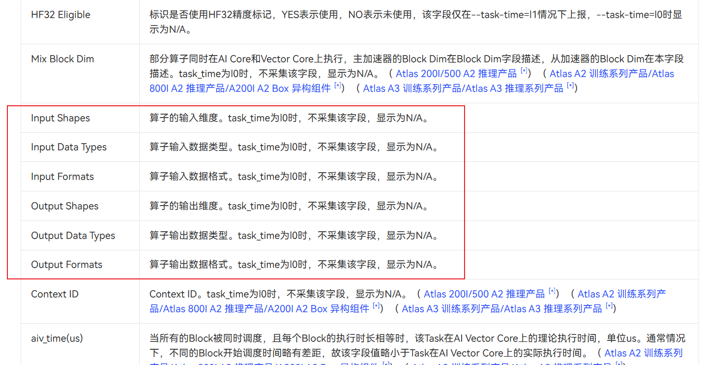

# operator页签问题汇总

## 如何同时打开多个文件，以便可对比

### 问题描述

如何同时打开多个文件，以便可对比

### 解决方法

1. 提供产品文档，按文档操作未实现对比效果https://www.hiascend.com/document/detail/zh/mindstudio/81RC1/GUI_baseddevelopmenttool/msascendinsightug/Insight_userguide_0028.html

2. 放在不同的工程下，分别设置baseline、compare即可。

---

## 调用torch_zeros_like没有采集到NPU执行算子

### 问题描述

调用 `torch_zeros_like` ,NPU上没有相应的操作，是工具没有采集到么还是什么原因，我看API是支持的，这里性能要慢4倍。



### 解决方法

这是正常的，NPU和GPU的实现不同。且在NPU上也没有这个下发的连线，是直接在 cpu 侧进行 copy 的

---

## 开启了算子的shape采集，MindStudio Insight 中不显示

### 问题描述

**问题现象：**

profile采集时开启了torch_npu.profiler.ProfilerActivity.CPU,与record_shapes=True,

但是工具中并没有显示

**软件版本：**


**profile采集配置：**

```python
experimental_config = torch_npu.profiler._ExperimentalConfig(
    export_type=[
        torch_npu.profiler.ExportType.Text,
        torch_npu.profiler.ExportType.Db
    ],
    profiler_level=torch_npu.profiler.ProfilerLevel.Level0,
    msprof_tx=False,
    mstx_domain_include=[],
    mstx_domain_exclude=[],
    aic_metrics=torch_npu.profiler.AiCMetrics.AiCoreNone,
    l2_cache=False,
    op_attr=False,
    data_simplification=False,
    record_op_args=False,
    gc_detect_threshold=None,
    host_sys=[
        torch_npu.profiler.HostSystem.CPU,
        torch_npu.profiler.HostSystem.MEM],
    sys_io=False,
    sys_interconnection=False
)
begin = time.time()

with torch_npu.profiler.profile(
        activities=[
            torch_npu.profiler.ProfilerActivity.CPU,
            torch_npu.profiler.ProfilerActivity.NPU
        ],
        schedule=torch_npu.profiler.schedule(wait=0, warmup=0, active=1, repeat=1, skip_first=0),
        # 与prof.step()配套使用
        on_trace_ready=torch_npu.profiler.tensorboard_trace_handler("./result"),
        record_shapes=True,
        profile_memory=True,
        with_stack=True,
        with_modules=False,
        with_flops=False,
        experimental_config=experimental_config) as prof:
```

### 解决方法

HCCL 类型的算子没有该列数据值。



tensor 列同理



---
