# Timeline 汇总issue以及解决措施

## 打开两个页面打开profiling无法统计数据 耗时显示有误

### 问题描述

同时打开两个insight窗口看两份prof，有一份无法选中查看事件统计信息，点中时间耗时计算有误。

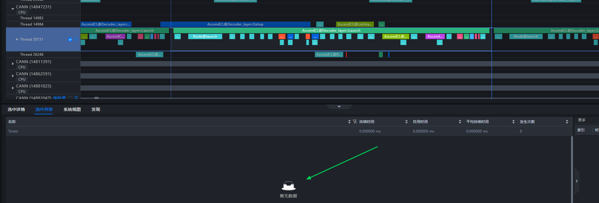

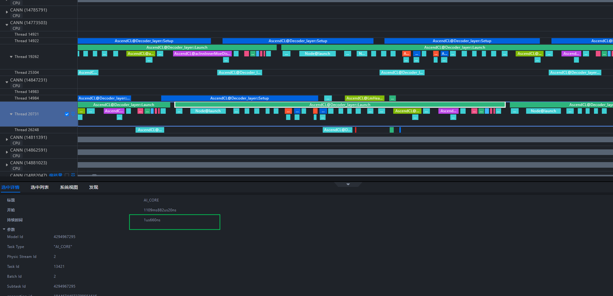

工具版本：Insight 8.1

### 解决方法

【错误原因】
两份prof在同一个文件夹下，会读写同一个.db文件，互相覆盖而导致其中一个有错误。

【解决方案】
删除db文件后，将多个文件分开在不同文件夹下，重新导入。

---

## timeline Overall Metric无数据问题

### 问题描述

手动修改源文件后，用 MindStudio_insight_jupyter 打开 profiling 数据 Overall Metric 仍然显示 no data。

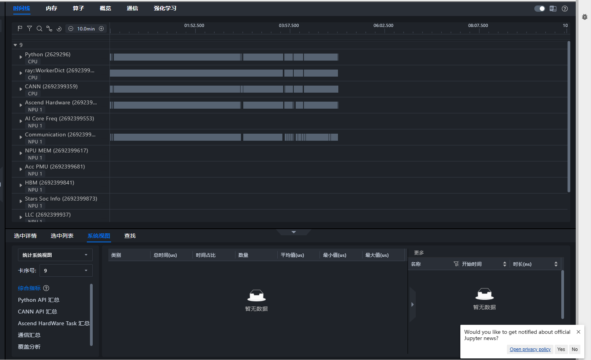

### 解决方法

【背景】
torch npu旧版本遗留bug。我们解析rank-device映射，用的是operator_memory.csv，而旧版本torch npu出问题，把NPU编号全都映射到0去了。因此，要么手动修改源文件operator_memory.csv的Device Type列到正确NPU编号，要么更新torch npu版本到2025/08/06之后的版本。

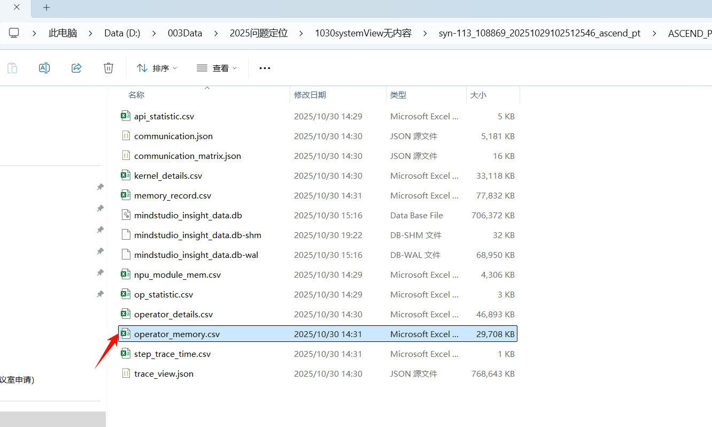

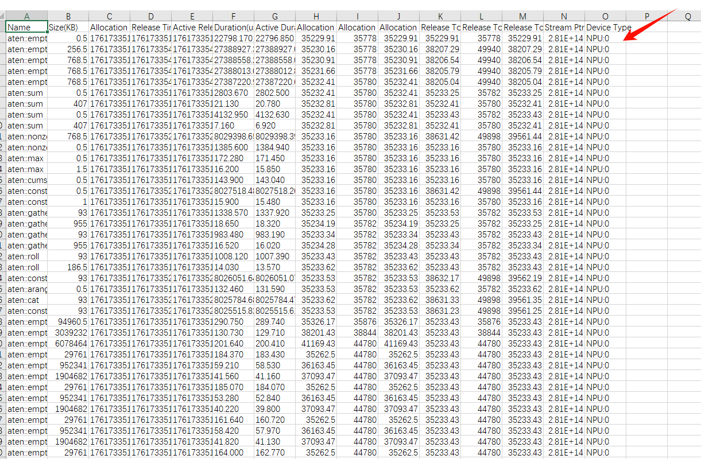

【定位过程】
查看源文件，发现用户修改 Device Type 为 NPU:9，而其他文件中显示 NPU Type 为 NPU:1
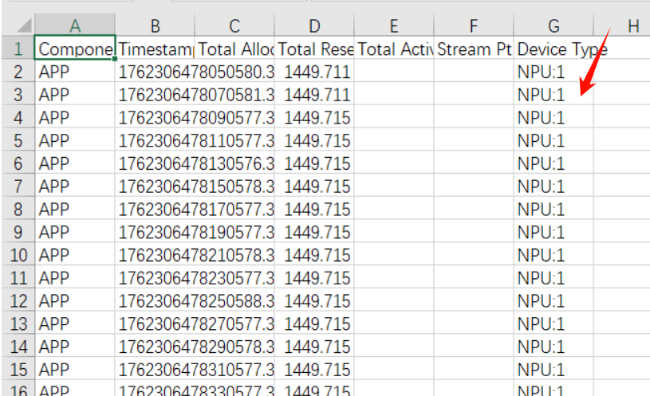

9 是全局 RankId，Device Type 应修改为节点内局部 ID(即，若单节点8卡，双节点共16卡，全局rankId为0至15，而DeviceId为0至7)，即RankId=9 为第二个节点的1卡，因此此处 Device Type 修改为 NPU:1 即可。

---

## 框选时间timeline显示时长与选中列表total时长不一致

### 问题描述

选中列表 total 时长是 timeline 显示时长的两倍以上。

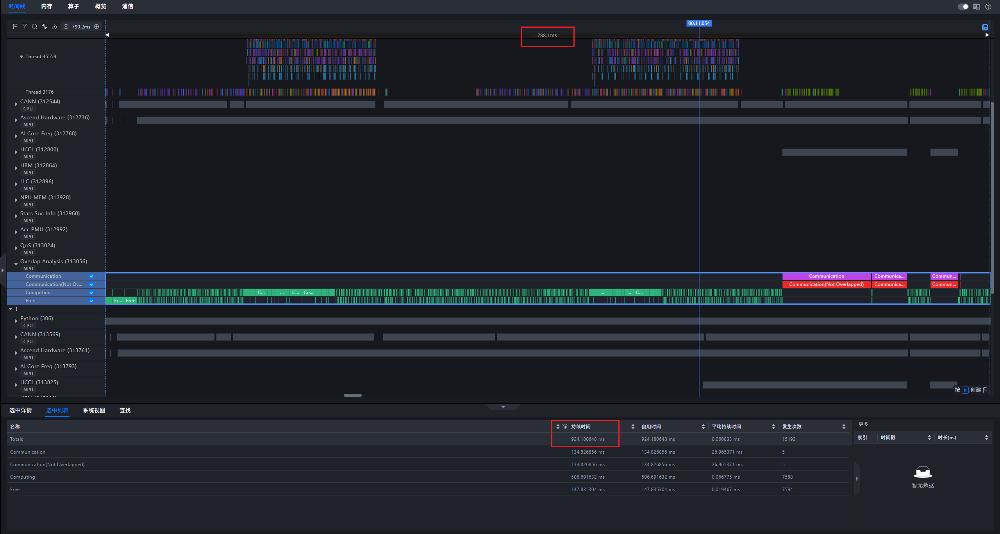

### 解决方法

这是正常现象。框选中Totals显示的时间是框选的各项的时间之和，这里框选的 `Communication` 和 `Communication(Not Overlapped)` 持续时间相同，所以 Totals 中通信算子的时间算了两次，导致和框选的时长不一致。

---

## 泳道排序控制

### 问题描述

自己生成的 JSON 文件导入到 MindStudio Insight，怎么控制 tid 排序？添加 thread_sort_index 没效果，反而会把对应 tid 隐藏

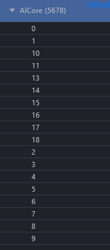

### 解决方法

添加所有泳道的 thread_sort_index 并更新版本，版本需用 2025年0930 版本及以后

---

## Insight Slice 颜色自定义

### 问题描述

insight里条目的颜色可以更改吗，compute和free的颜色都是绿色不好分辨。

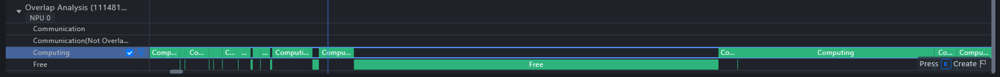

### 解决方法

目前不支持颜色变化，查看compute和free的占比可以通过 System View 下 Overall Metrics 功能。

---

## 打开profiling数据overall Metric显示no data

### 问题描述

采集了rank0和rank1的数据，rank0有综合指标，rank1没有

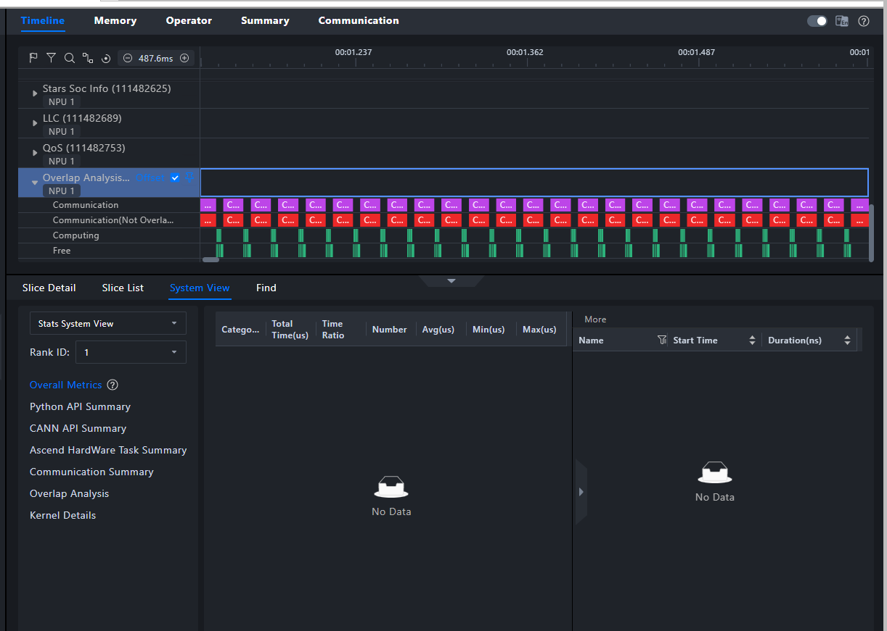

工具版本：MindStudio_insight_jupyter 8.2

### 解决方法

数据问题，operator_memory.csv文件中device Type列内容不正确导致这里没有拿到数据，有两个处理方案：

1.手动修改 Device Type 列

2.更新8.6后的 torch-npu 版本

---

## Insight timeline显示ProfilerStep在非第一行

### 问题描述

Insight timeline中，ProfilerStep显示在非第一行，且上游timeline亦有多次step显示

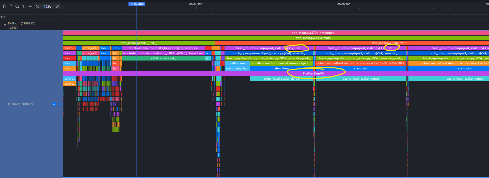

工具版本：Insight 8.1

### 解决方法

【问题分析】
timeline 页面这些泳道 Slice 的堆叠这样是正常的。在 Python 泳道里，既有 Python 调用栈，也有打点数据。两者之间的先后顺序没有特殊含义。

【解决方法】
如果您想查看 ProfilerStep 在第一行的样子，可以在该泳道右键，点击“隐藏Python调用栈”，这样只会显示打点数据，此时 ProfilerStep 就在第一行了。

对于第二个问题“上游timeline亦有多次step显示？”这些step只是python代码调用到 `torch_npu/npu/amp/grad_scaler.py` 的 step 方法的调用栈提示说明。和 ProfilerStep 的相对位置没有关系。

---

## timeline 堆栈以及算子信息未显示

### 问题描述

insight显示问题 堆栈以及算子信息未显示

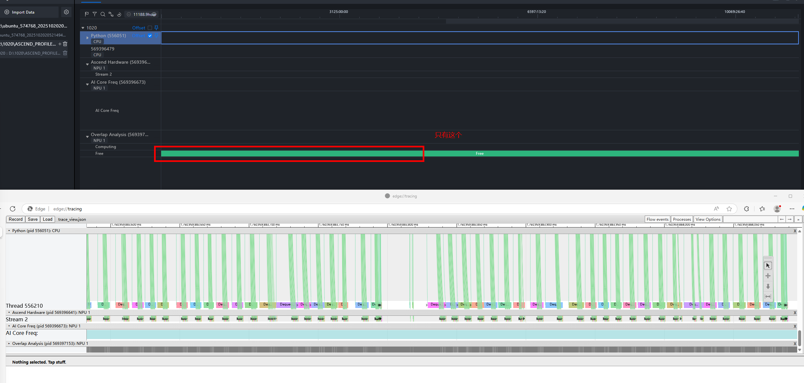

工具版本：Insight 8.2

### 解决方法

【问题分析】
json文件中有一个数据的ts值为0，导致时间轴异常，数据有问题。

【解决方法】
删除ts为0的数据，timeline展示正常

---

## 单机16卡，只有0卡显示"Ascend Hardware"和"Communication"，其他卡有数据但无这两个值

### 问题描述

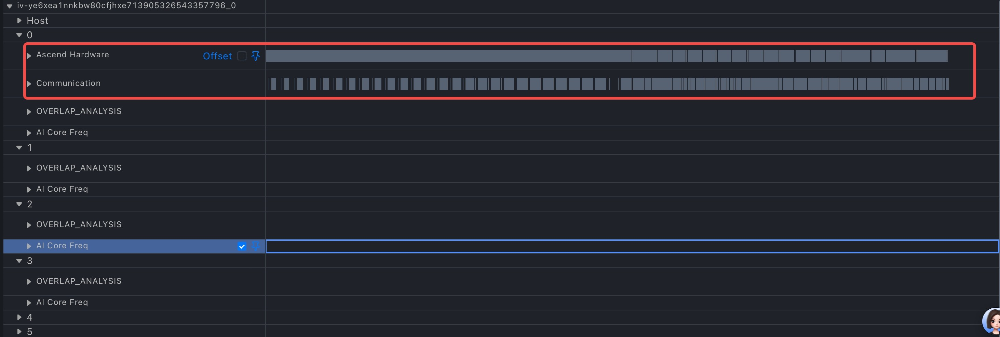

软件版本：Insight 8.1

### 解决方法

【问题分析】
发现其他卡中的 RANK_DEVICE_MAP 表中 deviceid 的值映射不对

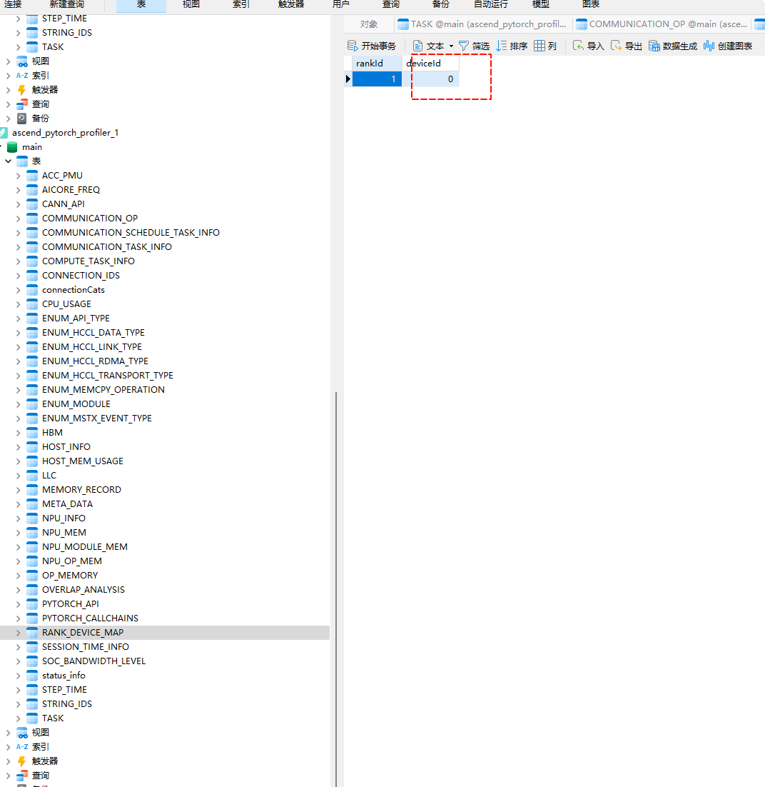
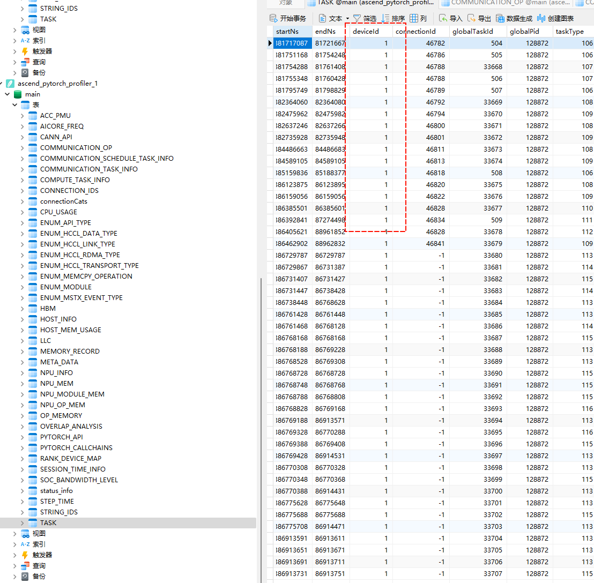

【解决方案】
是pta包和CANN版本太旧，请更新版本，重新采集

---

## 集合通信算子无法对齐

### 问题描述

1. 相同集合通信算子位置相差过大，怀疑是集合通信名称错误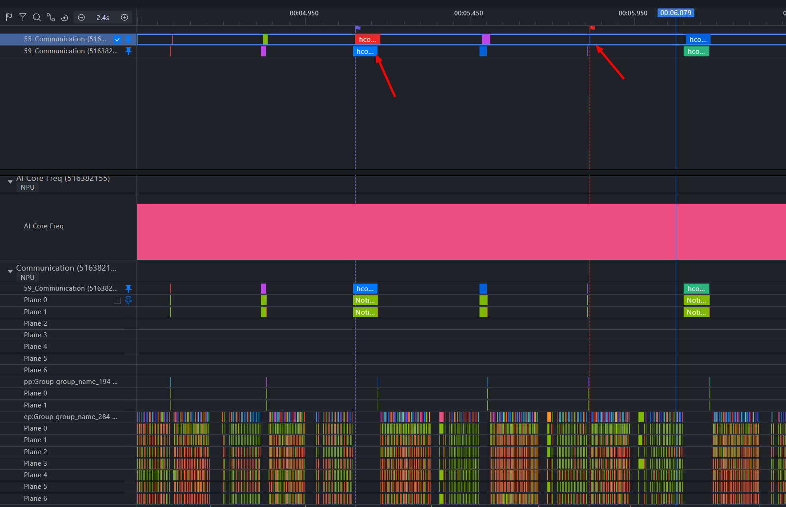
2. 集合通信概览比较乱，即使使用了一键对齐，仍有其它通信算子无法对齐。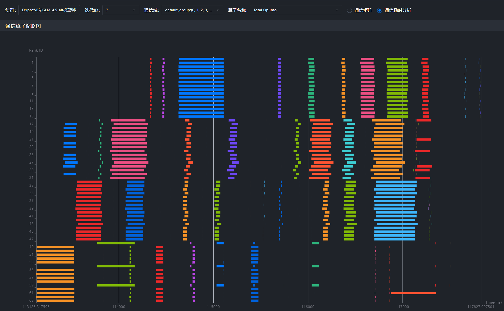

### 解决方法

【问题原因】现在prof解析数据时，通信算子序号先全体从0累加，再过滤掉warmup阶段的通信算子。如果不同rank在warmup阶段跑的通信算子不一样的话，那最终呈现的通信算子序号可能就不一致。(warmup就是用户可以提前拉起一些profiler流程，避免真正采集阶段因为prof的一些流程影响了训练step耗时)

以以下数据为例，看起来理应是同一个通信算子，但两个算子的序号名是错开的。

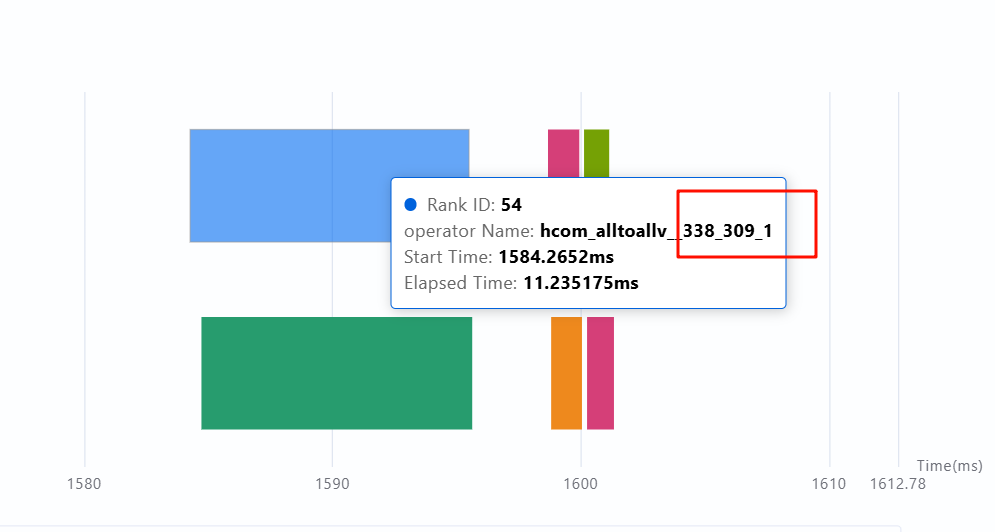

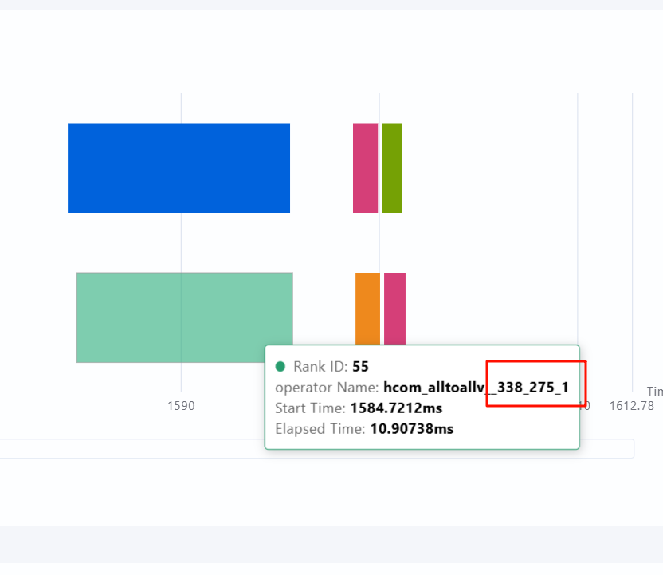

【规避手段】暂时将warm up设置为0，可避免此问题(warmup就是用户可以提前拉起一些profiler流程，避免真正采集阶段因为prof的一些流程影响了训练step耗时，可以设置warmup为0，多采集几个step，然后手动跳过前几个step)

【后续工具修改方案】profiler解析数据时，应先正确过滤warmup阶段的通信耗时，再从0统计。转内部任务跟踪，跟进调优组修改情况。

---

## 采集prof看不到具体步数通信等数据

### 问题描述

在pytorch-lightning库中，采集prof看不到具体步数通信等，怀疑采集方式有问题

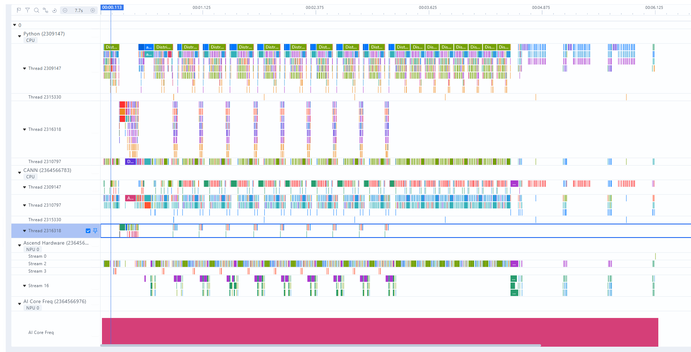

### 解决方法

分析数据，发现只采集了 2、3、4步骤，主要算子在第 0 步，采集时需要把第 0 步的数据也采集下来

---

## 点击集合通信，算子没有连线

### 问题描述

点击集合通信，hcom_allGather__算子没有连线，不知道这个是从哪里下发的。

工具版本：Insight 8.1

### 解决方法

更新 Insight 8.2 版本及以上

---

## 算子的耗时在timeline和communication里差别很大

### 问题描述

hcom_allGather__145_10算子的耗时在timeline和communication里差别很大

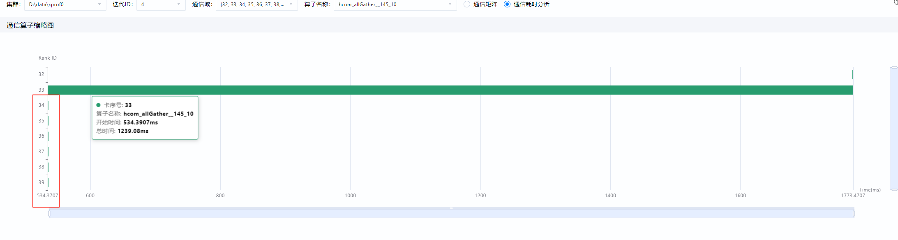

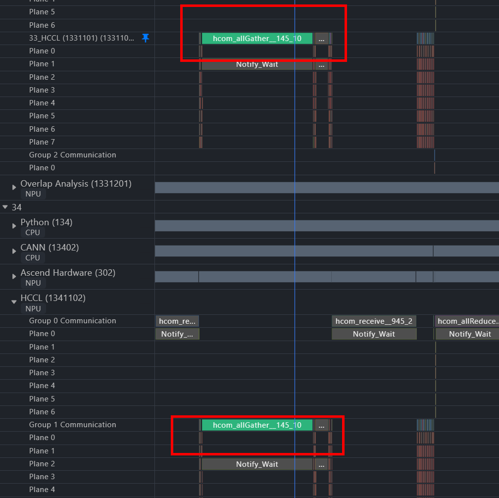

工具版本：Insight 8.1

### 解决方法

【问题分析】
为数据问题。1.communication页签的数据来源于communication.json文件；timeline页签的数据来源于trace_view.json文件。

【解决方案】
采集相关同事建议使用新的 torch_npu 版本重新进行采集解析。

---

## 集群场景下多卡timeline对不齐，相差超过分钟级

### 问题描述

集群场景下多卡timeline对不齐，相差超过分钟级
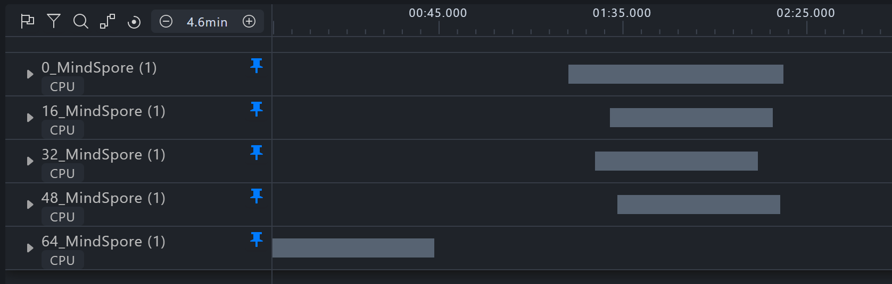

### 解决方法

【问题分析】
这份数据可能 64 卡对应的机器的时间和其他机器的时间不一致。导致相差超过分钟级。

【解决方案】

1. 你可以通过修改泳道的偏移量来对齐或者设置基准算子后，按键盘 L\R 根据基准算子的头、尾对齐。

2. 或者如果你想只看通信算子的对齐情况，可以在通信页面，鼠标右键点击一个想对齐的算子选择“根据选中算子对齐”来对所有卡的通信算子对齐。

    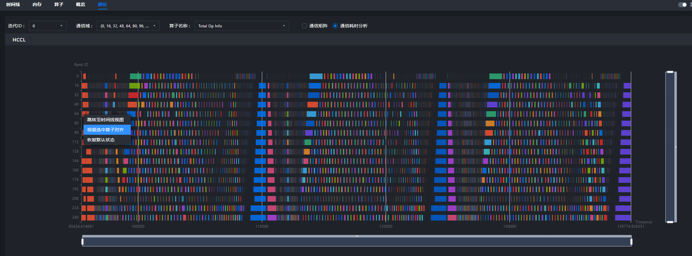

---

## 使用insight分析profiling，无法对应到是什么操作导致的free时间

### 问题描述

该任务为ACLGraph模式，大量泳道的TASK没有下发连线，无法通过连线找到对应Python API。

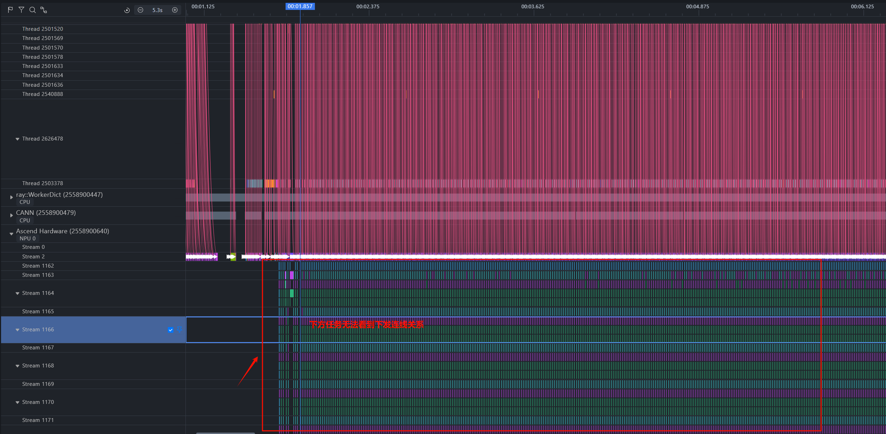

### 解决方法

【问题分析】
vllm对于ACLGraph或者图相关的编译动作都在vllm那个对象的初始化阶段做的，但是profler的开关只能在vllm实例化之后才能调用。所以暂时采不到。
