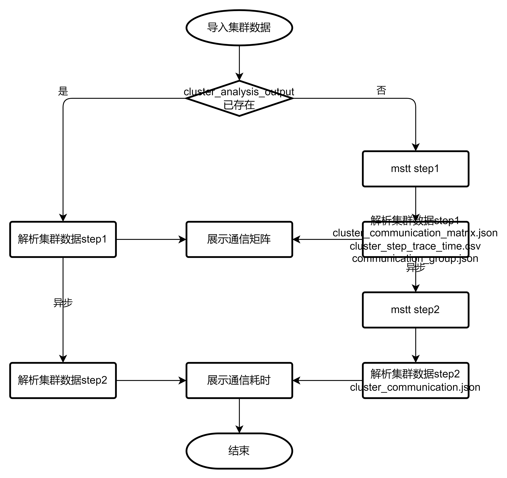
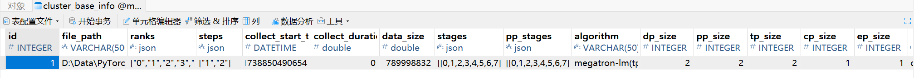
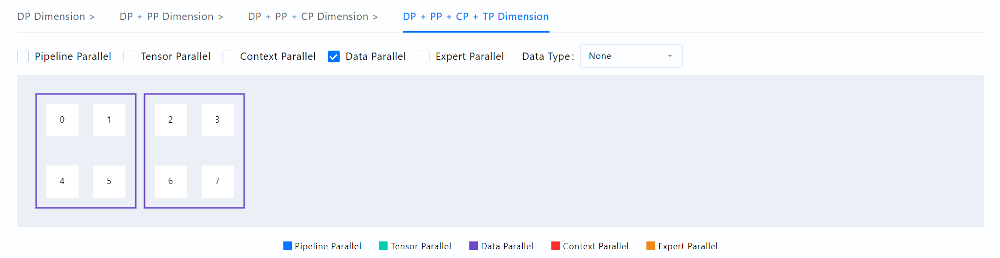
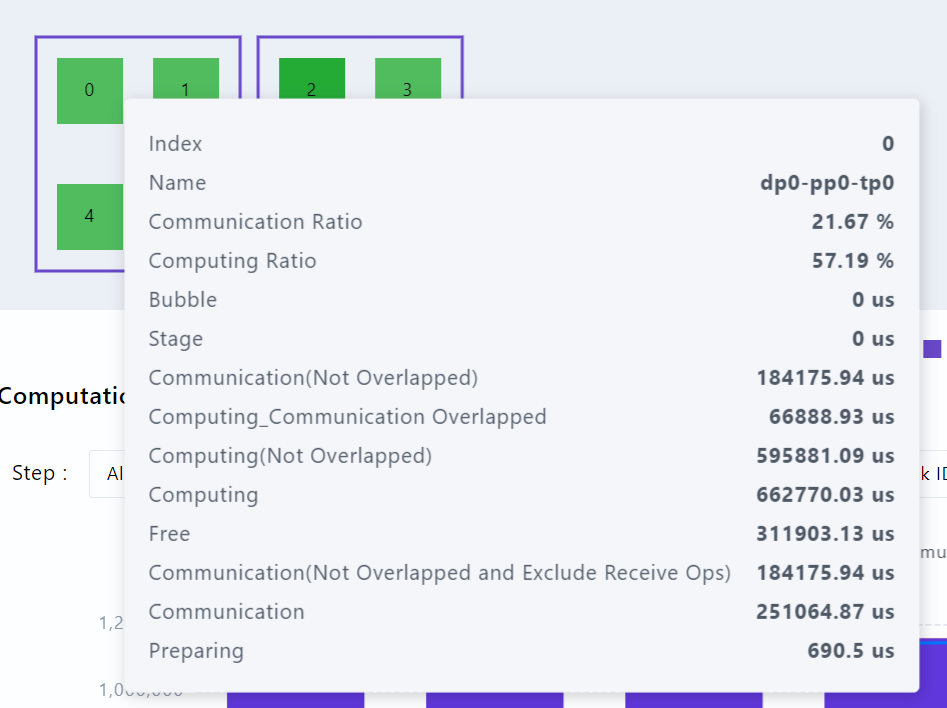
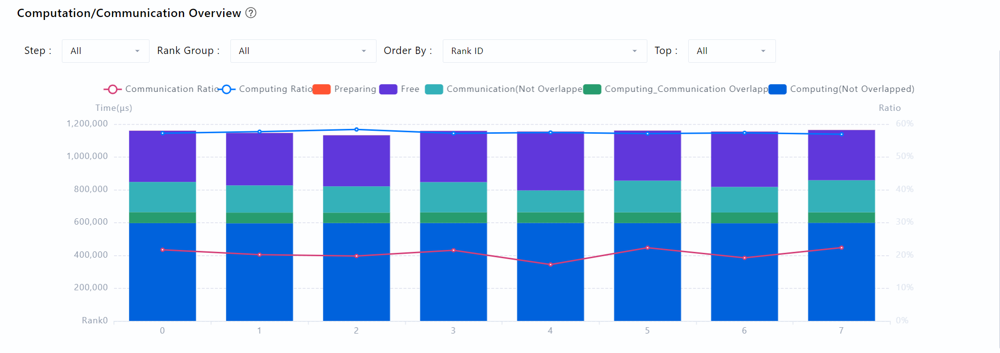
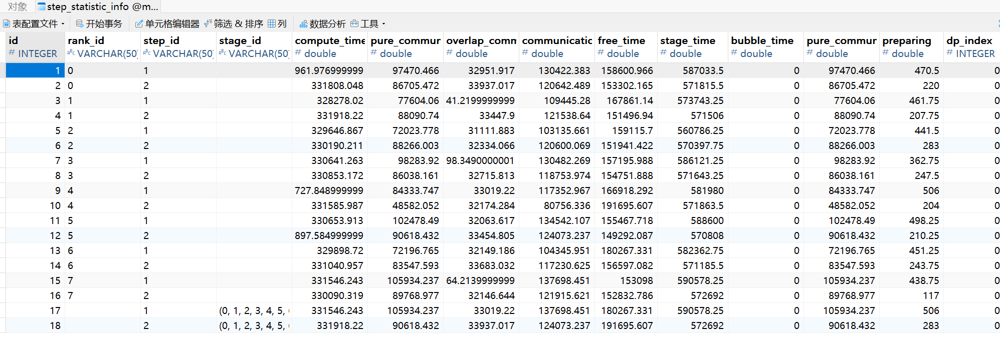
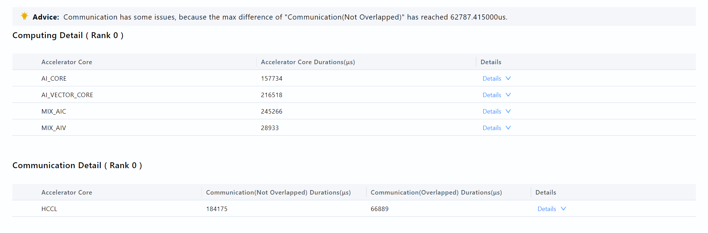

# Summary设计文档

## 集群数据解析

### 集群数据来源

[采集方式](https://www.hiascend.com/document/detail/zh/mindstudio/82RC1/T&ITools/Profiling/atlasprofiling_16_0090.html)

仅考虑PyTorch训练数据。
TEXT格式：
└── localhost.localdomain_139247_20230628101435_ascend_pt
&emsp;&emsp;├── profiler_info.json
&emsp;&emsp;├── profiler_metadata.json
&emsp;&emsp;├── ASCEND_PROFILER_OUTPUT
&emsp;&emsp;│&emsp;&emsp;├── communication.json // 为多卡或集群等存在通信的场景性能分析提供可视化数据基础，配置experimental_config的profiler_level=torch_npu.profiler.ProfilerLevel.Level1或profiler_level=torch_npu.profiler.ProfilerLevel.Level2生成
&emsp;&emsp;│&emsp;&emsp;├── communication_matrix.json // 通信小算子基本信息文件，配置experimental_config的profiler_level=torch_npu.profiler.ProfilerLevel.Level1或profiler_level=torch_npu.profiler.ProfilerLevel.Level2生成

DB格式：
└── localhost.localdomain_139247_20230628101435_ascend_pt
&emsp;&emsp;├── profiler_info.json
&emsp;&emsp;├── profiler_metadata.json
&emsp;&emsp;├── ASCEND_PROFILER_OUTPUT
&emsp;&emsp;│&emsp;&emsp;├── analysis.db                // 多卡或集群等存在通信的场景下，设置export_type=torch_npu.profiler.ExportType.Db时该目录下生成.db文件，其他.json和.csv文件不生成，使用MindStudio Insight工具展示

### mstt集群分析工具

[mstt集群分析工具](https://gitcode.com/Ascend/mstt/blob/master/profiler/msprof_analyze/README.md)

Windows

```shell
cluster_analysis.exe -d . -m mode
```

Linux

```shell
python3 cluster_analysis.py -d . -m mode
```

为什么Linux会用python方式启动集群分析工具？ 因为Linux系统一般默认用户安装了Python解释器，可以直接调用Python解释器，而Windows系统和macOS系统为了避免用户未安装Python解释器的情况，会使用pyinstaller将Python解释器和集群分析工具脚本打包成可执行文件。

Mac

```shell
cluster_analysis -d . -m mode
```

如果是DB格式数据，会加上选项：

```shell
--data_simplification
```

mode选项有三种：
all
communication_time
communication_matrix

### mstt集群分析工具输出件

TEXT格式：
└── cluster_analysis_output
&emsp;&emsp;├── cluster_step_trace_time.csv
&emsp;&emsp;├── cluster_communication_matrix.json
&emsp;&emsp;├── cluster_communication.json
&emsp;&emsp;├── communication_group.json

DB格式：
└── cluster_analysis_output
&emsp;&emsp;├── cluster_analysis.db

TEXT格式数据解析过程：



step1：
mode==communication_matrix
处理
cluster_communication_matrix.json
cluster_step_trace_time.csv
communication_group.json
step2：
mode==communication_time
处理
cluster_communication.json

DB格式数据解析过程：


## Summary数据展示

### 基本信息

界面：
接口：
summary/queryTopData

数据来源：
TEXT：
cluster_base_info表
来自


DB：
ClusterBaseInfo表


### 并行策略生成

界面：


接口：
summary/set/parallelStrategy

数据来源：

### 并行策略展示

界面：
TP==tensor parallel
CP==context parallel
EP==expert parallel
DP==data parallel
PP==pipeline parallel
假设是16卡数据，Algorithm选择TP-CP-EP-DP-PP，TP=2，CP=2，EP=1，DP=2，PP=2，并行策略计算方式如下：
开始时0-15卡每个卡单独为一组。
因为TP=2，相邻的组两两做TP并行，即0-1TP并行，2-3TP并行等，现在分组变为8组：0-1一组，2-3一组，以此类推。两个组TP并行在显示上是用一个框把两个组框在一起。
因为CP=2，相邻的组两两做CP并行，即0-1组和2-3组做CP并行，4-5组和6-7组做CP并行等，现在分组变为4组：0-1-2-3一组，4-5-6-7一组，8-9-10-11一组，12-13-14-15一组。两个组CP并行在显示上是用两个框把两个组分开来。
因为EP=1，不影响。
因为DP=2，相邻的组两两做DP并行，即0-1-2-3组和4-5-6-7组做DP并行，8-9-10-11组和12-13-14-15组做DP并行，现在分组变为2组：0-1-2-3-4-5-6-7一组，8-9-10-11-12-13-14-15一组。两个组DP并行在显示上是用两个框把两个组分开来。
因为PP=2，相邻的组两两做PP并行，即0-1-2-3-4-5-6-7组和8-9-10-11-12-13-14-15组做DP并行，现在分组变为1组：0-1-2-3-4-5-6-7-8-9-10-11-12-13-14-15一组。
并行策略展示结束。两个组PP并行在显示上是用一个框把两个组框在一起。


接口：
parallelism/arrangement/all

数据来源：
无

### 通信域内卡时间占比展示

界面：





接口：
parallelism/performance/data

数据来源：
TEXT：
step_statistic_info表
数据来自cluster_step_trace_time.csv


DB：
ClusterStepTraceTime表

### 详情

界面：



接口：
summary/statistic

数据来源：
单卡信息
