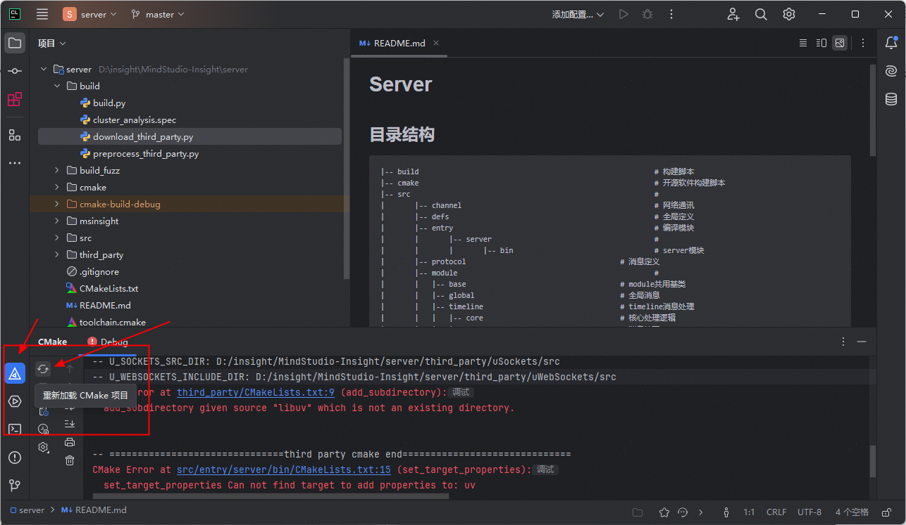
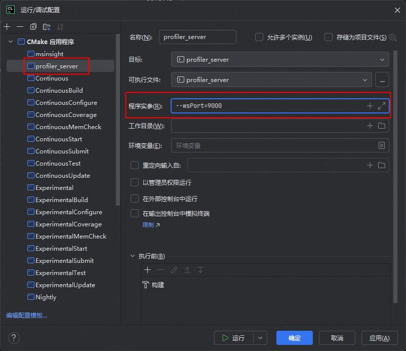
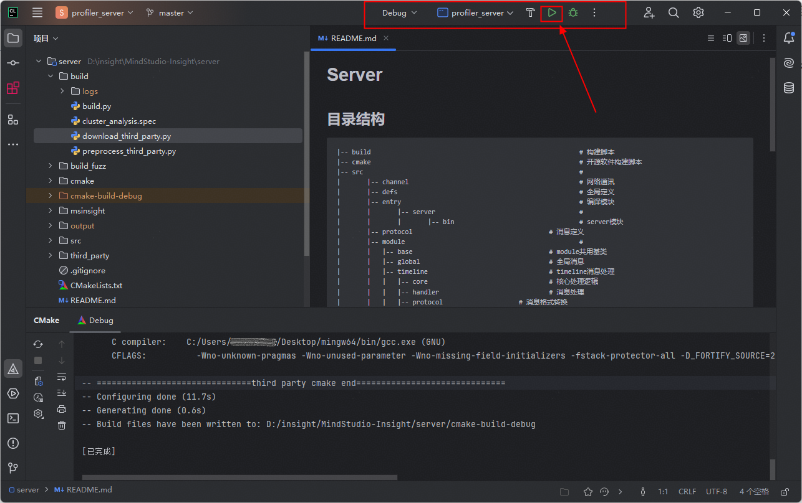
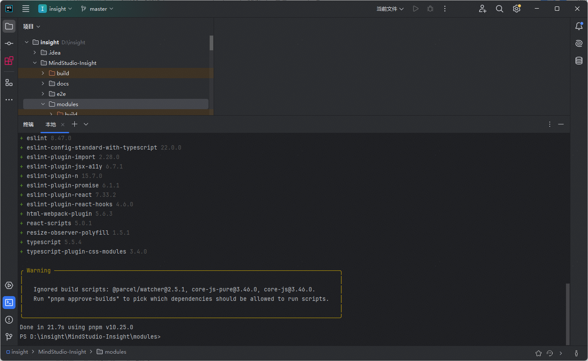
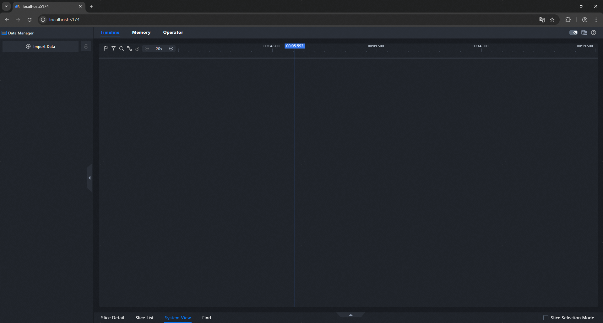
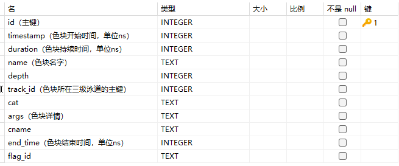
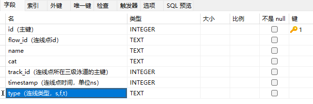
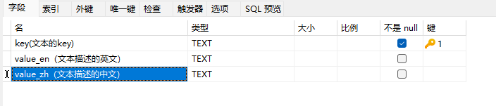
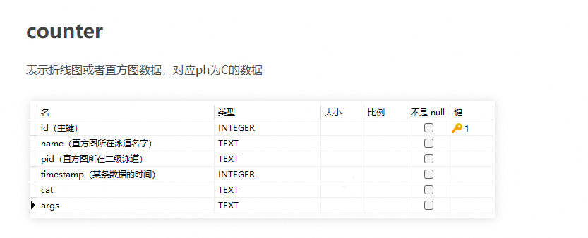

# **开发指南**

## 1. 代码仓目录说明

### 1.1 顶层目录结构

```text
├── build                              # 构建脚本
├── docs                               # 项目文档
├── e2e                                # 端到端测试用例
├── modules                            # 前端模块目录
│   ├── build                          # 前端构建脚本
│   ├── cluster                        # 概览、通信模块
│   ├── compute                        # 算子调优模块
│   ├── framework                      # 前端主框架模块（基础功能）
│   ├── leaks                          # 内存泄露检查模块
│   ├── lib                            # 公共库目录
│   ├── memory                         # 内存模块
│   ├── memory-on-chip                 # 片上内存模块
│   ├── operator                       # 算子模块
│   ├── reinforcement-learning         # 强化学习模块
│   ├── statistic                      # 服务化调优模块
│   ├── timeline                       # 时间线模块
│   └── triton                         # Triton 模块
├── platform                           # 底座目录（Rust/Tauri）
├── plugins                            # 插件目录
├── scripts                            # 脚本目录
└── server                             # 后端服务模块
    ├── build                          # 构建脚本
    ├── cmake                          # CMake 配置脚本
    ├── src                            # 后端源码
    │   ├── channel                    # 网络通讯
    │   ├── defs                       # 全局定义
    │   ├── entry/server/bin           # 程序入口
    │   ├── protocol                   # 消息定义
    │   ├── modules                    # 业务模块
    │   │   ├── base                   # 模块共用基类
    │   │   ├── global                 # 全局消息
    │   │   ├── timeline               # timeline 消息处理
    │   │   │   ├── core               # 核心处理逻辑
    │   │   │   ├── handler            # 消息处理
    │   │   │   └── protocol           # 消息格式转换
    │   │   └── ...                    # 其他业务模块
    │   ├── server                     # server 服务
    │   ├── test                       # 后端开发者测试
    │   └── utils                      # 工具类
    └── third_party                    # 第三方依赖
```

### 1.2 前端模块说明

| 文件夹名称 | 对应模块 |
| --- | --- |
| cluster | 概览（summary）、通信（communication） |
| compute | 算子调优 |
| framework | 基础功能（微前端基座） |
| leaks | 内存泄露检查 |
| memory | 内存 |
| operator | 算子 |
| reinforcement-learning | 强化学习 |
| statistic | 服务化调优 |
| timeline | 时间线 |

## 2. 开发环境搭建

### 2.1 推荐开发软件

| 软件名 | 用途 |
| --- | --- |
| WebStorm（推荐） | 编写 & 启动前端 |
| CLion（推荐） | 编写 & 启动 C++ 后端 |

### 2.2 环境依赖

| 软件名 | 版本要求 | 用途 |
| --- | --- | --- |
| Node.js | v18.20.8+ | 前端 |
| pnpm | 无要求 | 前端包管理 |
| Python | 3.11+ | 工具脚本 |
| MinGW | 10.0+（msvcrt 版本） | 执行编译程序 |
| git | 无 | 代码拉取与提交 |
| cmake | 3.16~3.20 | 后端项目构建与编译 |

### 2.3 代码下载

#### 2.3.1 Fork 代码到自己仓库，并使用 git 从远程仓库 clone 代码到本地

[MindStudio-Insight](https://gitcode.com/Ascend/msinsight)

#### 2.3.2 使用 CLion 打开 server 文件夹


### 2.4 配置 CLion 设置

**1. 点击右上角的设置按钮，选择设置选项**


**2. 选择构建、执行、部署中的工具链选项，将工具集路径指向已安装的 MinGW**


**3. 选择构建、执行、部署中的 CMake 选项，将工具链指向 MinGW**


### 2.5 配置 pre-commit 代码检查工具

pre-commit 是一款基于 Git 钩子的开源代码质量管控工具，在代码提交前会自动完成代码校验、格式规范化等工作。项目要求本地启用 pre-commit 完成代码校验后再提交。
[pre-commit 本地运行指南](https://gitcode.com/Ascend/community/blob/master/docs/contributor/pre-commit-guide.md)

**1. 安装 pre-commit**

```bash
pip install pre-commit
```

**2. 安装 Git 钩子**

在项目根目录下执行，注册 Git 钩子。后续执行 `git commit` 时将自动触发代码检查。

```bash
pre-commit install
```

**3. 执行代码检查**

在提交代码前，扫描暂存区的改动文件，自动完成格式化与合规性检查。

```bash
git add .
pre-commit run
```

检查过程中，格式化类问题（如代码缩进、换行等）会被自动修复，修复后需重新 `git add`。未能自动修复的错误请根据提示人工修复。

**4. 提交代码**

钩子安装成功后，正常提交代码即可，pre-commit 会自动运行。若自动修复后无其他问题，提交将直接成功。

```bash
git add .
git commit -S -m "提交信息"
```

## 3. 编译、构建、运行

### 3.1 第三方库的下载与编译

在 server 文件夹下新建终端，运行如下代码。**执行此步骤之前请保证网络畅通**。

```shell
cd server/build
python download_third_party.py
python preprocess_third_party.py
```

**下载第三方库成功**


**预运行成功**


### 3.2 CMake 编译

- 点击右下角的 CMake 按钮，选择重新加载 CMake 项目



- CMake 重载成功如下图所示


### 3.3 后端启动

#### 3.3.1 启动参数配置

- 打开 profiler_server 旁的更多选项，选择编辑选项


- 选择 profiler_server 选项，将参数修改为 `--wsPort=9000` 后点击确定保存
  - 提示：端口可以设置为其他端口，以避免和其他端口冲突
  - 警告：如果您的开发机器中已打开了 Insight 桌面端应用，请确认设置 `wsPort` 不会与已开启的 insight 产生端口冲突（Insight 应用默认为 `9000`，但多开时将从 `9000` 端口逐个 +1 绑定占用，建议设置为 `9050`~`9099`），否则可能导致前后端连接问题或其他未预期的异常，建议本地开发调试时，关闭所有已开启的 Insight 应用。



#### 3.3.2 构建并启动 profiler_server

- 点击右上角的启动按钮



- 构建成功如下图所示


### 3.4 前端启动

#### 3.4.1 安装前端依赖

- 安装 pnpm 包管理工具

```bash
npm install -g pnpm
```

- 在 modules 目录下执行安装指令

```bash
pnpm install
```

- 安装成功结果如下图所示



#### 3.4.2 拉起前端模块服务

MindStudio-Insight 采用模块设计，framework 模块为基础功能模块，其他模块可按需启动加载。进入模块项目中，在对应 `package.json` 文件中执行 `npm run start` 命令即可启动该模块。


- 模块启动成功如下图所示


**请注意，请确保 framework 模块启动成功，否则无法启动网页端 MindStudio-Insight。**

#### 3.4.3 开发者环境下运行 MindStudio-Insight

- 在浏览器中输入 `localhost:5174` 启动网页端

- 网页端启动成功如下图所示



### 3.5 本地出包

#### 3.5.1 Windows 环境

**环境依赖**

| 软件名称 | 版本 | 用途 |
| --- | --- | --- |
| rust | 1.89 | 底座编译构建 |
| windows11SDK | 10.0.22000.0+ | Windows 平台基础开发运行时 |
| MSVC | v143 | Windows 平台基础开发运行时 |
| mingw | 10.0+（msvcrt 版本） | 后台编译器 |
| Ninja | 无要求 | 后台编译 |
| cmake | 3.16~3.20 | 后端构建 |
| nsis | 无要求 | 安装包打包软件 |
| nsProcess 插件 | unicode support | 检查是否有重复运行 |
| node | v18.20.8+ | 前端构建 |
| pnpm | 无要求 | 前端构建 |
| python | 3.11+ | 集群工具打包 |

Python 运行时依赖：

```text
click
tabulate
networkx
jinja2
PyYaml
tqdm
prettytable
ijson
xlsxwriter>=3.0.6
sqlalchemy
numpy<=1.26.4
pandas<=2.3.2
psutil
```

Python 开发时依赖：

```shell
pyinstaller
```

**编译出包步骤**

1. 进入项目根目录下 `server/build` 目录，执行 `python3 download_third_party.py && python3 preprocess_third_party.py`
2. 在 Windows 系统，MindStudio Insight 会集成 Python 解释器：
   - 第一步：在构建环境上手动安装 Python 解释器（同时包含 pip），建议 Python 版本 3.12.10
   - 第二步：设置环境变量 `MINDSTUDIO_INSIGHT_PYTHON_INTERPRETER` 为 Python 解释器的安装目录，该目录需包含 `python.exe`。示例：如 Python 安装目录为 `D:\xxx\python`，则设置环境变量为 `D:\xxx\python`
3. 进入项目根目录下 `build` 目录，执行 `python build.py`，产物位于项目根目录 `out` 目录下

**依赖安装附录**

- Windows 运行时安装（windows11SDK 和 MSVC）：下载 Visual Studio Installer，双击打开，选择如下依赖（通常默认即可）：

  

- MinGW 安装：从 [WinLibs](https://www.winlibs.com/) 下载，版本选择 11.0 以上。下载后解压，将解压后 mingw 路径下的 bin 目录添加到系统 PATH 环境变量：

  

  验证安装：终端执行 `g++ -v`，正常输出版本信息即可。

- nsProcess 插件安装：首先安装 NSIS（需装在 `C:\Program Files (x86)` 下）。从 [NsProcess plugin](https://nsis.sourceforge.io/NsProcess_plugin) 获取压缩包，将 `Include/nsProcess.h` 放到 `C:\Program Files (x86)\NSIS\Include`，将 `Plugin/nsProcess.dll` 和 `Plugin/nsProcessw.dll` 放到 `C:\Program Files (x86)\NSIS\Plugins\x86-unicode`。

- Rust：推荐通过 [rustup](https://www.rust-lang.org) 安装，验证：`rustc --version` 和 `cargo --version`。

- Ninja：通过 [官网](https://ninja-build.org) 下载二进制文件或包管理器安装，验证：`ninja --version`。

- Node.js：通过 [官网](https://nodejs.org) 安装 LTS 版本（v18.20.8+），验证：`node --version`。

- pnpm：`npm install -g pnpm`，验证：`pnpm --version`。

- Python：通过 [官网](https://www.python.org) 安装 3.11+，勾选"Add Python to PATH"，验证：`python --version`。

#### 3.5.2 Mac 环境

**环境依赖**

| 软件名称 | 版本 | 用途 |
| --- | --- | --- |
| rust | 1.89 | 底座编译构建 |
| cargo-bundle | 无要求 | 打包 |
| Ninja | 无要求 | 后台编译 |
| node | v18.20.8+ | 前端构建 |
| pnpm | 无要求 | 前端构建 |
| python | 3.11+ | 集群工具打包 |
| clang | 15 | 编译 |
| cmake | 3.16~3.20 | 后端构建 |

Python 运行时依赖：

```text
click
tabulate
networkx
jinja2
PyYaml
tqdm
prettytable
ijson
xlsxwriter>=3.0.6
sqlalchemy
numpy<=1.26.4
pandas<=2.3.2
psutil
dmgbuild
```

Python 开发时依赖：

```shell
pyinstaller
```

**编译出包步骤**

**Step 1. 预处理构建依赖**

```shell
cd server/build
python3 download_third_party.py && python3 preprocess_third_party.py
```

**Step 2. 指定 APP 签名证书（可选）**

> 注意：请您确保已阅读并知悉 [LICENSE](https://gitcode.com/Ascend/msinsight/blob/master/docs/LICENSE) 要求。

Insight macOS ARM 版本在构建出包时，会对产物 APP 进行 macOS 开发者证书签名。您可以通过环境变量配置签名证书。如不指定，缺省时使用临时证书签名，可能导致产物无法通过网络分发（本地调试运行不受影响）。

- 证书使用前置：要求为可用于签名的苹果开发者证书，并确保已正确导入钥匙串中（如登录钥匙串 `~/Library/Keychains/login.keychain`）。
- 通过环境变量配置证书，支持**证书名**或**证书 ID**。

```shell
# 以证书名为 "insight_cert" 为例
export INSIGHT_APP_SIGN="insight_cert"
# 解锁钥匙串
security unlock-keychain -p {您当前用户的密码} ~/Library/Keychains/login.keychain
```

**Step 3. 设置集成 Python 解释器的环境变量**

在 macOS 系统，MindStudio Insight 会集成 Python 解释器：

- 第一步：在构建环境上手动安装可移植的 Python 解释器（同时包含 pip），建议 Python 版本 3.12.10
  - 提示："可移植"指将 A 机器上的 Python 文件夹拷贝到 B 机器上仍可直接使用。macOS 上某些 Python 版本依赖 `/Library` 下的动态库，需确保安装的是可移植版本
- 第二步：设置环境变量 `MINDSTUDIO_INSIGHT_PYTHON_INTERPRETER` 为 Python 解释器的安装目录，该目录需包含 `bin/python3`。如 Python 安装目录为 `/Users/xxx/python`，则设置环境变量为 `/Users/xxx/python`。如 Python 版本不为 3.12，需手动修改 `server/build/build.py` 中的 version 变量值

**Step 4. 执行出包脚本**

进入项目根目录下 `build` 目录，执行 `python build.py`，产物位于项目根目录 `out` 目录下。

## 4. 开发流程

### 4.1 新增模块开发

#### 4.1.1 前端部分

**1. 添加新模块目录**

在 `modules` 目录下创建新的模块，参考如下目录结构：

```text
.
├── modules
│   ├── framework
│   ├── new_module
│   │   ├── src
│   │   │   ├── assets
│   │   │   ├── components
│   │   │   ├── connection
│   │   │   ├── store
│   │   │   ├── theme
│   │   │   ├── units
│   │   │   ├── App.tsx
│   │   │   ├── index.tsx
│   │   │   └── index.css
│   │   ├── craco.config.js
│   │   ├── tsconfig.json
│   │   └── package.json
│   └── package.json
```

**2. 构建配置**

`craco.config.js`：

```js
const { webpackCfg, configureConfig } = require("../build-config");

const path = require("path");

const libPath = path.resolve(__dirname, "../lib/src");
const echartsPath = require.resolve("echarts");

module.exports = {
  devServer: {
    port: 3001,
    open: false,
    client: {
      overlay: {
        runtimeErrors: (error) => {
          // 禁止界面展示错误：ResizeObserver loop completed with undelivered notifications
          return !error?.message.includes("ResizeObserver");
        },
      },
    },
  },
  webpack: {
    alias: webpackCfg.alias,
    configure: (webpackConfig) => {
      return configureConfig(webpackConfig, [libPath, echartsPath]);
    },
  },
};
```

**3. 基础 scripts 配置**

`package.json`：

```json
{
    "scripts": {
        "start": "cross-env NODE_OPTIONS=--openssl-legacy-provider craco start",
        "build": "cross-env NODE_OPTIONS=--openssl-legacy-provider NODE_ENV=production GENERATE_SOURCEMAP=false CI=false craco build",
        "build:dev": "cross-env GENERATE_SOURCEMAP=true CI=false craco build",
        "..." : "// 自定义配置"
    }
}
```

**4. src 中必要模块**

**theme：主题**

`theme/index.ts`：

```ts
export { themeInstance } from "@insight/lib/theme";
export type { ThemeItem } from "@insight/lib/theme";
```

**connection：通信**

`connection/index.ts`：

```ts
import { ClientConnector } from "@insight/lib/connection";
export default new ClientConnector({
  getTargetWindow: (): any[] => [window.parent],
  module: [new_module_request_name],
});
```

其他部分根据新模块的实际需求自定义。

**5. 在主服务中加入新模块（微服务）**

framework 模块的 `moduleConfig.ts` 中，在 `modulesConfig` 中配置新模块：

```ts
{
    name: [new_module],   // 新模块的微服务名，自定义
    requestName: [new_module_request_name], // 前后端交互的模块名，与后端协定
    attributes: {
        src: isDev ? 'http://localhost:[new_port]/' : './plugins/[new_module]/index.html', // 本地开发端口自行分配
    },
    isDefault: true, // 默认是否显示该微服务
    // ... 其他配置条件
}
```

**6. 在 `ModuleConfig` 接口中添加新模块的属性**

**代码来源：** `modules/framework/src/moduleConfig.ts`

```ts
export interface ModuleConfig {
    name: string;
    requestName: Lowercase<string>;
    attributes: IframeHTMLAttributes<HTMLIFrameElement>;
    isDefault?: boolean;
    isCluster?: boolean;
    isCompute?: boolean;
    isLeaks?: boolean;
    isIE?: boolean;
    isRL?: boolean;
    hasCachelineRecords?: boolean;
    isOnlyTraceJson?: boolean;
    isHybridParse?: boolean;
    // 在此处添加新模块的属性
}
```

**7. 在更新数据场景中添加新模块处理**

**代码来源：** `modules/framework/src/components/TabPane/Index.tsx`

```tsx
export function updateDataScene(data: Record<string, any>): void {
    const sceneInfo = {
        // 在此处添加新增模块，对应数据更新
        isCluster: data.isCluster ?? false,
        isReset: data.reset ?? false,
        isIpynb: data.isIpynb ?? false,
        isBinary: data.isBinary ?? false,
        hasCachelineRecords: data.hasCachelineRecords ?? false,
        isOnlyTraceJson: data.isOnlyTraceJson ?? false,
        instrVersion: data.instrVersion ?? -1,
        isLeaks: data.isLeaks ?? false,
        isIE: data.isIE ?? false,
        isRL: false,
        isHybridParse: data.isCluster && data.isIE,
    };
    updateSession(sceneInfo);
}

// 在此处添加新增模块，对应页签改变的处理
useEffect(() => {
    if (session.isBinary === null && session.isCluster === null) {
        return;
    }
    setScene(session.scene);
    setDataCompose({ hasCachelineRecords: session.hasCachelineRecords, isRL: session.isRL });
}, [session.isBinary, session.isCluster, session.hasCachelineRecords, session.isOnlyTraceJson, session.isIE, session.isLeaks, session.isRL, session.isHybridParse]);
```

**8. 在 Session 类中添加新模块场景**

**代码来源：** `modules/framework/src/entity/session.ts`

```ts
// Scene：数据场景：默认、集群、算子调优、Leaks、只trace.json文件
export type Scene = 'Default' | 'Cluster' | 'Compute' | 'OnlyTraceJson' | 'IE' | 'Leaks' | 'RL' | 'HybridParse';

export class Session {
    isCluster: boolean | null = false;
    isBinary: boolean | null = false;
    isIE: boolean | null = false;
    isReset: boolean = false;
    isFullDb: boolean = false;
    isOnlyTraceJson: boolean = false;
    isLeaks: boolean = false;
    isRL: boolean = false;
    isHybridParse: boolean = false;
    hasCachelineRecords: boolean = false;
    instrVersion: number = -1;
    // 在此处添加新模块场景属性

    get scene(): Scene {
        let scene: Scene;
        if (this.isHybridParse) {
            scene = 'HybridParse';
        } else if (this.isOnlyTraceJson) {
            scene = 'OnlyTraceJson';
        } else if (this.isLeaks) {
            scene = 'Leaks';
        } else if (this.isBinary) {
            scene = 'Compute';
        } else if (this.isCluster) {
            scene = 'Cluster';
        } else if (this.isIE) {
            scene = 'IE';
        } else {
            scene = 'Default';
        }
        return scene;
    }
    // ...
}
```

**9. 在公共模块中添加查询接口和中英文翻译**

**代码来源：** `modules/lib/src/connection/index.ts`

```ts
// 新增模块的查询接口要写在 connection 中
```

**代码来源：** `modules/lib/src/i18n/index.ts`

```ts
// 新增模块的中英文切换由公共模块统一管理
import xxxEn from './xxx/en.json';
import xxxZh from './xxx/zh.json';

export const resources = {
    enUS: {
        ...en,
        ...frameworkEn,
        ...xxxEn,
    },
    zhCN: {
        ...zh,
        ...frameworkZh,
        ...xxxZh,
    },
};
```

**10. 构建脚本更新**

**代码来源：** `build/build.py`

新增模块的构建后清理：

```python
def clean():
    out = os.path.join(PROJECT_PATH, Const.OUT_DIR)
    if os.path.exists(out):
        shutil.rmtree(out)
    ascend_insight = os.path.join(PROJECT_PATH, Const.PRODUCT_DIR)
    if os.path.exists(ascend_insight):
        shutil.rmtree(ascend_insight)
    framework_dist = os.path.join(PROJECT_PATH, Const.MODULES_DIR, Const.FRAMEWORK_DIR, 'build')
    if os.path.exists(framework_dist):
        shutil.rmtree(framework_dist)
    # 需在此处添加你的新增模块
    modules = ['cluster', 'memory', 'timeline', 'compute', 'jupyter', 'operator', 'lib', 'statistic', 'leaks',
               'reinforcement-learning']
    for module in modules:
        build_dir = os.path.join(PROJECT_PATH, Const.MODULES_DIR, module, Const.BUILD_DIR)
        if os.path.exists(build_dir):
            shutil.rmtree(build_dir)
```

新增模块的名称以及构建：

```python
# 在这里添加你的模块以及对应的模块名称
MODULES_MAP = {
    'cluster': 'Cluster',
    'reinforcement-learning': 'RL',
    'memory': 'Memory',
    'operator': 'Operator',
    'compute': 'Compute',
    'statistic': 'Statistic',
    'leaks': 'Leaks',
    'timeline': 'Timeline',
}
```

#### 4.1.2 后端部分

**1. 后端模块目录结构**

``` shell
server
├── src
│   └── modules
│       └── xxx_module
│           ├── database
│           │   ├── xxxBase.h
│           │   └── xxxBase.cpp
│           ├── handler
│           └── protocol
```

**2. 协议处理**

**代码来源：** `server/msinsight/include/base/ProtocolUtil.h`

JSON 的协议处理、Response 的传递在这里编写：

```c++
struct JsonResponse : public Response {
    explicit JsonResponse(const std::string &command) : Response(command) {}
    [[nodiscard]] virtual std::optional<document_t> ToJson() const = 0;
};

struct Event : public ProtocolMessage {
    explicit Event(const std::string &e) : event(e)
    {
        type = ProtocolMessage::Type::EVENT;
    }
    ~Event() override = default;
    std::string event;
    bool result = false;
};

struct JsonEvent : public Event {
    explicit JsonEvent(const std::string &e) : Event(e) {}
    [[nodiscard]] virtual std::optional<document_t> ToJson() const = 0;
};

class ProtocolUtil {
public:
    ProtocolUtil() = default;
    virtual ~ProtocolUtil() = default;

    void Register();
    void UnRegister();

    std::unique_ptr<Request> FromJson(const json_t &requestJson, std::string &error);
    std::optional<document_t> ToJson(const Response &response, std::string &error);
    std::optional<document_t> ToJson(const Event &event, std::string &error);

    static bool SetRequestBaseInfo(Request &request, const json_t &json);
    static void SetResponseJsonBaseInfo(const Response &response, document_t &json);
    static void SetEventJsonBaseInfo(const Event &event, document_t &json);

    template <class SubRequest>
    static std::unique_ptr<Request> BuildRequestFromJson(const json_t &json, std::string &error)
    {
        static_assert(std::is_same_v<std::unique_ptr<Request>, decltype(SubRequest::FromJson(json, error))>,
                      "SubRequest must have a static FromJson method returning std::unique_ptr<Request>");
        return SubRequest::FromJson(json, error);
    }

    static std::optional<document_t> CommonResponseToJson(const Response &response)
    {
        try {
            const auto& jsonResponse = dynamic_cast<const JsonResponse&>(response);
            return jsonResponse.ToJson();
        } catch (const std::bad_cast& e) {
            return std::nullopt;
        }
    }
    // ...
};
```

**3. CMake 配置**

**代码来源：** `server/src/CMakeLists.txt`

```cmake
# new Module
include_directories(${SRC_HOME_DIR}/modules/xxx)
include_directories(${SRC_HOME_DIR}/modules/xxx/xxx)

# new Module
aux_source_directory(${SRC_HOME_DIR}/modules/xxx xxx_xxx_SRC)

list(APPEND DIC_MODULES_SRC_LIST
        ${DIC_MODULES_XXX_SRC}
        ${DIC_MODULES_XXX_XXX_SRC}
)
```

**4. 注册 Plugin**

**代码来源：** `server/src/modules/Plugins.cpp`

```cpp
/*
 * -------------------------------------------------------------------------
 * This file is part of the MindStudio project.
 * Copyright (c) 2025 Huawei Technologies Co.,Ltd.
 *
 * MindStudio is licensed under Mulan PSL v2.
 * You can use this software according to the terms and conditions of the Mulan PSL v2.
 * You may obtain a copy of Mulan PSL v2 at:
 *
 *          http://license.coscl.org.cn/MulanPSL2
 *
 * THIS SOFTWARE IS PROVIDED ON AN "AS IS" BASIS, WITHOUT WARRANTIES OF ANY KIND,
 * EITHER EXPRESS OR IMPLIED, INCLUDING BUT NOT LIMITED TO NON-INFRINGEMENT,
 * MERCHANTABILITY OR FIT FOR A PARTICULAR PURPOSE.
 * See the Mulan PSL v2 for more details.
 * -------------------------------------------------------------------------
 */
#include "AdvisorPlugin.h"
#include "GlobalPlugin.h"
#include "MemoryPlugin.h"
#include "OperatorPlugin.h"
#include "SourcePlugin.h"
#include "SummaryPlugin.h"
#include "TimelinePlugin.h"
#include "JupyterPlugin.h"
#include "CommunicationPlugin.h"
#include "IEPlugin.h"
#include "MemoryDetailPlugin.h"
// 在此处添加新模块相关信息
namespace Dic::Module {
    Core::PluginRegister ADVISOR_PLUGIN(std::make_unique<Advisor::AdvisorPlugin>());
    Core::PluginRegister GLOBAL_PLUGIN(std::make_unique<Global::GlobalPlugin>());
    Core::PluginRegister MEMORY_PLUGIN(std::make_unique<Memory::MemoryPlugin>());
    Core::PluginRegister OPERATOR_PLUGIN(std::make_unique<Operator::OperatorPlugin>());
    Core::PluginRegister SOURCE_PLUGIN(std::make_unique<Source::SourcePlugin>());
    Core::PluginRegister SUMMARY_PLUGIN(std::make_unique<Summary::SummaryPlugin>());
    Core::PluginRegister TIMELINE_PLUGIN(std::make_unique<Timeline::TimelinePlugin>());
    Core::PluginRegister JUPYTER_PLUGIN(std::make_unique<Jupyter::JupyterPlugin>());
    Core::PluginRegister COMM_PLUGIN(std::make_unique<Communication::CommunicationPlugin>());
    Core::PluginRegister IE_PLUGIN(std::make_unique<IE::IEPlugin>());
    Core::PluginRegister MEMORY_DETAIL_PLUGIN(std::make_unique<MemoryDetail::MemoryDetailPlugin>());
}
```

**5. 添加模块名常量**

**代码来源：** `server/src/modules/defs/ProtocolDefs.h`

```cpp
// 在此处添加新模块信息
const std::string MODULE_XXX = "xxx";

const std::string MODULE_SUMMARY = "summary";
const std::string MODULE_COMMUNICATION = "communication";
const std::string MODULE_MEMORY = "memory";
const std::string MODULE_MEMORY_DETAIL = "memory_detail";
const std::string MODULE_OPERATOR = "operator";
const std::string MODULE_SOURCE = "source";
const std::string MODULE_ADVISOR = "advisor";
```

**6. 全量 DB 查询（如涉及）**

**代码来源：** `server/src/modules/full_db/database/FullDbParser.cpp`

```cpp
// 如果涉及全量db查询，请在此添加查询
void FullDbParser::Reset()

void FullDbParser::BuildProfilingInitTask(
    std::shared_ptr<std::vector<std::future<void>>> &futures,
    std::string &dbId,
    std::unique_ptr<ThreadPool> &pool)
```

### 4.2 DB 场景新增泳道

#### 4.2.1 前端部分

**1. 配置 DB 场景显示模块**

`framework/src/moduleConfig.ts`：

```ts
[
    {
        name: 'Timeline',
        requestName: 'timeline',
        attributes: {
            src: isDev ? 'http://localhost:3000/' : './plugins/Timeline/index.html',
        },
        isIE: true,
    },
    {
        name: 'Statistic',
        requestName: 'statistic',
        attributes: {
            src: isDev ? 'http://localhost:3006/' : './plugins/Statistic/index.html',
        },
        isIE: true,
    }
]
```

**2. 导入 DB 文件**

选择 DB 文件并发送解析指令 `import/action`。

**代码来源：** `modules/framework/src/units/Project.tsx`

```ts
async function handleProjectAction({ action, project, isConflict, selectedFileType, selectedFilePath, selectedRankId }:
{action: ProjectAction;project: Project;isConflict: boolean;selectedFileType?: LayerType;selectedFilePath?: string;selectedRankId?: string}): Promise<void> {
    // ...
    runInAction(async() => {
        // ...
        const res = await addDataPath(newProject, action, isConflict, session);
        // ...
    });
    // ...
}
```

**3. 主服务将解析结果发送给微服务**

**代码来源：** `modules/framework/src/centralServer/server.ts`

```ts
export const addDataPath = async function(project: Project, action: ProjectAction, isConflict: boolean, session: Session): Promise<boolean> {
    // ...
    connector.send({
        event: 'remote/import',
        body: { dataSource: transformTimelineDataSource(project), importResult: res, switchProject },
        target: 'plugin',
    });
    // ...
}
```

**4. 微服务处理数据生成卡/泳道菜单**

**代码来源：** `modules/timeline/src/connection/handler.ts`

```ts
export const importRemoteHandler: NotificationHandler = async (data): Promise<void> => {
    // ...
    runInAction(() => {
        initUnitInfo(session, result, dataSource, isNeedResetRankId); // 根据解析结果初始化泳道信息
    });
    sendSessionUpdate(result, session);
    // ...
}
```

**5. 微服务接收并处理卡解析结果**

**代码来源：** `modules/timeline/src/connection/handler.ts`

```ts
export const parseSuccessHandler: NotificationHandler = (data): void => {
    // ...
}
```

**6. 微服务获取泳道数据并绘制泳道图**

**代码来源：** `modules/timeline/src/insight/units/AscendUnit.tsx`

```tsx
const ThreadUnit = unit<ThreadMetaData>({
    name: 'Thread',
    pinType: 'copied',
    chart: chart()
})
```

#### 4.2.2 后端部分

##### 创建一个 profiler.db 文件


##### 表结构说明

**1. slice（叶子泳道色块数据）**

表示 timeline 的一个长方形色块，对应 trace 文档中 `ph` 为 `X` 的数据。



```sql
CREATE TABLE slice (
    id INTEGER PRIMARY KEY AUTOINCREMENT,
    timestamp INTEGER,
    duration INTEGER,
    name TEXT,
    depth INTEGER,
    track_id INTEGER,
    cat TEXT,
    args TEXT,
    cname TEXT,
    end_time INTEGER,
    flag_id TEXT
);
```

**2. process（非叶子泳道）**

表示 timeline 的非叶子泳道，对应 trace 文档中 `ph` 为 `M` 的数据。


```sql
CREATE TABLE "process" (
    "pid" TEXT,
    "process_name" TEXT,
    "label" TEXT,
    "process_sort_index" INTEGER,
    "parentPid" TEXT,
    PRIMARY KEY ("pid")
);
```

**3. thread（叶子泳道）**

表示 timeline 的叶子泳道，对应 trace 文档中 `ph` 为 `M` 的数据。


**4. counter（折线图/直方图数据）**

表示折线图或者直方图数据，对应 `ph` 为 `C` 的数据。


```sql
CREATE TABLE counter (
    id INTEGER PRIMARY KEY AUTOINCREMENT,
    name TEXT,
    pid TEXT,
    timestamp INTEGER,
    cat TEXT,
    args TEXT
);
```

**5. flow（连线数据）**

表示连线，对应 `ph` 为 `s`、`f`、`t` 的数据。



```sql
CREATE TABLE flow (
    id INTEGER PRIMARY KEY AUTOINCREMENT,
    flow_id TEXT,
    name TEXT,
    cat TEXT,
    track_id INTEGER,
    timestamp INTEGER,
    type TEXT
);
```

**6. dataTable（纯表展示的表）**

表示哪些表需要按照纯表方式展示。


表字段说明：


```sql
CREATE TABLE "data_table" (
    "id" INTEGER NOT NULL,
    "name" TEXT,
    "view_name" TEXT,
    PRIMARY KEY ("id")
);
```

**7. data_link（字段关联关系）**

表示字段与某张表的某个字段的关联关系。


```sql
CREATE TABLE "data_link" (
    "source_name" TEXT NOT NULL,
    "target_table" TEXT NOT NULL,
    "target_name" TEXT NOT NULL,
    PRIMARY KEY ("source_name")
);
```

**8. translate（中英文翻译）**

表示文本的中英文翻译。



```sql
CREATE TABLE "translate" (
    "key" TEXT NOT NULL,
    "value_en" TEXT,
    "value_zh" TEXT,
    PRIMARY KEY ("key")
);
```

##### 添加数据操作示意

- 添加非叶子泳道：在 process 表里添加二级泳道数据

  

- 添加叶子泳道

  

- 添加叶子泳道里的色块数据

  

- 添加色块关联关系

  

- 添加直方图数据

  

##### 创建好的 profiler.db 拖入 Insight 即可看见新增泳道

## 5. 测试指南

### 5.1 后端开发者测试

#### 5.1.1 测试框架与构建方式

- 测试框架：GoogleTest + GMock
- Mock 框架：mockcpp（通过 ExternalProject 自动构建）
- 两种构建模式：

| 构建模式 | 触发方式 | 覆盖率插桩 | 适用场景 |
| --- | --- | --- | --- |
| 完整测试构建 | CMake 添加 `-D_PROJECT_TYPE=test` | 启用（-fprofile-arcs -ftest-coverage） | CI 流水线、覆盖率统计 |
| 开发测试构建 | CMake 环境变量 `DEV_TYPE=true` | 不启用 | 本地开发快速验证 |

在 CLion 设置的**构建、执行、部署**中的**CMake**选项中添加环境变量 `DEV_TYPE=true`，然后重新加载 CMake，即可构建 `insight_test` 可执行文件。

完整测试构建（含覆盖率）需在 Linux 上执行：

```bash
cd build
python3 build.py test
```

#### 5.1.2 测试目录结构

后端 DT 代码位于 `server/src/test`：

```text
server/src/test/
├── CMakeLists.txt                  # 测试 CMake 配置
├── TestSuit.h / TestSuit.cpp       # 主集成 Fixture
├── DatabaseTestConst.h / .cpp      # 共享建表 DDL 常量
├── DatabaseTestCaseMockUtil.h       # 内存 SQLite 工具
├── FullDbTestSuit.cpp              # 全量 DB 解析集成测试 Fixture
├── framework/
│   ├── DtFramework.h               # 测试数据路径解析工具
│   └── DtFramework.cpp
├── mock/
│   └── MockDatabase.h              # 通用内存 SQLite Mock 工厂
├── modules/                        # 按模块组织的测试代码
├── fuzz/                           # 模糊测试（仅 _PROJECT_TYPE=fuzz 时构建）
├── performance/                    # 性能基准测试
├── server/                         # WebSocket 服务端测试
├── test_data/                      # 测试固件数据
└── utils/                          # 工具函数测试
```

#### 5.1.3 测试命名规范

- **Fixture 命名**：`<模块名><组件名>Test`，如 `MemoryHandlerTest`、`CommunicationProtocolRequestTest`
- **用例命名**：
  - 功能式：`QueryComputeStatisticsData`（描述测试的功能）
  - 场景式：`TestFindSliceByAllocationTimeHandlerWhenTimelineNotExist`（描述测试场景）
  - 参数校验式：`OperatorDetailsParamTest`（验证参数边界）
  - 安全注入式：`TestOpenDbWithPathInject`（验证路径注入等安全问题）
- **无状态工具测试**：使用 `TEST(UtilName, FunctionName)`，如 `TEST(StringUtil, IntToString)`

#### 5.1.4 新增测试用例步骤

1. **创建测试文件**：在 `server/src/test/modules/<模块名>/` 下创建测试文件，如 `<模块名><组件>Test.cpp`
2. **编写测试 Fixture 与用例**：使用 `TEST_F(FixtureName, CaseName)` 宏编写
3. **更新 CMakeLists.txt**：在 `server/src/test/CMakeLists.txt` 中添加新的 `aux_source_directory` 条目
4. **构建并运行**：重新加载 CMake 项目后构建 `insight_test`，执行测试验证

**常用命令：**

```bash
# 执行全部测试
./insight_test

# 执行指定测试套件或用例
./insight_test --gtest_filter=TestSuit.*
./insight_test --gtest_filter=TestSuit.QueryComputeStatisticsData

# 列出所有用例名称
./insight_test --gtest_list_tests
```

更多用法参考 [GoogleTest 官方文档](https://google.github.io/googletest/)。

#### 5.1.5 测试数据管理

- 测试数据位于 `server/src/test/test_data/` 目录，各模块按需创建子目录
- 使用 `DtFramework` 工具获取测试数据路径：
  - `SRC_TEST_DATA`：`server/src/test/test_data/` 下的数据
  - `ROOT_TEST`：项目根目录 `test/` 下的数据
- `TestSuit::SetUpTestSuite()` 会在测试套件初始化时解析 `test_rank_0/` 等真实 profiler 数据

#### 5.1.6 覆盖率

- **覆盖率要求**：行覆盖率达到 **80%**，分支覆盖率达到 **60%**
- 在 Linux 系统上，运行如下命令生成覆盖率：

```bash
cd build
bash cpp_coverage.sh
```

- `cpp_coverage.sh` 执行流程：
  1. 预处理第三方依赖
  2. 使用 `-D_PROJECT_TYPE=test` 构建带覆盖率插桩的 `insight_test`
  3. 执行 `insight_test` 生成 `.gcda` 覆盖率数据
  4. 使用 lcov 过滤 include/test/third_party 目录后生成覆盖率信息
  5. 使用 genhtml 生成 HTML 报告
- 覆盖率报告路径：`build_llt/output/cpp_coverage/result/index.html`
- 注意：当前 lcov/genhtml 报告生成功能暂时屏蔽，覆盖率数据文件（.gcda）仍正常生成

### 5.2 GUI 开发者测试

#### 5.2.1 测试框架与配置

- 测试框架：Playwright 1.57 + TypeScript
- 测试代码位于项目根目录 `e2e/` 下
- 配置文件：`e2e/playwright.config.ts`，关键配置如下：

| 配置项 | 值 | 说明 |
| --- | --- | --- |
| timeout | 60s | 单用例超时时间 |
| workers | 1 | 并行 Worker 数 |
| baseURL | http://localhost:5174 | 前端开发服务地址 |
| headless | true | 默认无头模式 |
| viewport | 1920x1080 | 浏览器视口尺寸 |
| webServer[0] | profiler_server --wsPort=9000 | 自动拉起后端服务 |
| webServer[1] | framework npm run staging | 自动拉起前端开发服务 |

Playwright 会自动拉起前后端服务，无需手动启动。`profiler_server` 二进制路径根据操作系统自动选择：

- Windows：`../server/output/win_mingw64/bin/profiler_server.exe`
- macOS：`../server/output/darwin/bin/profiler_server`
- Linux：`../server/output/linux-{arch}/bin/profiler_server`

#### 5.2.2 测试目录结构

```text
e2e/src/
├── components/                    # 可复用 UI 组件操作封装
├── page-object/                   # Page Object Model 类
├── tests/                         # 测试用例
│   ├── smoke/                     # 冒烟测试
│   ├── full-test/                 # 全量回归测试
│   ├── joint-test/                # 联调测试
│   └── performance-test/          # 性能基准测试
└── utils/                         # 测试工具函数
```

#### 5.2.3 新增 GUI 测试用例步骤

1. **创建 Page Object**（如模块已有可跳过）：在 `e2e/src/page-object/` 下创建模块 Page 类，封装 iframe 定位与模块操作
2. **创建 spec 文件**：在 `e2e/src/tests/` 对应子目录下创建 `.spec.ts` 文件
3. **定义测试 Fixture**：扩展 Playwright 的 `test` 对象，注入 Page Object 和 WebSocket 连接

```typescript
interface TestFixtures {
    timelinePage: TimelinePage;
    ws: Promise<WebSocket>;
}
const test = baseTest.extend<TestFixtures>({
    timelinePage: async ({ page }, use) => {
        const timelinePage = new TimelinePage(page);
        await use(timelinePage);
    },
    ws: async ({ page }, use) => {
        const ws = setupWebSocketListener(page);
        await use(ws);
    },
});
```

1. **编写测试用例**：使用 `test.describe` 组织用例组，`test.beforeEach` 完成数据准备，`test` 编写具体场景
2. **在 `page-object/index.ts` 中导出**新 Page Object
3. **运行验证**

#### 5.2.4 测试数据管理

- 测试数据路径定义在 `e2e/src/utils/constants.ts` 中
- 主要数据目录：

| 常量 | 路径 | 用途 |
| --- | --- | --- |
| 文件路径常量 | `C:\msinsight-quick-start-demo\GUI-test-data\` | Windows 本地全量测试数据 |
| `SMOKE_DATA` | `../../test/st/level2` | CI 冒烟测试数据（相对路径） |
| `JOINT_DATA` | `/home/profiler_performance/task` | 联调测试数据（Linux 路径） |

- 测试数据可从数据仓库下载：https://gitcode.com/zhangruoyu2/msinsight-quick-start-demo.git
- 请在 `constants.ts` 中修改路径为本地实际路径

#### 5.2.5 常用测试命令

```bash
# 安装依赖（首次运行）
cd e2e
npm install
npx playwright install

# 运行全量回归测试
npm run test

# 运行冒烟测试
npm run test:smoke

# 运行联调测试
npm run jointTest

# 运行单个测试文件
npm run test timeline.spec.ts

# 运行单个测试用例（按名称过滤）
npm run test -- -g test_unitsExpandAndCollapse_when_click

# UI 交互模式（方便调试定位）
npm run test -- --ui

# 查看 HTML 测试报告
npx playwright show-report

# 自动化录制用例（Codegen）
npx playwright codegen localhost:5174 --viewport-size=1920,1080

# 更新快照
npx playwright test tests/full-test/framework.spec.ts -u

# Lint 检查
npm run lint
```

#### 5.2.6 预冒烟测试（CI 环境）

##### Linux 环境（Docker）

- 推荐使用 Playwright 官方 Docker 镜像（[参考](https://playwright.dev/docs/docker)），镜像 tag 为 `v1.57.0-jammy`
- 从镜像创建容器后，安装前端和后端需要的其他依赖：

```bash
bash build/mindstudio_insight_gui_set_environment.sh
```

- 完成依赖安装后，执行预冒烟测试：

```bash
bash build/mindstudio_insight_gui_run.sh
```

- `gui_set_environment.sh`：安装 gcc-11、cmake、ninja、pnpm 及 Python 依赖
- `gui_run.sh`：构建后端 → 构建前端模块 → 执行 `npm run test:smoke`

##### Windows 环境

- 安装依赖参考 [GUI 指导文档](https://gitcode.com/Ascend/msinsight/blob/master/e2e/README.md)

```bash
cd e2e
npm run test:smoke
```

#### 5.2.7 注意事项

1. **WS 连接冲突**：运行前请关闭浏览器中已打开的 Insight 页面，WS 同时只能保持一个连接
2. **无头模式一致性**：快照必须在无头模式（`headless: true`）下生成，有头/无头模式下快照存在差异
3. **定位器选择**：优先使用 `getByRole()`/`getByText()`/`getByTestId()` 等稳定定位器，避免使用 Emotion 自动生成的类名
4. **避免硬等**：不使用 `page.waitForTimeout()`，应通过 WS 事件或元素可见性进行同步
5. **缩小快照范围**：快照断言时尽量缩小到功能影响区域，截图前将鼠标移出区域（`page.mouse.move(0, 0)`）
6. **串行执行**：默认测试并行执行，需要串行时在 `test.describe` 内设置 `test.describe.configure({ mode: 'serial' })`

## 6. Pull Request 提交流程

### 6.1 提交前检查

在提交 PR 之前，请确保：

1. 代码通过本地编译和构建
2. **pre-commit 代码检查全部通过**（参见 [2.5 配置 pre-commit 代码检查工具](#25-配置-pre-commit-代码检查工具)）
3. 后端代码变更需补充 DT，行覆盖率 >= 80%，分支覆盖率 >= 60%
4. 前后端代码变更需通过预冒烟测试（参见 [5.2.6 预冒烟测试](#526-预冒烟测试ci-环境)）
5. 涉及用户端功能的改动，请同步更新对应的用户和开发者文档
6. 每个 PR 仅包含**一个 commit**（如有多 commit 请先合并）

### 6.2 PR 标题规范

请在 PR 标题前添加合适的前缀，以明确 PR 类型：

| 前缀 | 说明 |
| --- | --- |
| `[Platform]` | 底座平台相关 |
| `[Common]` | 公共模块相关 |
| `[Timeline]` | 系统调优-时间线相关 |
| `[Memory]` | 系统调优-内存相关 |
| `[Operator]` | 系统调优-算子相关 |
| `[MemScope]` | 系统调优-内存详情相关 |
| `[Cluster]` | 系统调优-集群详情相关 |
| `[RL]` | 系统调优-强化学习相关 |
| `[Advisor]` | 系统调优-专家建议相关 |
| `[Source]` | 算子调优相关 |
| `[Servitization]` | 服务化调优相关 |

示例：`[Timeline] 新增 xxx 泳道支持`

### 6.3 PR 模板

请遵循 [Pull Request 模板](https://gitcode.com/Ascend/msinsight/blob/master/.gitcode/PULL_REQUEST_TEMPLATE.md) 填写以下内容：

- **PR 描述**：说明变更内容和变更原因，关联 issue 号（如有）
- **面向用户的变更**：是否包含 API、UI 或其他行为变更
- **功能验证**：自验截图、UT 覆盖说明

### 6.4 多提交合并为单 Commit

如果当前分支包含多个 commit，请使用以下方法合并为单个 commit：

**方式一：交互式变基（推荐）**

```bash
# 查看需要合并的最近几个 commit
git log --oneline -n 3

# 启动交互式 rebase（将 N 替换为需要合并的 commit 数量）
git rebase -i HEAD~N

# 在编辑器中：保留第一个 pick，其余改为 squash(s)
# 保存后编写合并后的 commit 信息

# 强制推送（仅限自己的特性分支）
git push --force-with-lease origin your-branch-name
```

**方式二：reset + 新建 commit**

```bash
# 获取最新的目标分支
git fetch origin main

# Soft-reset 到主干分支（修改保留在暂存区）
git reset --soft origin/main

# 将所有更改提交为一个新的 commit
git commit -m "feat: concise description of your change"

# 强制推送
git push --force-with-lease origin your-branch-name
```

> 警告：切勿对共享或受保护的分支执行强制推送。

### 6.5 提交与合入

1. 完成上述准备工作后提交代码
2. 输入 `compile` 命令触发机器人编译流水线
3. 流水线编译通过后联系[仓库管理和维护成员](https://gitcode.com/Ascend/msinsight/member)进行检视与合入

### 6.6 寻找可贡献的 Issue

- [good-first-issue](https://gitcode.com/Ascend/msinsight/issues?state=all&scope=all&page=1&categorysearch=%255B%257B%22field%22:%22labels%22,%22value%22:%255B%257B%22id%22:22797,%22name%22:%22good-first-issue%22%257D%255D,%22label%22:%22good-first-issue%22%257D%255D)
- [help-wanted](https://gitcode.com/Ascend/msinsight/pulls?categorysearch=%255B%257B%22field%22:%22labels%22,%22value%22:%255B%257B%22id%22:22796,%22name%22:%22help-wanted%22%257D%255D,%22label%22:%22help-wanted%22%257D%255D&state=opened&scope=all&page=1)
- [RFC](https://gitcode.com/Ascend/msinsight/issues?state=all&scope=all&page=1&categorysearch=%255B%257B%22field%22:%22labels%22,%22value%22:%255B%257B%22id%22:25328,%22name%22:%22rfc%22%257D%255D,%22label%22:%22rfc%22%257D%255D)
- [Roadmap](https://gitcode.com/Ascend/msinsight/issues?state=all&scope=all&page=1&categorysearch=%255B%257B%22field%22:%22labels%22,%22value%22:%255B%257B%22id%22:22807,%22name%22:%22roadmap%22%257D%255D,%22label%22:%22roadmap%22%257D%255D)
